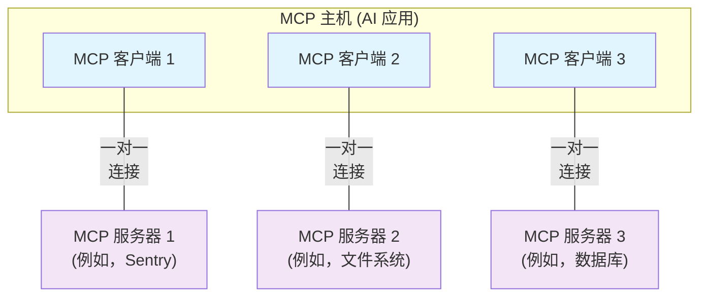

本篇 Model Context Protocol (MCP) 概览将讨论其[适用范围](#scope)、[核心概念](#mcp的核心概念)以及提供一个[示例](#示例)，以演示每个核心概念。

由于 MCP SDK 抽象了许多实现细节，大多数开发者可能会发现[数据层协议](#数据层协议)部分最为有用。该部分讨论了 MCP 服务器如何向 AI 应用提供上下文。

有关具体实现细节，请参考您使用的[语言 SDK 文档](/docs/sdk)。

## 适用范围

Model Context Protocol 包含以下项目：

- [MCP 规范](https://modelcontextprotocol.io/specification/latest)：定义 MCP 的规范，阐明客户端和服务器的实现要求。
- [MCP SDK](/docs/sdk)：实现 MCP 的多种编程语言 SDK。
- **MCP 开发工具**：用于开发 MCP 服务器和客户端的工具，包括 [MCP Inspector](https://github.com/modelcontextprotocol/inspector)
- [MCP 参考服务器实现](https://github.com/modelcontextprotocol/servers)：MCP 服务器的参考实现。

<Note>
  MCP 专注于上下文交换的协议 — 它不规定 AI 应用如何使用 LLM 或管理提供的上下文。
</Note>

## MCP 的核心概念

### 参与者

MCP 采用客户端-服务器架构，其中 MCP 主机 — 一个 AI 应用，例如 [Claude Code](https://www.anthropic.com/claude-code) 或 [Claude Desktop](https://www.claude.ai/download) — 与一个或多个 MCP 服务器建立连接。MCP 主机通过为每个 MCP 服务器创建一个 MCP 客户端来实现这一连接。每个 MCP 客户端都与其对应的 MCP 服务器保持专用的一对一连接。

MCP 架构中的关键参与者包括：

- **MCP 主机**：协调并管理一个或多个 MCP 客户端的 AI 应用
- **MCP 客户端**：维护与 MCP 服务器的连接，并为 MCP 主机获取上下文的组件
- **MCP 服务器**：为 MCP 客户端提供上下文的程序

**例如**：Visual Studio Code 作为 MCP 主机。当 Visual Studio Code 建立与 MCP 服务器（如 [Sentry MCP 服务器](https://docs.sentry.io/product/sentry-mcp/)）的连接时，Visual Studio Code 运行时会实例化一个 MCP 客户端对象，以维持与 Sentry MCP 服务器的连接。当 Visual Studio Code 随后连接到另一个 MCP 服务器（如 [本地文件系统服务器](https://github.com/modelcontextprotocol/servers/tree/main/src/filesystem)）时，Visual Studio Code 运行时会实例化另一个 MCP 客户端对象以维持该连接，从而保持 MCP 客户端与 MCP 服务器之间的一对一关系。



请注意，**MCP 服务器**是指提供上下文数据的程序，无论其运行位置如何。MCP 服务器可以本地或远程执行。例如，当 Claude Desktop 启动 [文件系统服务器](https://github.com/modelcontextprotocol/servers/tree/main/src/filesystem)时，该服务器在本地机器上运行，因为它使用 STDIO 传输。这通常称为“本地”MCP 服务器。官方 [Sentry MCP 服务器](https://docs.sentry.io/product/sentry-mcp/)在 Sentry 平台上运行，并使用可流式 HTTP 传输。这通常称为“远程”MCP 服务器。

### 层级结构

MCP 包含两个层级：

- **数据层**：定义基于 JSON-RPC 的客户端-服务器通信协议，包括生命周期管理以及核心原语（如工具、资源、提示和通知）。
- **传输层**：定义用于客户端和服务器之间数据交换的通信机制和通道，包括特定于传输的连接建立、消息分帧和授权。

从概念上讲，数据层是内层，而传输层是外层。

#### 数据层

数据层实现了一个基于 [JSON-RPC 2.0](https://www.jsonrpc.org/) 的交换协议，定义了消息结构和语义。
该层包括：

- **生命周期管理**：处理客户端和服务器之间的连接初始化、能力协商和连接终止
- **服务器功能**：使服务器能够提供核心功能，包括用于 AI 操作的工具、用于上下文数据的资源以及用于交互模板的提示
- **客户端功能**：使服务器能够要求客户端从主机 LLM 采样、从用户获取输入以及向客户端记录消息
- **实用功能**：支持通知等附加能力，用于实时更新和长时间操作的进度跟踪

#### 传输层

传输层管理客户端和服务器之间的通信通道和身份验证。它处理连接建立、消息分帧以及 MCP 参与者之间的安全通信。

MCP 支持两种传输机制：

- **Stdio 传输**：使用标准输入/输出流进行本地进程间的直接通信，提供最佳性能且无网络开销。
- **可流式 HTTP 传输**：使用 HTTP POST 进行客户端到服务器的消息传输，并可选支持 Server-Sent Events 以实现流式功能。该传输机制支持远程服务器通信，并支持标准 HTTP 身份验证方法，包括 Bearer Token、API 密钥和自定义头。MCP 推荐使用 OAuth 获取身份验证令牌。

传输层将通信细节从协议层中抽象出来，使得所有传输机制都可以使用相同的 JSON-RPC 2.0 消息格式。

### 数据层协议

MCP 的核心部分之一是定义 MCP 客户端和 MCP 服务器之间的模式和语义。开发者可能会发现数据层 — 特别是 [原语](#原语) 集合 — 是 MCP 中最有趣的部分。这是 MCP 中定义开发者如何将上下文从 MCP 服务器共享到 MCP 客户端的部分。

MCP 使用 [JSON-RPC 2.0](https://www.jsonrpc.org/) 作为其底层 RPC 协议。客户端和服务器相互发送请求并作出响应。当不需要响应时可以使用通知。

#### 生命周期管理

MCP 是一种 <Tooltip tip="使用可流式 HTTP 传输时，MCP 的子集可以是无状态的">有状态协议</Tooltip>，需要生命周期管理。生命周期管理的目的是协商 <Tooltip tip="客户端或服务器支持的功能和操作，例如工具、资源或提示">能力</Tooltip>。详细信息请参见 [规范](/specification/2025-06-18/basic/lifecycle)，[示例](#示例) 展示了初始化序列。

#### 原语

MCP 原语是 MCP 中最重要的概念。它们定义了客户端和服务器可以相互提供的功能。这些原语指定了可以与 AI 应用共享的上下文信息类型以及可以执行的操作范围。

MCP 定义了三个核心原语，供**服务器**暴露：

- **工具**：AI 应用可以调用以执行操作的可执行函数（例如，文件操作、API 调用、数据库查询）
- **资源**：为 AI 应用提供上下文信息的数据源（例如，文件内容、数据库记录、API 响应）
- **提示**：可重用的模板，帮助构建与语言模型的交互（例如，系统提示、少量示例）

每种原语类型都有相关的发现（`*/list`）、检索（`*/get`）和在某些情况下的执行（`tools/call`）方法。
MCP 客户端将使用 `*/list` 方法发现可用原语。例如，客户端可以首先列出所有可用工具（`tools/list`），然后执行它们。这种设计允许列表动态变化。

举个具体例子，一个提供数据库上下文的 MCP 服务器可以暴露用于查询数据库的工具、包含数据库模式的资源以及包含与工具交互的少量示例的提示。

有关服务器原语的更多详细信息，请参见 [服务器概念](./server-concepts)。

MCP 也定义了**客户端**可以暴露的原语。这些原语允许 MCP 服务器作者构建更丰富的交互。

- **采样**：允许服务器从客户端的 AI 应用请求语言模型补全。这对于服务器作者希望访问语言模型但希望保持模型无关性且不在其 MCP 服务器中包含语言模型 SDK 的情况很有用。他们可以使用 `sampling/complete` 方法从客户端的 AI 应用请求语言模型补全。
- **引导**：允许服务器请求用户额外的信息。这对于服务器作者希望从用户获取更多信息或请求确认操作的情况很有用。他们可以使用 `elicitation/request` 方法从用户请求额外信息。
- **日志**：允许服务器向客户端发送日志消息以用于调试和监控目的。

有关客户端原语的更多详细信息，请参见 [客户端概念](./client-concepts)。

#### 通知

协议支持实时通知，以实现服务器和客户端之间的动态更新。例如，当服务器的可用工具发生变化 — 例如当新功能可用或现有工具被修改时 — 服务器可以发送工具更新通知，以通知连接的客户端这些变化。通知以 JSON-RPC 2.0 通知消息的形式发送（不期望响应），并使 MCP 服务器能够向连接的客户端提供实时更新。

## 示例

### 数据层

本节提供了一个 MCP 客户端-服务器交互的逐步演练，重点介绍数据层协议。我们将演示生命周期序列、工具操作和通知，使用 JSON-RPC 2.0 消息。

<Steps>
<Step title="初始化 (生命周期管理)">

MCP 通过能力协商握手开始生命周期管理。如 [生命周期管理](#生命周期管理) 部分所述，客户端发送 `initialize` 请求以建立连接并协商支持的功能。

<CodeGroup>
  ```json 请求
  {
    "jsonrpc": "2.0",
    "id": 1,
    "method": "initialize",
    "params": {
      "protocolVersion": "2025-06-18",
      "capabilities": {
        "elicitation": {}
      },
      "clientInfo": {
        "name": "example-client",
        "version": "1.0.0"
      }
    }
  }
  ```
  ```json 响应
  {
    "jsonrpc": "2.0",
    "id": 1,
    "result": {
      "protocolVersion": "2025-06-18",
      "capabilities": {
        "tools": {
          "listChanged": true
        },
        "resources": {}
      },
      "serverInfo": {
        "name": "example-server",
        "version": "1.0.0"
      }
    }
  }
  ```
</CodeGroup>

#### 理解初始化交换

初始化过程是 MCP 生命周期管理的关键部分，具有几个关键目的：

1. **协议版本协商**：`protocolVersion` 字段（例如，"2025-06-18"）确保客户端和服务器使用兼容的协议版本。这可以防止不同版本之间尝试交互时发生的通信错误。如果未能协商出相互兼容的版本，则应终止连接。

2. **能力发现**：`capabilities` 对象允许各方声明其支持的功能，包括其可以处理的 [原语](#原语)（工具、资源、提示）以及是否支持诸如 [通知](#通知) 等功能。这通过避免不支持的操作实现高效通信。

3. **身份交换**：`clientInfo` 和 `serverInfo` 对象提供标识和版本信息，用于调试和兼容性目的。

在此示例中，能力协商展示了 MCP 原语是如何声明的：

**客户端能力**：

- `"elicitation": {}` - 客户端声明它可以处理用户交互请求（可以接收 `elicitation/create` 方法调用）

**服务器能力**：

- `"tools": {"listChanged": true}` - 服务器支持工具原语，并且可以在其工具列表更改时发送 `tools/list_changed` 通知
- `"resources": {}` - 服务器也支持资源原语（可以处理 `resources/list` 和 `resources/read` 方法）

成功初始化后，客户端发送通知以表明已准备就绪：

```json 通知
{
  "jsonrpc": "2.0",
  "method": "notifications/initialized"
}
```

#### AI 应用中的工作原理

在初始化期间，AI 应用的 MCP 客户端管理器建立与配置服务器的连接，并存储其能力以供后续使用。应用使用这些信息来确定哪些服务器可以提供特定类型的功能（工具、资源、提示），以及它们是否支持实时更新。

```python 伪代码：AI 应用初始化
# 伪代码
async with stdio_client(server_config) as (read, write):
    async with ClientSession(read, write) as session:
        init_response = await session.initialize()
        if init_response.capabilities.tools:
            app.register_mcp_server(session, supports_tools=True)
        app.set_server_ready(session)
```

</Step>

<Step title="工具发现 (原语)">
现在连接已经建立，客户端可以通过发送 `tools/list` 请求来发现可用工具。此请求是 MCP 工具发现机制的基础 — 它允许客户端在尝试使用之前了解服务器上有哪些工具可用。

<CodeGroup>
  ```json 请求
  {
    "jsonrpc": "2.0",
    "id": 2,
    "method": "tools/list"
  }
  ```
  ```json 响应
  {
    "jsonrpc": "2.0",
    "id": 2,
    "result": {
      "tools": [
        {
          "name": "calculator_arithmetic",
          "title": "计算器",
          "description": "执行包括基本算术、三角函数和代数运算在内的数学计算",
          "inputSchema": {
            "type": "object",
            "properties": {
              "expression": {
                "type": "string",
                "description": "要计算的数学表达式（例如，'2 + 3 * 4'、'sin(30)'、'sqrt(16)'）"
              }
            },
            "required": ["expression"]
          }
        },
        {
          "name": "weather_current",
          "title": "天气信息",
          "description": "获取全球任何地点的当前天气信息",
          "inputSchema": {
            "type": "object",
            "properties": {
              "location": {
                "type": "string",
                "description": "城市名称、地址或坐标（纬度,经度）"
              },
              "units": {
                "type": "string",
                "enum": ["metric", "imperial", "kelvin"],
                "description": "响应中使用的温度单位",
                "default": "metric"
              }
            },
            "required": ["location"]
          }
        }
      ]
    }
  }
  ```
</CodeGroup>

#### 理解工具发现请求

`tools/list` 请求很简单，不包含任何参数。

#### 理解工具发现响应

响应包含一个 `tools` 数组，提供了每个可用工具的完整元数据。这种数组结构允许服务器同时暴露多个工具，同时在不同功能之间保持清晰边界。

响应中的每个工具对象包含几个关键字段：

- **`name`**：工具在服务器命名空间中的唯一标识符。这是工具执行的主要键，应遵循清晰的命名模式（例如，`calculator_arithmetic` 而不是仅仅 `calculate`）
- **`title`**：客户端可以向用户显示的工具可读名称
- **`description`**：对工具功能及使用时机的详细说明
- **`inputSchema`**：定义预期输入参数的 JSON Schema，支持类型验证并提供关于必需和可选参数的清晰文档

#### AI 应用中的工作原理

AI 应用从所有连接的 MCP 服务器获取可用工具，并将它们合并到一个统一的工具注册表中，供语言模型访问。这使 LLM 能够理解它可以执行哪些操作，并在对话中自动生成适当的工具调用。

```python 伪代码：AI 应用工具发现
# 伪代码，使用 MCP Python SDK 模式
available_tools = []
for session in app.mcp_server_sessions():
    tools_response = await session.list_tools()
    available_tools.extend(tools_response.tools)
conversation.register_available_tools(available_tools)
```

</Step>

<Step title="工具执行 (原语)">
客户端现在可以使用 `tools/call` 方法执行工具。这展示了 MCP 原语在实践中的使用方式：在发现可用工具后，客户端可以使用适当的参数调用它们。

#### 理解工具执行请求

`tools/call` 请求遵循一种结构化格式，确保客户端和服务器之间的类型安全和清晰通信。请注意，我们使用了从发现响应中获得的正确工具名称（`weather_current`）而不是简化名称：

<CodeGroup>
  ```json 请求
  {
    "jsonrpc": "2.0",
    "id": 3,
    "method": "tools/call",
    "params": {
      "name": "weather_current",
      "arguments": {
        "location": "旧金山",
        "units": "imperial"
      }
    }
  }
  ```
  ```json 响应
  {
    "jsonrpc": "2.0",
    "id": 3,
    "result": {
      "content": [
        {
          "type": "text",
          "text": "旧金山当前天气：68°F，部分多云，西风轻风，风速 8 英里/小时。湿度：65%"
        }
      ]
    }
  }
  ```
</CodeGroup>

#### 工具执行请求的关键要素

请求结构包括几个重要组成部分：

1. **`name`**：必须与发现响应中的工具名称完全匹配（`weather_current`）。这确保服务器可以正确识别要执行的工具。

2. **`arguments`**：包含工具 `inputSchema` 定义的输入参数。在此示例中：
   - `location`: "旧金山"（必需参数）
   - `units`: "imperial"（可选参数，未指定时默认为 "metric"）

3. **JSON-RPC 结构**：使用标准 JSON-RPC 2.0 格式，使用唯一的 `id` 用于请求-响应关联。

#### 理解工具执行响应

响应展示了 MCP 的灵活内容系统：

1. **`content` 数组**：工具响应返回内容对象数组，支持富文本、多格式响应（文本、图像、资源等）

2. **内容类型**：每个内容对象都有一个 `type` 字段。在此示例中，`"type": "text"` 表示纯文本内容，但 MCP 支持各种内容类型以适应不同用例。

3. **结构化输出**：响应提供了 AI 应用可以使用的操作信息，作为语言模型交互的上下文。

这种执行模式使 AI 应用能够动态调用服务器功能并接收结构化响应，这些响应可以集成到与语言模型的对话中。

#### AI 应用中的工作原理

当语言模型在对话中决定使用某个工具时，AI 应用拦截工具调用，将其路由到适当的 MCP 服务器，执行它，并将结果作为对话流程的一部分返回给 LLM。这使 LLM 能够访问实时数据并在外部世界中执行操作。

```python
# 伪代码：AI 应用工具执行
async def handle_tool_call(conversation, tool_name, arguments):
    session = app.find_mcp_session_for_tool(tool_name)
    result = await session.call_tool(tool_name, arguments)
    conversation.add_tool_result(result.content)
```

</Step>

<Step title="实时更新 (通知)">
MCP 支持实时通知，使服务器能够在未被显式请求的情况下通知客户端更改。这展示了通知系统，这是一个保持 MCP 连接同步和响应的关键特性。

#### 理解工具列表更改通知

当服务器的可用工具更改时 — 例如当新功能可用、现有工具修改或工具暂时不可用时 — 服务器可以主动通知连接的客户端：

```json 请求
{
  "jsonrpc": "2.0",
  "method": "notifications/tools/list_changed"
}
```

#### MCP 通知的关键特性

1. **无需响应**：请注意，通知中没有 `id` 字段。这遵循 JSON-RPC 2.0 的通知语义，即不期望或发送响应。

2. **基于能力**：此通知仅由在初始化期间在工具能力中声明 `"listChanged": true` 的服务器发送（如步骤 1 所示）。

3. **事件驱动**：服务器根据内部状态更改决定何时发送通知，使 MCP 连接具有动态性和响应性。

#### 客户端对通知的响应

收到此通知后，客户端通常通过请求更新的工具列表作出反应。这创建了一个刷新循环，使客户端对可用工具的理解保持最新：

```json 请求
{
  "jsonrpc": "2.0",
  "id": 4,
  "method": "tools/list"
}
```

#### 通知的重要性

此通知系统至关重要，原因如下：

1. **动态环境**：工具可能根据服务器状态、外部依赖或用户权限而变化
2. **效率**：客户端无需轮询更改；在发生更新时会收到通知
3. **一致性**：确保客户端始终拥有关于可用服务器能力的准确信息
4. **实时协作**：启用可以适应上下文变化的响应式 AI 应用

此通知模式不仅适用于工具，还扩展到其他 MCP 原语，实现客户端和服务器之间的全面实时同步。

#### AI 应用中的工作原理

当 AI 应用收到关于更改工具的通知时，它会立即刷新其工具注册表并更新 LLM 的可用能力。这确保正在进行的对话始终可以访问最新的工具集，LLM 可以动态适应新功能。

```python
# 伪代码：AI 应用通知处理
async def handle_tools_changed_notification(session):
    tools_response = await session.list_tools()
    app.update_available_tools(session, tools_response.tools)
    if app.conversation.is_active():
        app.conversation.notify_llm_of_new_capabilities()
```

</Step>
</Steps>