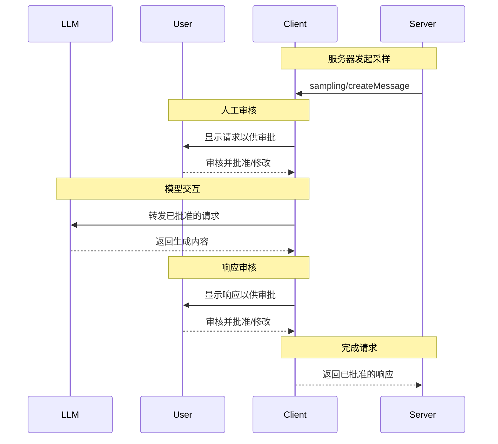
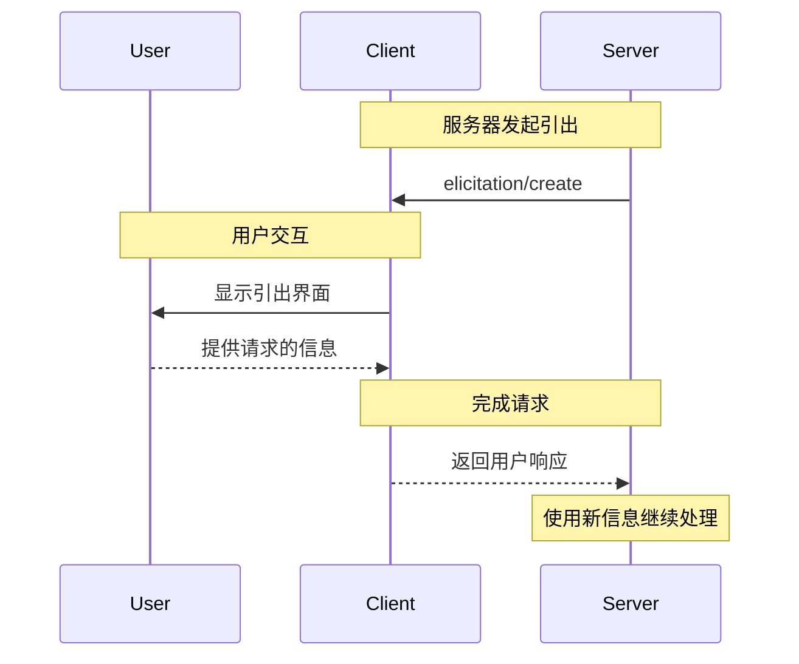

MCP 客户端由宿主应用程序实例化，用于与特定的 MCP 服务器通信。宿主应用程序（如 Claude.ai 或 IDE）管理整体用户体验，并协调多个客户端。每个客户端处理与一个服务器的一对一直接通信。

理解这种区别很重要：_宿主_ 是用户交互的应用程序，而 _客户端_ 是启用服务器连接的协议级组件。

## 核心客户端功能

除了使用服务器提供的上下文外，客户端还可以向服务器提供几种功能。这些客户端功能允许服务器作者构建更丰富的交互体验。例如，客户端可以通过“引出”（elicitations）允许 MCP 服务器向用户请求额外信息。客户端可以提供以下能力：

### 采样（Sampling）

采样允许服务器通过客户端请求语言模型补全，从而在保持安全性和用户控制的前提下实现代理行为。

#### 概述

采样使服务器能够在不直接集成或支付 AI 模型费用的情况下执行依赖 AI 的任务。相反，服务器可以请求已经具有 AI 模型访问权限的客户端代表它们处理这些任务。这种方法将用户权限和安全措施的控制权完全交给了客户端。由于采样请求发生在其他操作（例如分析数据的工具）的上下文中，并作为独立的模型调用进行处理，因此它们在不同上下文之间保持了清晰的边界，从而更高效地利用上下文窗口。

**采样流程：**



该流程通过多个人工审核点确保安全性。用户可以在请求返回服务器之前审核并修改初始请求和生成的响应。

**请求参数示例：**

```typescript
{
  messages: [
    {
      role: "user",
      content: "分析这些航班选项并推荐最佳选择：\n" +
               "[47个航班，包含价格、时间、航空公司和经停信息]\n" +
               "用户偏好：上午出发，最多1个经停"
    }
  ],
  modelPreferences: {
    hints: [{
      name: "claude-3-5-sonnet"  // 推荐模型
    }],
    costPriority: 0.3,      // 不太关注 API 成本
    speedPriority: 0.2,     // 可以等待详细分析
    intelligencePriority: 0.9  // 需要复杂的权衡评估
  },
  systemPrompt: "你是一位旅行专家，帮助用户根据他们的偏好找到最佳航班",
  maxTokens: 1500
}
```

#### 示例：航班分析工具

考虑一个旅行预订服务器，它有一个名为 `findBestFlight` 的工具，该工具使用采样来分析可用航班并推荐最佳选择。当用户询问“帮我预订下个月飞往巴塞罗那的最佳航班”时，该工具需要 AI 协助来评估复杂的权衡。

该工具查询航空公司 API 并收集 47 个航班选项。然后它请求 AI 协助来分析这些选项：“分析这些航班选项并推荐最佳选择：[47 个航班包含价格、时间、航空公司和经停] 用户偏好：上午出发，最多 1 个经停。”

客户端会向用户询问：“允许采样请求？”获得批准后，AI 会评估权衡——比如便宜的夜间航班与方便的上午出发。该工具使用此分析来展示前三名推荐。

#### 用户交互模型

采样设计以人工参与控制为核心原则。用户通过以下机制保持监督：

**审批控制**：每个采样请求都需要用户的明确同意。客户端显示服务器想要分析的内容及原因。用户可以批准、拒绝或修改请求。

**透明功能**：客户端显示确切的提示词、模型选择和 token 限制。用户在响应返回服务器之前可以审查 AI 的回复。

**配置选项**：用户可以设置模型偏好，为受信任的操作配置自动批准，或要求对所有内容进行审批。客户端可能提供选项以屏蔽敏感信息。用户通过 `includeContext` 参数决定在采样请求中可以包含多少对话上下文。

**隔离性**：默认情况下，采样请求与主对话上下文隔离。服务器无法访问用户对话。

**安全考虑**：客户端和服务器都必须在采样过程中妥善处理敏感数据。客户端应实施速率限制并验证所有消息内容。人工参与的设计确保了服务器发起的 AI 交互不会在未经用户明确同意的情况下危及安全或访问敏感数据。

### 根目录（Roots）

根目录定义了服务器操作的文件系统边界，允许客户端指定服务器应关注的目录。

#### 概述

根目录是客户端向服务器传达文件系统访问边界的机制。它们由指示服务器可以操作的目录的文件 URI 组成，帮助服务器理解可用文件和文件夹的范围。与给予服务器无限制的文件系统访问权限不同，根目录引导它们到相关的工作目录，同时保持安全边界。

**根目录结构：**

```json
{
  "uri": "file:///Users/agent/travel-planning",
  "name": "旅行规划工作区"
}
```

根目录仅限于文件系统路径，始终使用 `file://` URI 方案。它们帮助服务器理解项目边界、工作区组织和可访问目录。随着用户处理不同项目或文件夹，根目录列表可以动态更新，服务器通过 `roots/list_changed` 接收边界变化的通知。

需要注意的是，虽然根目录为服务器提供了操作指导，但客户端始终完全控制文件访问。根目录只是传达预期的边界——实际的文件访问始终由客户端的安全策略控制。

#### 示例：旅行规划工作区

旅行代理在处理多个客户行程时，可以从根目录中受益，以组织文件系统访问。考虑一个包含不同目录来管理旅行规划各个方面的工作区。

客户端为旅行规划服务器提供文件系统根目录：

- `file:///Users/agent/travel-planning` - 包含所有旅行文件的主工作区
- `file:///Users/agent/travel-templates` - 可重用的行程模板和资源
- `file:///Users/agent/client-documents` - 客户护照和旅行文件

当代理创建巴塞罗那行程时，服务器在这些边界内工作——访问模板、保存新行程并引用客户文件。它无法访问这些根目录之外的文件。服务器通常通过使用相对于根目录的路径或使用尊重根边界文件搜索工具来访问根目录内的文件。

如果代理打开了一个归档文件夹如 `file:///Users/agent/archive/2023-trips`，客户端将通过 `roots/list_changed` 更新根目录列表。

#### 用户交互模型

根目录通常由宿主应用程序根据用户操作自动管理，尽管有些应用程序可能提供手动根目录管理：

**自动根目录检测**：当用户打开文件夹时，客户端会自动将其作为根目录暴露。打开一个旅行工作区后，服务器即可访问该目录内的行程和文档。

**手动根目录配置**：高级用户可以通过配置手动指定根目录。例如，添加 `/travel-templates` 以访问可重用资源，同时排除包含财务记录的目录。

### 引出（Elicitation）

引出使服务器能够在交互过程中向用户请求特定信息，从而创建更动态和响应式的流程。

#### 概述

引出为服务器提供了一种结构化的方式来按需收集必要信息。服务器不必在开始时获取所有信息或在缺少数据时失败，而是可以在操作过程中暂停以请求用户的特定输入。这创建了更灵活的交互，服务器可以根据用户需求进行调整，而不是遵循僵化的模式。

**引出流程：**



该流程支持动态信息收集。服务器可以在需要时请求特定数据，用户通过适当的 UI 提供信息，服务器使用新获得的上下文继续处理。

**引出组件示例：**

```typescript
{
  method: "elicitation/requestInput",
  params: {
    message: "请确认您的巴塞罗那度假预订详情：",
    schema: {
      type: "object",
      properties: {
        confirmBooking: {
          type: "boolean",
          description: "确认预订（航班+酒店=3000美元）"
        },
        seatPreference: {
          type: "string",
          enum: ["window", "aisle", "no preference"],
          description: "航班偏好的座位类型"
        },
        roomType: {
          type: "string",
          enum: ["sea view", "city view", "garden view"],
          description: "酒店偏好的房间类型"
        },
        travelInsurance: {
          type: "boolean",
          default: false,
          description: "添加旅行保险（150美元）"
        }
      },
      required: ["confirmBooking"]
    }
  }
}
```

#### 示例：假期预订确认

旅行预订服务器通过最终预订确认过程展示了引出的强大功能。当用户选择了理想的巴塞罗那度假套餐后，服务器需要在继续操作前收集最终确认信息和任何缺失的细节。

服务器通过结构化请求引出预订确认，包含行程摘要（6月15日至22日巴塞罗那航班，海滨酒店，总计3000美元）以及任何附加偏好的字段——如座位选择、房间类型或旅行保险选项。

随着预订流程的推进，服务器会引出完成预订所需联系信息。它可能会请求航班预订所需的旅客详细信息、酒店的特殊请求或紧急联系人信息。

#### 用户交互模型

引出交互设计为清晰、有上下文且尊重用户自主权的方式：

**请求展示**：客户端显示引出请求时，会清楚说明是哪个服务器在请求，请求原因以及用途。请求消息解释了目的，而 schema 提供了结构和验证。

**响应选项**：用户可以通过适当的 UI 控件（文本框、下拉框、复选框）提供请求的信息，拒绝提供信息（可选解释），或取消整个操作。客户端在将响应返回服务器之前，会根据提供的 schema 验证响应。

**隐私考虑**：引出从不请求密码或 API 密钥。客户端会警告可疑请求，并让用户在发送前审查数据。