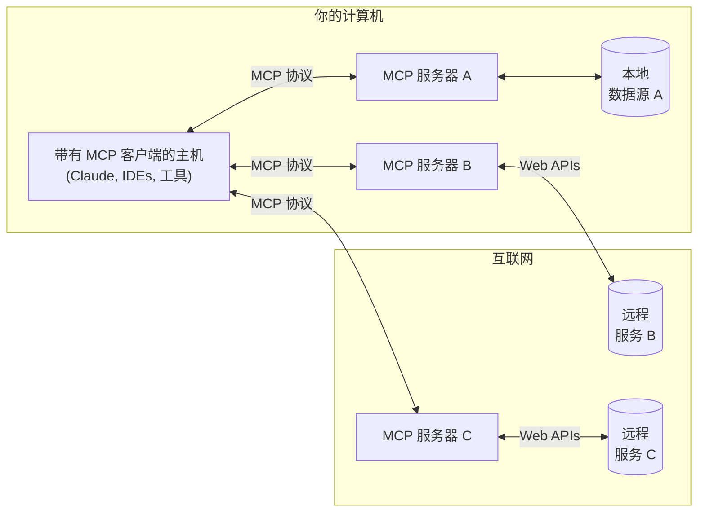

MCP 是一个开放协议，标准化了应用程序向大语言模型（LLMs）提供上下文的方式。可以把 MCP 想象成 AI 应用程序的 USB-C 接口。就像 USB-C 提供了一种标准化的方式将设备连接到各种外设和配件，MCP 提供了一种标准化的方式将 AI 模型连接到不同的数据源和工具。

## 为什么需要 MCP？

MCP 帮助你在 LLM 之上构建代理和复杂的工作流程。LLM 经常需要集成数据和工具，而 MCP 提供了以下能力：

- 一个不断增长的预构建集成列表，LLM 可以直接接入
- 在不同 LLM 提供商和供应商之间灵活切换的能力
- 在你的基础设施中保护数据的最佳实践

### 总体架构

核心上，MCP 遵循客户端-服务器架构，主机应用可以连接到多个服务器：

- **MCP 主机**：如 Claude Desktop、IDE 或 AI 工具，希望通过 MCP 访问数据的程序
- **MCP 客户端**：维护与服务器 1:1 连接的协议客户端
- **MCP 服务器**：轻量级程序，每个都通过标准化的模型上下文协议暴露特定功能
- **本地数据源**：你的计算机上的文件、数据库和服务，MCP 服务器可以安全访问
- **远程服务**：可通过互联网访问的外部系统（例如通过 API），MCP 服务器可以连接到这些系统

## 入门

选择最适合你需求的路径：

### 快速入门

<CardGroup cols={2}>
  <Card title="面向服务器开发者" icon="bolt" href="/quickstart/server">
    开始构建你自己的服务器，在 Claude Desktop 和其他客户端中使用
  </Card>
  <Card title="面向客户端开发者" icon="bolt" href="/quickstart/client">
    开始构建你自己的客户端，可与所有 MCP 服务器集成
  </Card>
  <Card title="面向 Claude Desktop 用户" icon="bolt" href="/quickstart/user">
    开始在 Claude Desktop 中使用预构建的服务器
  </Card>
</CardGroup>

### 示例

<CardGroup cols={2}>
  <Card title="示例服务器" icon="grid" href="/examples">
    浏览我们的官方 MCP 服务器和实现示例库
  </Card>
  <Card title="示例客户端" icon="cubes" href="/clients">
    查看支持 MCP 集成的客户端列表
  </Card>
</CardGroup>

## 教程

<CardGroup cols={2}>
  <Card
    title="使用 LLM 构建 MCP"
    icon="comments"
    href="/tutorials/building-mcp-with-llms"
  >
    学习如何使用像 Claude 这样的 LLM 加快你的 MCP 开发
  </Card>
  <Card title="调试指南" icon="bug" href="/legacy/tools/debugging">
    学习如何有效调试 MCP 服务器和集成
  </Card>
  <Card
    title="MCP 检查器"
    icon="magnifying-glass"
    href="/legacy/tools/inspector"
  >
    使用我们的交互式调试工具测试和检查你的 MCP 服务器
  </Card>
  <Card
    title="MCP 工作坊（视频，2小时）"
    icon="person-chalkboard"
    href="https://www.youtube.com/watch?v=kQmXtrmQ5Zg"
  >
    <iframe src="https://www.youtube.com/embed/kQmXtrmQ5Zg"> </iframe>
  </Card>
</CardGroup>

## 探索 MCP

深入了解 MCP 的核心概念和能力：

<CardGroup cols={2}>
  <Card
    title="核心架构"
    icon="sitemap"
    href="/legacy/concepts/architecture"
  >
    理解 MCP 如何连接客户端、服务器和 LLM
  </Card>
  <Card title="资源" icon="database" href="/legacy/concepts/resources">
    从你的服务器向 LLM 暴露数据和内容
  </Card>
  <Card title="提示词" icon="message" href="/legacy/concepts/prompts">
    创建可重用的提示模板和工作流程
  </Card>
  <Card title="工具" icon="wrench" href="/legacy/concepts/tools">
    使你的 LLM 能够通过服务器执行操作
  </Card>
  <Card title="采样" icon="robot" href="/legacy/concepts/sampling">
    让你的服务器向 LLM 请求生成内容
  </Card>
  <Card
    title="传输机制"
    icon="network-wired"
    href="/legacy/concepts/transports"
  >
    了解 MCP 的通信机制
  </Card>
</CardGroup>

## 贡献

想参与贡献？请查看我们的 [贡献指南](/development/contributing) 了解如何帮助改进 MCP。

## 支持与反馈

以下是获取帮助或提供反馈的方式：

- 对于与 MCP 规范、SDK 或文档（开源）相关的错误报告和功能请求，请 [创建一个 GitHub issue](https://github.com/modelcontextprotocol)
- 对于关于 MCP 规范的讨论或问答，请使用 [规范讨论区](https://github.com/modelcontextprotocol/specification/discussions)
- 对于关于其他 MCP 开源组件的讨论或问答，请使用 [组织讨论区](https://github.com/orgs/modelcontextprotocol/discussions)
- 对于与 Claude.app 和 claude.ai 的 MCP 集成相关的错误报告、功能请求和问题，请参阅 Anthropic 的 [获取支持指南](https://support.anthropic.com/en/articles/9015913-how-to-get-support)