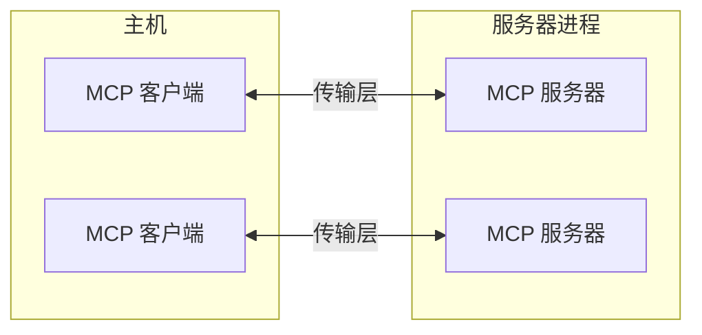
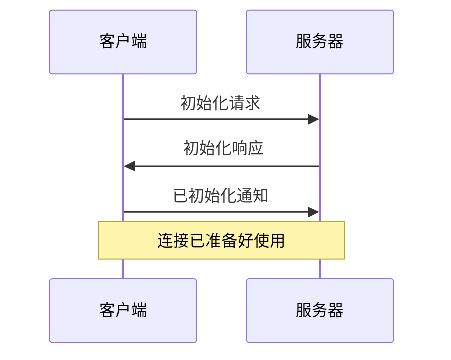

模型上下文协议 (MCP) 建立在灵活、可扩展的架构之上，使 LLM 应用程序和集成之间能够无缝通信。本文档涵盖核心架构组件和概念。

## 概述

MCP 遵循客户端-服务器架构，其中：

- **主机** 是启动连接的 LLM 应用程序（如 Claude Desktop 或 IDE）
- **客户端** 在主机应用程序内与服务器保持 1:1 连接
- **服务器** 向客户端提供上下文、工具和提示



## 核心组件

### 协议层

协议层处理消息帧、请求/响应链接和高层通信模式。

<CodeGroup>

```typescript TypeScript
class Protocol<Request, Notification, Result> {
  // 处理传入请求
  setRequestHandler<T>(
    schema: T,
    handler: (request: T, extra: RequestHandlerExtra) => Promise<Result>,
  ): void;

  // 处理传入通知
  setNotificationHandler<T>(
    schema: T,
    handler: (notification: T) => Promise<void>,
  ): void;

  // 发送请求并等待响应
  request<T>(request: Request, schema: T, options?: RequestOptions): Promise<T>;

  // 发送单向通知
  notification(notification: Notification): Promise<void>;
}
```

```python Python
class Session(BaseSession[RequestT, NotificationT, ResultT]):
    async def send_request(
        self,
        request: RequestT,
        result_type: type[Result]
    ) -> Result:
        """发送请求并等待响应。如果响应包含错误则引发 McpError。"""
        # 请求处理实现

    async def send_notification(
        self,
        notification: NotificationT
    ) -> None:
        """发送不期望响应的单向通知。"""
        # 通知处理实现

    async def _received_request(
        self,
        responder: RequestResponder[ReceiveRequestT, ResultT]
    ) -> None:
        """处理来自另一端的请求。"""
        # 请求处理实现

    async def _received_notification(
        self,
        notification: ReceiveNotificationT
    ) -> None:
        """处理来自另一端的通知。"""
        # 通知处理实现
```

</CodeGroup>

关键类包括：

- `Protocol`
- `Client`
- `Server`

### 传输层

传输层处理客户端和服务器之间的实际通信。MCP 支持多种传输机制：

1. **标准输入输出传输**
   - 使用标准输入/输出进行通信
   - 适用于本地进程

2. **可流式 HTTP 传输**
   - 使用 HTTP 和可选的服务器发送事件进行流式传输
   - 使用 HTTP POST 发送客户端到服务器的消息

所有传输都使用 [JSON-RPC](https://www.jsonrpc.org/) 2.0 交换消息。有关模型上下文协议消息格式的详细信息，请参阅[规范](/specification/)。

### 消息类型

MCP 有以下主要消息类型：

1. **请求** 期望另一方的响应：

   ```typescript
   interface Request {
     method: string;
     params?: { ... };
   }
   ```

2. **结果** 是对请求的成功响应：

   ```typescript
   interface Result {
     [key: string]: unknown;
   }
   ```

3. **错误** 表示请求失败：

   ```typescript
   interface Error {
     code: number;
     message: string;
     data?: unknown;
   }
   ```

4. **通知** 是不期望响应的单向消息：
   ```typescript
   interface Notification {
     method: string;
     params?: { ... };
   }
   ```

## 连接生命周期

### 1. 初始化



1. 客户端发送包含协议版本和功能的 `initialize` 请求
2. 服务器响应其协议版本和功能
3. 客户端发送 `initialized` 通知作为确认
4. 开始正常的消息交换

### 2. 消息交换

初始化后，支持以下模式：

- **请求-响应**：客户端或服务器发送请求，另一方响应
- **通知**：任何一方发送单向消息

### 3. 终止

任何一方都可以终止连接：

- 通过 `close()` 清理关闭
- 传输断开连接
- 错误情况

## 错误处理

MCP 定义了以下标准错误代码：

```typescript
enum ErrorCode {
  // 标准 JSON-RPC 错误代码
  ParseError = -32700,
  InvalidRequest = -32600,
  MethodNotFound = -32601,
  InvalidParams = -32602,
  InternalError = -32603,
}
```

SDK 和应用程序可以在 -32000 以上定义自己的错误代码。

错误通过以下方式传播：

- 请求的错误响应
- 传输的错误事件
- 协议级错误处理程序

## 实现示例

以下是如何实现 MCP 服务器的基本示例：

<CodeGroup>

```typescript TypeScript
import { Server } from "@modelcontextprotocol/sdk/server/index.js";
import { StdioServerTransport } from "@modelcontextprotocol/sdk/server/stdio.js";

const server = new Server(
  {
    name: "example-server",
    version: "1.0.0",
  },
  {
    capabilities: {
      resources: {},
    },
  },
);

// 处理请求
server.setRequestHandler(ListResourcesRequestSchema, async () => {
  return {
    resources: [
      {
        uri: "example://resource",
        name: "示例资源",
      },
    ],
  };
});

// 连接传输
const transport = new StdioServerTransport();
await server.connect(transport);
```

```python Python
import asyncio
import mcp.types as types
from mcp.server import Server
from mcp.server.stdio import stdio_server

app = Server("example-server")

@app.list_resources()
async def list_resources() -> list[types.Resource]:
    return [
        types.Resource(
            uri="example://resource",
            name="示例资源"
        )
    ]

async def main():
    async with stdio_server() as streams:
        await app.run(
            streams[0],
            streams[1],
            app.create_initialization_options()
        )

if __name__ == "__main__":
    asyncio.run(main())
```

</CodeGroup>

## 最佳实践

### 传输选择

1. **本地通信**
   - 对本地进程使用标准输入输出传输
   - 同机通信高效
   - 简单的进程管理

2. **远程通信**
   - 使用需要 HTTP 兼容性的场景的可流式 HTTP
   - 考虑包括身份验证和授权在内的安全影响

### 消息处理

1. **请求处理**
   - 彻底验证输入
   - 使用类型安全的模式
   - 优雅地处理错误
   - 实现超时

2. **进度报告**
   - 对长期操作使用进度令牌
   - 逐步报告进度
   - 已知时包含总进度

3. **错误管理**
   - 使用适当的错误代码
   - 包含有帮助的错误消息
   - 在错误时清理资源

## 安全考虑

1. **传输安全**
   - 对远程连接使用 TLS
   - 验证连接来源
   - 在需要时实现身份验证

2. **消息验证**
   - 验证所有传入消息
   - 净化输入
   - 检查消息大小限制
   - 验证 JSON-RPC 格式

3. **资源保护**
   - 实现访问控制
   - 验证资源路径
   - 监控资源使用
   - 限制请求速率

4. **错误处理**
   - 不泄露敏感信息
   - 记录安全相关错误
   - 实现正确清理
   - 处理拒绝服务场景

## 调试和监控

1. **日志记录**
   - 记录协议事件
   - 跟踪消息流
   - 监控性能
   - 记录错误

2. **诊断**
   - 实现健康检查
   - 监控连接状态
   - 跟踪资源使用
   - 分析性能

3. **测试**
   - 测试不同传输
   - 验证错误处理
   - 检查边界情况
   - 对服务器进行负载测试