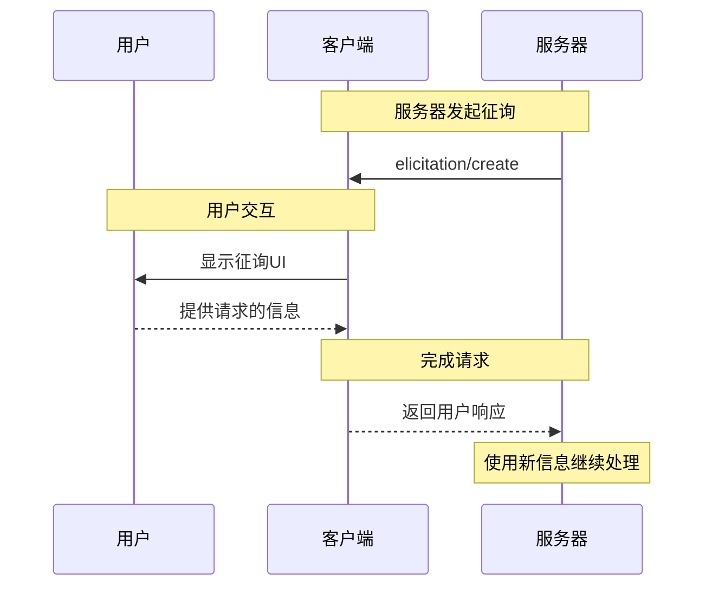

信息征询是MCP的一项强大功能，允许服务器在与用户交互期间请求额外信息。这使得服务器可以按需动态获取必要数据，同时保持用户控制权和隐私。

<Info>
  信息征询是MCP规范[修订版 2025-06-18](/specification/2025-06-18/client/elicitation)中新增的功能。
</Info>

## 什么是信息征询？

信息征询为MCP服务器提供了一种标准化方式，通过客户端向用户请求结构化信息。服务器无需一开始就获取所有信息，而可以在需要时请求特定数据，从而创建更自然和灵活的交互体验。

例如，服务器可以：

- 在连接服务时请求用户名
- 在设置过程中请求配置偏好
- 在创建新资源时收集项目详细信息

## 信息征询的工作原理

信息征询流程非常简单：

1. 服务器发送包含消息和预期数据结构的征询请求
2. 客户端以适当的UI向用户展示请求
3. 用户接受、拒绝或取消请求
4. 客户端验证后将响应返回给服务器
5. 服务器使用提供的信息继续处理

## 请求结构

信息征询请求包含两个关键组件：

### 消息

清晰、可读的文本说明需要什么信息及其原因。

### 模式

定义响应预期结构的JSON Schema。为了简化客户端实现，模式特意限制为仅包含基本类型的扁平对象。

示例请求：

```json
{
  "message": "请提供您的GitHub用户名",
  "requestedSchema": {
    "type": "object",
    "properties": {
      "username": {
        "type": "string",
        "title": "GitHub用户名",
        "description": "您的GitHub用户名（例如：octocat）"
      }
    },
    "required": ["username"]
  }
}
```

## 支持的数据类型

信息征询支持以下基本类型：

### 文本输入

```json
{
  "type": "string",
  "title": "项目名称",
  "description": "新项目的名称",
  "minLength": 3,
  "maxLength": 50
}
```

### 数字

```json
{
  "type": "number",
  "title": "端口号",
  "description": "服务器运行端口",
  "minimum": 1024,
  "maximum": 65535
}
```

### 布尔选择

```json
{
  "type": "boolean",
  "title": "启用分析",
  "description": "发送匿名使用统计信息",
  "default": false
}
```

### 选择列表

```json
{
  "type": "string",
  "title": "环境",
  "enum": ["development", "staging", "production"],
  "enumNames": ["开发", "预发布", "生产"]
}
```

## 用户响应操作

用户可以通过三种方式响应信息征询请求：

1. **接受**：用户提供请求的信息
2. **拒绝**：用户明确拒绝提供信息
3. **取消**：用户未做选择就关闭（例如：关闭对话框）

服务器应适当处理每种响应：

- 接受 → 处理提供的数据
- 拒绝 → 提供替代方案或调整流程
- 取消 → 考虑稍后重试或使用默认值

## 最佳实践

实施信息征询时：

### 对于服务器

1. **明确清晰**：编写说明信息，解释为什么需要这些信息
2. **保持简洁**：只请求必要的信息
3. **保持灵活**：为被拒绝或取消的请求准备备选方案
4. **把握时机**：在真正需要时才请求信息，而非提前请求
5. **保持尊重**：绝不请求密码或令牌等敏感信息

### 对于客户端

1. **保持透明**：清楚显示哪个服务器在请求信息
2. **加强保护**：允许用户查看和修改响应内容
3. **严格验证**：根据提供的模式检查响应
4. **赋予权力**：使拒绝和取消选项显眼易用
5. **限制频率**：实施速率限制以防止垃圾请求

## 常见用例

信息征询适用于以下场景：

- **初始设置**：在首次设置期间收集配置信息
- **动态流程**：请求特定上下文的信息
- **用户偏好**：收集可选的设置和偏好
- **项目详情**：收集有关正在创建资源的元数据
- **服务集成**：请求外部服务的用户名或ID

## 示例流程

这是一个典型的信息征询交互：



## 安全注意事项

<Warning>
  服务器绝不能使用信息征询来请求密码、API密钥、令牌或其他敏感凭证。应使用正确的认证流程。
</Warning>

关键安全准则：

1. 服务器应只请求非敏感信息
2. 客户端应清楚显示哪个服务器在请求数据
3. 用户应始终有权拒绝
4. 应根据模式验证响应
5. 应实施速率限制防止请求泛滥

## 实现示例

以下是一个服务器使用信息征询收集项目信息的示例：

```typescript
// 服务器请求项目详情
const response = await client.request("elicitation/create", {
  message: "让我们设置您的新项目",
  requestedSchema: {
    type: "object",
    properties: {
      name: {
        type: "string",
        title": "项目名称",
        description: "项目的描述性名称",
      },
      framework: {
        type: "string",
        title: "框架",
        enum: ["react", "vue", "angular", "none"],
        enumNames: ["React", "Vue", "Angular", "无"],
      },
      useTypeScript: {
        type: "boolean",
        title: "使用TypeScript",
        default: true,
      },
    },
    required: ["name", "framework"],
  },
});

// 处理响应
if (response.action === "accept") {
  // 使用提供的详细信息创建项目
  await createProject(response.content);
} else if (response.action === "decline") {
  // 使用默认值或提供替代方案
  await createDefaultProject();
} else {
  // 用户取消 - 可能稍后重试
  console.log("项目创建已取消");
}
```

这种方法在尊重用户控制和隐私的同时，创造了流畅的交互体验。