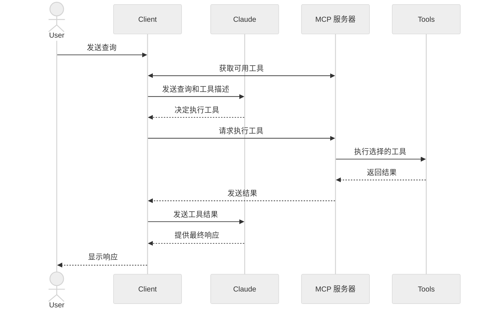

在本教程中，您将学习如何构建一个连接到 MCP 服务器的 LLM 驱动聊天机器人客户端。建议您先阅读 [Server quickstart](/quickstart/server) 教程，了解如何构建第一个服务器的基础知识。

<Tabs>
<Tab title="Python">

[您可以在此处找到本教程的完整代码。](https://github.com/modelcontextprotocol/quickstart-resources/tree/main/mcp-client-python)

## 系统要求

开始之前，请确保您的系统满足以下要求：

- Mac 或 Windows 电脑
- 已安装最新版本的 Python
- 已安装最新版本的 `uv`

## 设置您的环境

首先，使用 `uv` 创建一个新的 Python 项目：

```bash
# 创建项目目录
uv init mcp-client
cd mcp-client

# 创建虚拟环境
uv venv

# 激活虚拟环境
# 在 Windows 上：
.venv\Scripts\activate
# 在 Unix 或 macOS 上：
source .venv/bin/activate

# 安装所需包
uv add mcp anthropic python-dotenv

# 删除样板文件
# 在 Windows 上：
del main.py
# 在 Unix 或 macOS 上：
rm main.py

# 创建我们的主文件
touch client.py
```

## 设置您的 API 密钥

您需要从 [Anthropic Console](https://console.anthropic.com/settings/keys) 获取一个 Anthropic API 密钥。

创建一个 `.env` 文件来存储它：

```bash
# 创建 .env 文件
touch .env
```

将您的密钥添加到 `.env` 文件中：

```bash
ANTHROPIC_API_KEY=<您的密钥>
```

将 `.env` 添加到您的 `.gitignore` 中：

```bash
echo ".env" >> .gitignore
```

<Warning>

请确保您的 `ANTHROPIC_API_KEY` 是安全的！

</Warning>

## 创建客户端

### 基本客户端结构

首先，让我们设置导入并创建基本的客户端类：

```python
import asyncio
from typing import Optional
from contextlib import AsyncExitStack

from mcp import ClientSession, StdioServerParameters
from mcp.client.stdio import stdio_client

from anthropic import Anthropic
from dotenv import load_dotenv

load_dotenv()  # 从 .env 加载环境变量

class MCPClient:
    def __init__(self):
        # 初始化会话和客户端对象
        self.session: Optional[ClientSession] = None
        self.exit_stack = AsyncExitStack()
        self.anthropic = Anthropic()
    # 方法将放在这里
```

### 服务器连接管理

接下来，我们将实现连接到 MCP 服务器的方法：

```python
async def connect_to_server(self, server_script_path: str):
    """连接到 MCP 服务器

    参数:
        server_script_path: 服务器脚本的路径 (.py 或 .js)
    """
    is_python = server_script_path.endswith('.py')
    is_js = server_script_path.endswith('.js')
    if not (is_python or is_js):
        raise ValueError("服务器脚本必须是 .py 或 .js 文件")

    command = "python" if is_python else "node"
    server_params = StdioServerParameters(
        command=command,
        args=[server_script_path],
        env=None
    )

    stdio_transport = await self.exit_stack.enter_async_context(stdio_client(server_params))
    self.stdio, self.write = stdio_transport
    self.session = await self.exit_stack.enter_async_context(ClientSession(self.stdio, self.write))

    await self.session.initialize()

    # 列出可用工具
    response = await self.session.list_tools()
    tools = response.tools
    print("\n已连接到带有以下工具的服务器：", [tool.name for tool in tools])
```

### 查询处理逻辑

现在让我们添加处理查询和调用工具的核心功能：

```python
async def process_query(self, query: str) -> str:
    """使用 Claude 和可用工具处理查询"""
    messages = [
        {
            "role": "user",
            "content": query
        }
    ]

    response = await self.session.list_tools()
    available_tools = [{
        "name": tool.name,
        "description": tool.description,
        "input_schema": tool.inputSchema
    } for tool in response.tools]

    # 初始的 Claude API 调用
    response = self.anthropic.messages.create(
        model="claude-3-5-sonnet-20241022",
        max_tokens=1000,
        messages=messages,
        tools=available_tools
    )

    # 处理响应并调用工具
    final_text = []

    assistant_message_content = []
    for content in response.content:
        if content.type == 'text':
            final_text.append(content.text)
            assistant_message_content.append(content)
        elif content.type == 'tool_use':
            tool_name = content.name
            tool_args = content.input

            # 执行工具调用
            result = await self.session.call_tool(tool_name, tool_args)
            final_text.append(f"[调用工具 {tool_name}，参数为 {tool_args}]")

            assistant_message_content.append(content)
            messages.append({
                "role": "assistant",
                "content": assistant_message_content
            })
            messages.append({
                "role": "user",
                "content": [
                    {
                        "type": "tool_result",
                        "tool_use_id": content.id,
                        "content": result.content
                    }
                ]
            })

            # 从 Claude 获取下一个响应
            response = self.anthropic.messages.create(
                model="claude-3-5-sonnet-20241022",
                max_tokens=1000,
                messages=messages,
                tools=available_tools
            )

            final_text.append(response.content[0].text)

    return "\n".join(final_text)
```

### 交互式聊天界面

现在我们将添加聊天循环和清理功能：

```python
async def chat_loop(self):
    """运行交互式聊天循环"""
    print("\nMCP 客户端已启动！")
    print("输入您的查询或输入 'quit' 退出。")

    while True:
        try:
            query = input("\n查询: ").strip()

            if query.lower() == 'quit':
                break

            response = await self.process_query(query)
            print("\n" + response)

        except Exception as e:
            print(f"\n错误: {str(e)}")

async def cleanup(self):
    """清理资源"""
    await self.exit_stack.aclose()
```

### 主入口点

最后，我们将添加主执行逻辑：

```python
async def main():
    if len(sys.argv) < 2:
        print("使用方法: python client.py <服务器脚本路径>")
        sys.exit(1)

    client = MCPClient()
    try:
        await client.connect_to_server(sys.argv[1])
        await client.chat_loop()
    finally:
        await client.cleanup()

if __name__ == "__main__":
    import sys
    asyncio.run(main())
```

您可以在此处找到完整的 `client.py` 文件 [链接](https://gist.github.com/zckly/f3f28ea731e096e53b39b47bf0a2d4b1)。

## 关键组件解释

### 1. 客户端初始化

- `MCPClient` 类初始化时包含会话管理和 API 客户端
- 使用 `AsyncExitStack` 进行资源管理
- 配置 Anthropic 客户端以与 Claude 交互

### 2. 服务器连接

- 支持 Python 和 Node.js 服务器
- 验证服务器脚本类型
- 设置通信通道
- 初始化会话并列出可用工具

### 3. 查询处理

- 维护对话上下文
- 处理 Claude 的响应和工具调用
- 管理 Claude 和工具之间的消息流
- 将结果组合成连贯的响应

### 4. 交互式界面

- 提供简单的命令行界面
- 处理用户输入并显示响应
- 包含基本的错误处理
- 允许优雅退出

### 5. 资源管理

- 正确清理资源
- 处理连接问题的错误处理
- 实现优雅的关闭程序

## 常见自定义点

1. **工具处理**
   - 修改 `process_query()` 以处理特定工具类型
   - 为工具调用添加自定义错误处理
   - 实现工具特定的响应格式化

2. **响应处理**
   - 自定义工具结果的格式化方式
   - 添加响应过滤或转换
   - 实现自定义日志记录

3. **用户界面**
   - 添加 GUI 或 Web 界面
   - 实现丰富的控制台输出
   - 添加命令历史记录或自动补全

## 运行客户端

要使用任何 MCP 服务器运行您的客户端：

```bash
uv run client.py path/to/server.py # python 服务器
uv run client.py path/to/build/index.js # node 服务器
```

<Note>

如果您继续使用服务器快速入门中的天气教程，您的命令可能如下所示：`python client.py .../quickstart-resources/weather-server-python/weather.py`

</Note>

客户端将：

1. 连接到指定的服务器
2. 列出可用工具
3. 开始交互式聊天会话，在这里您可以：
   - 输入查询
   - 查看工具执行
   - 获取 Claude 的响应

以下是连接到服务器快速入门中的天气服务器时的示例外观：

<Frame>
  
</Frame>

## 它是如何工作的

当您提交查询时：

1. 客户端从服务器获取可用工具列表
2. 您的查询连同工具描述一起发送给 Claude
3. Claude 决定是否使用（如果有的话）哪些工具
4. 客户端通过服务器执行任何请求的工具调用
5. 结果发送回 Claude
6. Claude 提供自然语言响应
7. 响应显示给您

## 最佳实践

1. **错误处理**
   - 始终将工具调用包裹在 try-catch 块中
   - 提供有意义的错误消息
   - 优雅地处理连接问题

2. **资源管理**
   - 使用 `AsyncExitStack` 进行正确清理
   - 使用完后关闭连接
   - 处理服务器断开连接

3. **安全性**
   - 在 `.env` 中安全地存储 API 密钥
   - 验证服务器响应
   - 谨慎处理工具权限

## 故障排除

### 服务器路径问题

- 仔细检查服务器脚本的路径是否正确
- 如果相对路径不起作用，请使用绝对路径
- 对于 Windows 用户，请确保路径中使用正斜杠 (/) 或转义的反斜杠 (\\)
- 验证服务器文件是否具有正确的扩展名 (.py 表示 Python，.js 表示 Node.js)

正确路径使用的示例：

```bash
# 相对路径
uv run client.py ./server/weather.py

# 绝对路径
uv run client.py /Users/username/projects/mcp-server/weather.py

# Windows 路径（任何格式都可以）
uv run client.py C:/projects/mcp-server/weather.py
uv run client.py C:\\projects\\mcp-server\\weather.py
```

### 响应时间

- 第一个响应可能需要最多 30 秒才能返回
- 这是正常的，发生这种情况时：
  - 服务器正在初始化
  - Claude 正在处理查询
  - 工具正在执行
- 后续响应通常更快
- 在此初始等待期间不要中断进程

### 常见错误消息

如果您看到：

- `FileNotFoundError`: 检查您的服务器路径
- `Connection refused`: 确保服务器正在运行且路径正确
- `Tool execution failed`: 验证工具所需的环境变量是否已设置
- `Timeout error`: 考虑在客户端配置中增加超时时间

</Tab>

<Tab title="Node">

[您可以在此处找到本教程的完整代码。](https://github.com/modelcontextprotocol/quickstart-resources/tree/main/mcp-client-typescript)

## 系统要求

开始之前，请确保您的系统满足以下要求：

- Mac 或 Windows 电脑
- 已安装 Node.js 17 或更高版本
- 已安装最新版本的 `npm`
- Anthropic API 密钥 (Claude)

## 设置您的环境

首先，让我们创建并设置我们的项目：

<CodeGroup>

```bash macOS/Linux
# 创建项目目录
mkdir mcp-client-typescript
cd mcp-client-typescript

# 初始化 npm 项目
npm init -y

# 安装依赖
npm install @anthropic-ai/sdk @modelcontextprotocol/sdk dotenv

# 安装开发依赖
npm install -D @types/node typescript

# 创建源文件
touch index.ts
```

```powershell Windows
# 创建项目目录
md mcp-client-typescript
cd mcp-client-typescript

# 初始化 npm 项目
npm init -y

# 安装依赖
npm install @anthropic-ai/sdk @modelcontextprotocol/sdk dotenv

# 安装开发依赖
npm install -D @types/node typescript

# 创建源文件
new-item index.ts
```

</CodeGroup>

在您的 `package.json` 中更新以设置 `type: "module"` 和构建脚本：

```json package.json
{
  "type": "module",
  "scripts": {
    "build": "tsc && chmod 755 build/index.js"
  }
}
```

在项目的根目录中创建一个 `tsconfig.json`：

```json tsconfig.json
{
  "compilerOptions": {
    "target": "ES2022",
    "module": "Node16",
    "moduleResolution": "Node16",
    "outDir": "./build",
    "rootDir": "./",
    "strict": true,
    "esModuleInterop": true,
    "skipLibCheck": true,
    "forceConsistentCasingInFileNames": true
  },
  "include": ["index.ts"],
  "exclude": ["node_modules"]
}
```

## 设置您的 API 密钥

您需要从 [Anthropic Console](https://console.anthropic.com/settings/keys) 获取一个 Anthropic API 密钥。

创建一个 `.env` 文件来存储它：

```bash
echo "ANTHROPIC_API_KEY=<您的密钥>" > .env
```

将 `.env` 添加到您的 `.gitignore` 中：

```bash
echo ".env" >> .gitignore
```

<Warning>

请确保您的 `ANTHROPIC_API_KEY` 是安全的！

</Warning>

## 创建客户端

### 基本客户端结构

首先，让我们设置导入并在 `index.ts` 中创建基本的客户端类：

```typescript
import { Anthropic } from "@anthropic-ai/sdk";
import {
  MessageParam,
  Tool,
} from "@anthropic-ai/sdk/resources/messages/messages.mjs";
import { Client } from "@modelcontextprotocol/sdk/client/index.js";
import { StdioClientTransport } from "@modelcontextprotocol/sdk/client/stdio.js";
import readline from "readline/promises";
import dotenv from "dotenv";

dotenv.config();

const ANTHROPIC_API_KEY = process.env.ANTHROPIC_API_KEY;
if (!ANTHROPIC_API_KEY) {
  throw new Error("ANTHROPIC_API_KEY 未设置");
}

class MCPClient {
  private mcp: Client;
  private anthropic: Anthropic;
  private transport: StdioClientTransport | null = null;
  private tools: Tool[] = [];

  constructor() {
    this.anthropic = new Anthropic({
      apiKey: ANTHROPIC_API_KEY,
    });
    this.mcp = new Client({ name: "mcp-client-cli", version: "1.0.0" });
  }
  // 方法将放在这里
}
```

### 服务器连接管理

接下来，我们将实现连接到 MCP 服务器的方法：

```typescript
async connectToServer(serverScriptPath: string) {
  try {
    const isJs = serverScriptPath.endsWith(".js");
    const isPy = serverScriptPath.endsWith(".py");
    if (!isJs && !isPy) {
      throw new Error("服务器脚本必须是 .js 或 .py 文件");
    }
    const command = isPy
      ? process.platform === "win32"
        ? "python"
        : "python3"
      : process.execPath;

    this.transport = new StdioClientTransport({
      command,
      args: [serverScriptPath],
    });
    await this.mcp.connect(this.transport);

    const toolsResult = await this.mcp.listTools();
    this.tools = toolsResult.tools.map((tool) => {
      return {
        name: tool.name,
        description: tool.description,
        input_schema: tool.inputSchema,
      };
    });
    console.log(
      "已连接到带有以下工具的服务器：",
      this.tools.map(({ name }) => name)
    );
  } catch (e) {
    console.log("连接到 MCP 服务器失败: ", e);
    throw e;
  }
}
```

### 查询处理逻辑

现在让我们添加处理查询和调用工具的核心功能：

```typescript
async processQuery(query: string) {
  const messages: MessageParam[] = [
    {
      role: "user",
      content: query,
    },
  ];

  const response = await this.anthropic.messages.create({
    model: "claude-3-5-sonnet-20241022",
    max_tokens: 1000,
    messages,
    tools: this.tools,
  });

  const finalText = [];

  for (const content of response.content) {
    if (content.type === "text") {
      finalText.push(content.text);
    } else if (content.type === "tool_use") {
      const toolName = content.name;
      const toolArgs = content.input as { [x: string]: unknown } | undefined;

      const result = await this.mcp.callTool({
        name: toolName,
        arguments: toolArgs,
      });
      finalText.push(
        `[调用工具 ${toolName}，参数为 ${JSON.stringify(toolArgs)}]`
      );

      messages.push({
        role: "user",
        content: result.content as string,
      });

      const response = await this.anthropic.messages.create({
        model: "claude-3-5-sonnet-20241022",
        max_tokens: 1000,
        messages,
      });

      finalText.push(
        response.content[0].type === "text" ? response.content[0].text : ""
      );
    }
  }

  return finalText.join("\n");
}
```

### 交互式聊天界面

现在我们将添加聊天循环和清理功能：

```typescript
async chatLoop() {
  const rl = readline.createInterface({
    input: process.stdin,
    output: process.stdout,
  });

  try {
    console.log("\nMCP 客户端已启动！");
    console.log("输入您的查询或输入 'quit' 退出。");

    while (true) {
      const message = await rl.question("\n查询: ");
      if (message.toLowerCase() === "quit") {
        break;
      }
      const response = await this.processQuery(message);
      console.log("\n" + response);
    }
  } finally {
    rl.close();
  }
}

async cleanup() {
  await this.mcp.close();
}
```

### 主入口点

最后，我们将添加主执行逻辑：

```typescript
async function main() {
  if (process.argv.length < 3) {
    console.log("使用方法: node index.ts <服务器脚本路径>");
    return;
  }
  const mcpClient = new MCPClient();
  try {
    await mcpClient.connectToServer(process.argv[2]);
    await mcpClient.chatLoop();
  } finally {
    await mcpClient.cleanup();
    process.exit(0);
  }
}

main();
```

## 运行客户端

要使用任何 MCP 服务器运行您的客户端：

```bash
# 构建 TypeScript
npm run build

# 运行客户端
node build/index.js path/to/server.py # python 服务器
node build/index.js path/to/build/index.js # node 服务器
```

<Note>

如果您继续使用服务器快速入门中的天气教程，您的命令可能如下所示：`node build/index.js .../quickstart-resources/weather-server-typescript/build/index.js`

</Note>

**客户端将：**

1. 连接到指定的服务器
2. 列出可用工具
3. 开始交互式聊天会话，在这里您可以：
   - 输入查询
   - 查看工具执行
   - 获取 Claude 的响应

## 它是如何工作的

当您提交查询时：

1. 客户端从服务器获取可用工具列表
2. 您的查询连同工具描述一起发送给 Claude
3. Claude 决定是否使用（如果有的话）哪些工具
4. 客户端通过服务器执行任何请求的工具调用
5. 结果发送回 Claude
6. Claude 提供自然语言响应
7. 响应显示给您

## 最佳实践

1. **错误处理**
   - 使用 TypeScript 的类型系统进行更好的错误检测
   - 将工具调用包裹在 try-catch 块中
   - 提供有意义的错误消息
   - 优雅地处理连接问题

2. **安全性**
   - 在 `.env` 中安全地存储 API 密钥
   - 验证服务器响应
   - 谨慎处理工具权限

## 故障排除

### 服务器路径问题

- 仔细检查服务器脚本的路径是否正确
- 如果相对路径不起作用，请使用绝对路径
- 对于 Windows 用户，请确保路径中使用正斜杠 (/) 或转义的反斜杠 (\\)
- 验证服务器文件是否具有正确的扩展名 (.js 表示 Node.js，.py 表示 Python)

正确路径使用的示例：

```bash
# 相对路径
node build/index.js ./server/build/index.js

# 绝对路径
node build/index.js /Users/username/projects/mcp-server/build/index.js

# Windows 路径（任何格式都可以）
node build/index.js C:/projects/mcp-server/build/index.js
node build/index.js C:\\projects\\mcp-server\\build\\index.js
```

### 响应时间

- 第一个响应可能需要最多 30 秒才能返回
- 这是正常的，发生这种情况时：
  - 服务器正在初始化
  - Claude 正在处理查询
  - 工具正在执行
- 后续响应通常更快
- 在此初始等待期间不要中断进程

### 常见错误消息

如果您看到：

- `Error: Cannot find module`: 检查您的构建文件夹并确保 TypeScript 编译成功
- `Connection refused`: 确保服务器正在运行且路径正确
- `Tool execution failed`: 验证工具所需的环境变量是否已设置
- `ANTHROPIC_API_KEY is not set`: 检查您的 .env 文件和环境变量
- `TypeError`: 确保工具参数使用正确的类型

</Tab>

<Tab title="Java">

<Note>

这是一个基于 Spring AI MCP 自动配置和启动器的快速入门演示。
要了解如何手动创建同步和异步 MCP 客户端，请参阅 [Java SDK Client](/sdk/java/mcp-client) 文档

</Note>

这个示例演示了如何构建一个交互式聊天机器人，它结合了 Spring AI 的模型上下文协议 (MCP) 和 [Brave Search MCP 服务器](https://github.com/modelcontextprotocol/servers-archived/tree/main/src/brave-search)。该应用程序创建了一个由 Anthropic 的 Claude AI 模型驱动的对话界面，可以通过 Brave Search 执行互联网搜索，从而实现与实时网络数据的自然语言交互。
[您可以在此处找到本教程的完整代码。](https://github.com/spring-projects/spring-ai-examples/tree/main/model-context-protocol/web-search/brave-chatbot)

## 系统要求

开始之前，请确保您的系统满足以下要求：

- Java 17 或更高版本
- Maven 3.6+
- npx 包管理器
- Anthropic API 密钥 (Claude)
- Brave Search API 密钥

## 设置您的环境

1. 安装 npx（Node 包执行器）：
   首先，确保安装 [npm](https://docs.npmjs.com/downloading-and-installing-node-js-and-npm)
   然后运行：

   ```bash
   npm install -g npx
   ```

2. 克隆仓库：

   ```bash
   git clone https://github.com/spring-projects/spring-ai-examples.git
   cd model-context-protocol/brave-chatbot
   ```

3. 设置您的 API 密钥：

   ```bash
   export ANTHROPIC_API_KEY='您的-anthropic-api-密钥'
   export BRAVE_API_KEY='您的-brave-api-密钥'
   ```

4. 构建应用程序：

   ```bash
   ./mvnw clean install
   ```

5. 使用 Maven 运行应用程序：
   ```bash
   ./mvnw spring-boot:run
   ```

<Warning>

请确保您的 `ANTHROPIC_API_KEY` 和 `BRAVE_API_KEY` 密钥安全！

</Warning>

## 它是如何工作的

该应用程序通过几个组件将 Spring AI 与 Brave Search MCP 服务器集成：

### MCP 客户端配置

1. pom.xml 中的必需依赖项：

```xml
<dependency>
    <groupId>org.springframework.ai</groupId>
    <artifactId>spring-ai-starter-mcp-client</artifactId>
</dependency>
<dependency>
    <groupId>org.springframework.ai</groupId>
    <artifactId>spring-ai-starter-model-anthropic</artifactId>
</dependency>
```

2. 应用程序属性 (application.yml)：

```yml
spring:
  ai:
    mcp:
      client:
        enabled: true
        name: brave-search-client
        version: 1.0.0
        type: SYNC
        request-timeout: 20s
        stdio:
          root-change-notification: true
          servers-configuration: classpath:/mcp-servers-config.json
        toolcallback:
          enabled: true
    anthropic:
      api-key: ${ANTHROPIC_API_KEY}
```

这会激活 `spring-ai-starter-mcp-client`，根据提供的服务器配置创建一个或多个 `McpClient`。
`spring.ai.mcp.client.toolcallback.enabled=true` 属性启用了工具回调机制，该机制会自动注册所有 MCP 工具作为 spring ai 工具。
默认情况下禁用。

3. MCP 服务器配置 (`mcp-servers-config.json`)：

```json
{
  "mcpServers": {
    "brave-search": {
      "command": "npx",
      "args": ["-y", "@modelcontextprotocol/server-brave-search"],
      "env": {
        "BRAVE_API_KEY": "<PUT YOUR BRAVE API KEY>"
      }
    }
  }
}
```

### 聊天实现

聊天机器人使用 Spring AI 的 ChatClient 与 MCP 工具集成：

```java
var chatClient = chatClientBuilder
    .defaultSystem("You are useful assistant, expert in AI and Java.")
    .defaultToolCallbacks((Object[]) mcpToolAdapter.toolCallbacks())
    .defaultAdvisors(new MessageChatMemoryAdvisor(new InMemoryChatMemory()))
    .build();
```

<Warning>

重大变更：从 SpringAI 1.0.0-M8 开始，使用 `.defaultToolCallbacks(...)` 而不是 `.defaultTool(...)` 来注册 MCP 工具。

</Warning>

关键特性：

- 使用 Claude AI 模型进行自然语言理解
- 通过 MCP 与 Brave Search 集成，实现实时网络搜索功能
- 使用 InMemoryChatMemory 维护对话记忆
- 作为交互式命令行应用程序运行

### 构建和运行

```bash
./mvnw clean install
java -jar ./target/ai-mcp-brave-chatbot-0.0.1-SNAPSHOT.jar
```

或者

```bash
./mvnw spring-boot:run
```

应用程序将启动一个交互式聊天会话，您可以在其中提问。当需要从互联网查找信息来回答您的问题时，聊天机器人将使用 Brave Search。

聊天机器人可以：

- 使用其内置知识回答问题
- 在需要时通过 Brave Search 进行网络搜索
- 记住对话中先前消息的上下文
- 结合多个来源的信息提供全面的答案

### 高级配置

MCP 客户端支持额外的配置选项：

- 通过 `McpSyncClientCustomizer` 或 `McpAsyncClientCustomizer` 自定义客户端
- 多个客户端与多种传输类型：`STDIO` 和 `SSE`（服务器发送事件）
- 与 Spring AI 的工具执行框架集成
- 自动客户端初始化和生命周期管理

对于 WebFlux 应用程序，您可以使用 WebFlux 启动器：

```xml
<dependency>
    <groupId>org.springframework.ai</groupId>
    <artifactId>spring-ai-mcp-client-webflux-spring-boot-starter</artifactId>
</dependency>
```

这提供了类似的功能，但使用了基于 WebFlux 的 SSE 传输实现，推荐用于生产部署。

</Tab>

<Tab title="Kotlin">

[您可以在此处找到本教程的完整代码。](https://github.com/modelcontextprotocol/kotlin-sdk/tree/main/samples/kotlin-mcp-client)

## 系统要求

开始之前，请确保您的系统满足以下要求：

- Java 17 或更高版本
- Anthropic API 密钥 (Claude)

## 设置您的环境

首先，让我们安装 `java` 和 `gradle`（如果您还没有安装的话）。
您可以从 [官方 Oracle JDK 网站](https://www.oracle.com/java/technologies/downloads/) 下载 `java`。
验证您的 `java` 安装：

```bash
java --version
```

现在，让我们创建并设置您的项目：

<CodeGroup>

```bash macOS/Linux
# 创建一个新目录用于我们的项目
mkdir kotlin-mcp-client
cd kotlin-mcp-client

# 初始化一个新 kotlin 项目
gradle init
```

```powershell Windows
# 创建一个新目录用于我们的项目
md kotlin-mcp-client
cd kotlin-mcp-client
# 初始化一个新 kotlin 项目
gradle init
```

</CodeGroup>

运行 `gradle init` 后，您将看到创建项目的选项。
选择 **Application** 作为项目类型，**Kotlin** 作为编程语言，**Java 17** 作为 Java 版本。

或者，您可以使用 [IntelliJ IDEA 项目向导](https://kotlinlang.org/docs/jvm-get-started.html) 创建 Kotlin 应用程序。

创建项目后，添加以下依赖项：

<CodeGroup>

```kotlin build.gradle.kts
val mcpVersion = "0.4.0"
val slf4jVersion = "2.0.9"
val anthropicVersion = "0.8.0"

dependencies {
    implementation("io.modelcontextprotocol:kotlin-sdk:$mcpVersion")
    implementation("org.slf4j:slf4j-nop:$slf4jVersion")
    implementation("com.anthropic:anthropic-java:$anthropicVersion")
}
```

```groovy build.gradle
def mcpVersion = '0.3.0'
def slf4jVersion = '2.0.9'
def anthropicVersion = '0.8.0'
dependencies {
    implementation "io.modelcontextprotocol:kotlin-sdk:$mcpVersion"
    implementation "org.slf4j:slf4j-nop:$slf4jVersion"
    implementation "com.anthropic:anthropic-java:$anthropicVersion"
}
```

</CodeGroup>

此外，将以下插件添加到您的构建脚本中：

<CodeGroup>

```kotlin build.gradle.kts
plugins {
    id("com.github.johnrengelman.shadow") version "8.1.1"
}
```

```groovy build.gradle
plugins {
    id 'com.github.johnrengelman.shadow' version '8.1.1'
}
```

</CodeGroup>

## 设置您的 API 密钥

您需要从 [Anthropic Console](https://console.anthropic.com/settings/keys) 获取一个 Anthropic API 密钥。

设置您的 API 密钥：

```bash
export ANTHROPIC_API_KEY='您的-anthropic-api-密钥'
```

<Warning>

请确保您的 `ANTHROPIC_API_KEY` 是安全的！

</Warning>

## 创建客户端

### 基本客户端结构

首先，让我们创建基本的客户端类：

```kotlin
class MCPClient : AutoCloseable {
    private val anthropic = AnthropicOkHttpClient.fromEnv()
    private val mcp: Client = Client(clientInfo = Implementation(name = "mcp-client-cli", version = "1.0.0"))
    private lateinit var tools: List<ToolUnion>

    // 方法将放在这里

    override fun close() {
        runBlocking {
            mcp.close()
            anthropic.close()
        }
    }
```

### 服务器连接管理

接下来，我们将实现连接到 MCP 服务器的方法：

```kotlin
suspend fun connectToServer(serverScriptPath: String) {
    try {
        val command = buildList {
            when (serverScriptPath.substringAfterLast(".")) {
                "js" -> add("node")
                "py" -> add(if (System.getProperty("os.name").lowercase().contains("win")) "python" else "python3")
                "jar" -> addAll(listOf("java", "-jar"))
                else -> throw IllegalArgumentException("服务器脚本必须是 .js、.py 或 .jar 文件")
            }
            add(serverScriptPath)
        }

        val process = ProcessBuilder(command).start()
        val transport = StdioClientTransport(
            input = process.inputStream.asSource().buffered(),
            output = process.outputStream.asSink().buffered()
        )

        mcp.connect(transport)

        val toolsResult = mcp.listTools()
        tools = toolsResult?.tools?.map { tool ->
            ToolUnion.ofTool(
                Tool.builder()
                    .name(tool.name)
                    .description(tool.description ?: "")
                    .inputSchema(
                        Tool.InputSchema.builder()
                            .type(JsonValue.from(tool.inputSchema.type))
                            .properties(tool.inputSchema.properties.toJsonValue())
                            .putAdditionalProperty("required", JsonValue.from(tool.inputSchema.required))
                            .build()
                    )
                    .build()
            )
        } ?: emptyList()
        println("已连接到带有以下工具的服务器：${tools.joinToString(", ") { it.tool().get().name() }}")
    } catch (e: Exception) {
        println("连接到 MCP 服务器失败：$e")
        throw e
    }
}
```

还要创建一个辅助函数，将 `JsonObject` 转换为 Anthropic 的 `JsonValue`：

```kotlin
private fun JsonObject.toJsonValue(): JsonValue {
    val mapper = ObjectMapper()
    val node = mapper.readTree(this.toString())
    return JsonValue.fromJsonNode(node)
}
```

### 查询处理逻辑

现在让我们添加处理查询和调用工具的核心功能：

```kotlin
private val messageParamsBuilder: MessageCreateParams.Builder = MessageCreateParams.builder()
    .model(Model.CLAUDE_3_5_SONNET_20241022)
    .maxTokens(1024)

suspend fun processQuery(query: String): String {
    val messages = mutableListOf(
        MessageParam.builder()
            .role(MessageParam.Role.USER)
            .content(query)
            .build()
    )

    val response = anthropic.messages().create(
        messageParamsBuilder
            .messages(messages)
            .tools(tools)
            .build()
    )

    val finalText = mutableListOf<String>()
    response.content().forEach { content ->
        when {
            content.isText() -> finalText.add(content.text().getOrNull()?.text() ?: "")

            content.isToolUse() -> {
                val toolName = content.toolUse().get().name()
                val toolArgs =
                    content.toolUse().get()._input().convert(object : TypeReference<Map<String, JsonValue>>() {})

                val result = mcp.callTool(
                    name = toolName,
                    arguments = toolArgs ?: emptyMap()
                )
                finalText.add("[调用工具 $toolName，参数为 $toolArgs]")

                messages.add(
                    MessageParam.builder()
                        .role(MessageParam.Role.USER)
                        .content(
                            """
                                "type": "tool_result",
                                "tool_name": $toolName,
                                "result": ${result?.content?.joinToString("\n") { (it as TextContent).text ?: "" }}
                            """.trimIndent()
                        )
                        .build()
                )

                val aiResponse = anthropic.messages().create(
                    messageParamsBuilder
                        .messages(messages)
                        .build()
                )

                finalText.add(aiResponse.content().first().text().getOrNull()?.text() ?: "")
            }
        }
    }

    return finalText.joinToString("\n", prefix = "", postfix = "")
}
```

### 交互式聊天

我们将添加聊天循环：

```kotlin
suspend fun chatLoop() {
    println("\nMCP 客户端已启动！")
    println("输入您的查询或输入 'quit' 退出。")

    while (true) {
        print("\n查询: ")
        val message = readLine() ?: break
        if (message.lowercase() == "quit") break
        val response = processQuery(message)
        println("\n$response")
    }
}
```

### 主入口点

最后，我们将添加主执行函数：

```kotlin
fun main(args: Array<String>) = runBlocking {
    if (args.isEmpty()) throw IllegalArgumentException("使用方法: java -jar <您的路径>/build/libs/kotlin-mcp-client-0.1.0-all.jar <服务器脚本路径>")
    val serverPath = args.first()
    val client = MCPClient()
    client.use {
        client.connectToServer(serverPath)
        client.chatLoop()
    }
}
```

## 运行客户端

要使用任何 MCP 服务器运行您的客户端：

```bash
./gradlew build

# 运行客户端
java -jar build/libs/<您的-jar-名称>.jar path/to/server.jar # jvm 服务器
java -jar build/libs/<您的-jar-名称>.jar path/to/server.py # python 服务器
java -jar build/libs/<您的-jar-名称>.jar path/to/build/index.js # node 服务器
```

<Note>

如果您继续使用服务器快速入门中的天气教程，您的命令可能如下所示：`java -jar build/libs/kotlin-mcp-client-0.1.0-all.jar .../samples/weather-stdio-server/build/libs/weather-stdio-server-0.1.0-all.jar`

</Note>

**客户端将：**

1. 连接到指定的服务器
2. 列出可用工具
3. 开始交互式聊天会话，在这里您可以：
   - 输入查询
   - 查看工具执行
   - 获取 Claude 的响应

## 它是如何工作的

以下是高级工作流图：



当您提交查询时：

1. 客户端从服务器获取可用工具列表
2. 您的查询连同工具描述一起发送给 Claude
3. Claude 决定是否使用（如果有的话）哪些工具
4. 客户端通过服务器执行任何请求的工具调用
5. 结果发送回 Claude
6. Claude 提供自然语言响应
7. 响应显示给您

## 最佳实践

1. **错误处理**
   - 利用 Kotlin 的类型系统显式建模错误
   - 在可能发生异常时将外部工具和 API 调用包裹在 `try-catch` 块中
   - 提供清晰且有意义的错误消息
   - 优雅地处理网络超时和连接问题

2. **安全性**
   - 在 `local.properties`、环境变量或秘密管理器中安全存储 API 密钥和秘密
   - 验证所有外部响应以避免使用意外或不安全的数据
   - 在使用工具时注意权限和信任边界

## 故障排除

### 服务器路径问题

- 仔细检查服务器脚本的路径是否正确
- 如果相对路径不起作用，请使用绝对路径
- 对于 Windows 用户，请确保路径中使用正斜杠 (/) 或转义的反斜杠 (\\)
- 确保所需运行时已安装（Java 用于 Java，npm 用于 Node.js，或 uv 用于 Python）
- 验证服务器文件是否具有正确的扩展名（.jar 用于 Java，.js 用于 Node.js 或 .py 用于 Python）

正确路径使用的示例：

```bash
# 相对路径
java -jar build/libs/client.jar ./server/build/libs/server.jar

# 绝对路径
java -jar build/libs/client.jar /Users/username/projects/mcp-server/build/libs/server.jar

# Windows 路径（任何格式都可以）
java -jar build/libs/client.jar C:/projects/mcp-server/build/libs/server.jar
java -jar build/libs/client.jar C:\\projects\\mcp-server\\build\\libs\\server.jar
```

### 响应时间

- 第一个响应可能需要最多 30 秒才能返回
- 这是正常的，发生这种情况时：
  - 服务器正在初始化
  - Claude 正在处理查询
  - 工具正在执行
- 后续响应通常更快
- 在此初始等待期间不要中断进程

### 常见错误消息

如果您看到：

- `Connection refused`: 确保服务器正在运行且路径正确
- `Tool execution failed`: 验证工具所需的环境变量是否已设置
- `ANTHROPIC_API_KEY is not set`: 检查您的环境变量

</Tab>

<Tab title="C#">

[您可以在此处找到本教程的完整代码。](https://github.com/modelcontextprotocol/csharp-sdk/tree/main/samples/QuickstartClient)

## 系统要求

开始之前，请确保您的系统满足以下要求：

- .NET 8.0 或更高版本
- Anthropic API 密钥 (Claude)
- Windows、Linux 或 macOS

## 设置您的环境

首先，创建一个新的 .NET 项目：

```bash
dotnet new console -n QuickstartClient
cd QuickstartClient
```

然后，将所需的依赖项添加到您的项目中：

```bash
dotnet add package ModelContextProtocol --prerelease
dotnet add package Anthropic.SDK
dotnet add package Microsoft.Extensions.Hosting
dotnet add package Microsoft.Extensions.AI
```

## 设置您的 API 密钥

您需要从 [Anthropic Console](https://console.anthropic.com/settings/keys) 获取一个 Anthropic API 密钥。

```bash
dotnet user-secrets init
dotnet user-secrets set "ANTHROPIC_API_KEY" "<您的密钥>"
```

## 创建客户端

### 基本客户端结构

首先，让我们在 `Program.cs` 文件中设置基本的客户端类：

```csharp
using Anthropic.SDK;
using Microsoft.Extensions.AI;
using Microsoft.Extensions.Configuration;
using Microsoft.Extensions.Hosting;
using ModelContextProtocol.Client;
using ModelContextProtocol.Protocol.Transport;

var builder = Host.CreateApplicationBuilder(args);

builder.Configuration
    .AddEnvironmentVariables()
    .AddUserSecrets<Program>();
```

这将创建一个 .NET 控制台应用程序的开始，该程序可以从用户机密中读取 API 密钥。

接下来，我们将设置 MCP 客户端：

```csharp
var (command, arguments) = GetCommandAndArguments(args);

var clientTransport = new StdioClientTransport(new()
{
    Name = "Demo Server",
    Command = command,
    Arguments = arguments,
});

await using var mcpClient = await McpClientFactory.CreateAsync(clientTransport);

var tools = await mcpClient.ListToolsAsync();
foreach (var tool in tools)
{
    Console.WriteLine($"已连接到带有以下工具的服务器: {tool.Name}");
}
```

在 `Program.cs` 文件末尾添加以下函数：

```csharp
static (string command, string[] arguments) GetCommandAndArguments(string[] args)
{
    return args switch
    {
        [var script] when script.EndsWith(".py") => ("python", args),
        [var script] when script.EndsWith(".js") => ("node", args),
        [var script] when Directory.Exists(script) || (File.Exists(script) && script.EndsWith(".csproj")) => ("dotnet", ["run", "--project", script, "--no-build"]),
        _ => throw new NotSupportedException("提供了不支持的服务器脚本。支持的脚本是 .py, .js, 或 .csproj")
    };
}
```

这将创建一个 MCP 客户端，该客户端将连接到作为命令行参数提供的服务器。然后它会列出连接服务器上的可用工具。

### 查询处理逻辑

现在让我们添加处理查询和处理工具调用的核心功能：

```csharp
using var anthropicClient = new AnthropicClient(new APIAuthentication(builder.Configuration["ANTHROPIC_API_KEY"]))
    .Messages
    .AsBuilder()
    .UseFunctionInvocation()
    .Build();

var options = new ChatOptions
{
    MaxOutputTokens = 1000,
    ModelId = "claude-3-5-sonnet-20241022",
    Tools = [.. tools]
};

Console.ForegroundColor = ConsoleColor.Green;
Console.WriteLine("MCP 客户端已启动！");
Console.ResetColor();

PromptForInput();
while(Console.ReadLine() is string query && !"exit".Equals(query, StringComparison.OrdinalIgnoreCase))
{
    if (string.IsNullOrWhiteSpace(query))
    {
        PromptForInput();
        continue;
    }

    await foreach (var message in anthropicClient.GetStreamingResponseAsync(query, options))
    {
        Console.Write(message);
    }
    Console.WriteLine();

    PromptForInput();
}

static void PromptForInput()
{
    Console.WriteLine("输入命令（或输入 'exit' 退出）：");
    Console.ForegroundColor = ConsoleColor.Cyan;
    Console.Write("> ");
    Console.ResetColor();
}
```

## 关键组件解释

### 1. 客户端初始化

- 客户端使用 `McpClientFactory.CreateAsync()` 初始化，该方法设置传输类型和运行服务器的命令。

### 2. 服务器连接

- 支持 Python、Node.js 和 .NET 服务器。
- 服务器使用参数中指定的命令启动。
- 配置为使用 stdio 与服务器通信。
- 初始化会话和可用工具。

### 3. 查询处理

- 利用 [Microsoft.Extensions.AI](https://learn.microsoft.com/dotnet/ai/ai-extensions) 作为聊天客户端。
- 配置 `IChatClient` 以使用自动工具（函数）调用。
- 客户端读取用户输入并将其发送到服务器。
- 服务器处理查询并返回响应。
- 响应显示给用户。

## 运行客户端

要使用任何 MCP 服务器运行您的客户端：

```bash
dotnet run -- path/to/server.csproj # dotnet 服务器
dotnet run -- path/to/server.py # python 服务器
dotnet run -- path/to/server.js # node 服务器
```

<Note>

如果您继续使用服务器快速入门中的天气教程，您的命令可能如下所示：`dotnet run -- path/to/QuickstartWeatherServer`。

</Note>

客户端将：

1. 连接到指定的服务器
2. 列出可用工具
3. 开始交互式聊天会话，在这里您可以：
   - 输入查询
   - 查看工具执行
   - 获取 Claude 的响应
4. 完成后退出会话

以下是连接到天气服务器快速入门时的示例外观：

<Frame>
  
</Frame>

</Tab>

</Tabs>

## 下一步

<CardGroup cols={2}>
  <Card title="示例服务器" icon="grid" href="/examples">
    查看我们官方 MCP 服务器和实现的画廊
  </Card>
  <Card title="客户端" icon="cubes" href="/clients">
    查看支持 MCP 集成的客户端列表
  </Card>
  <Card
    title="使用 LLM 构建 MCP"
    icon="comments"
    href="/tutorials/building-mcp-with-llms"
  >
    学习如何使用像 Claude 这样的 LLM 加速您的 MCP 开发
  </Card>
  <Card
    title="核心架构"
    icon="sitemap"
    href="/legacy/concepts/architecture"
  >
    了解 MCP 如何连接客户端、服务器和 LLM
  </Card>
</CardGroup>