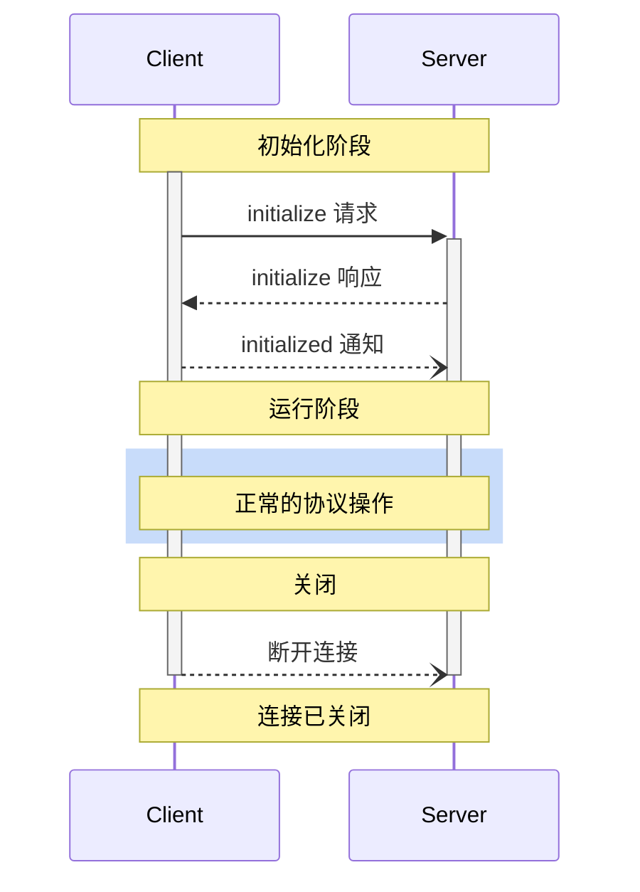

<Info>**协议修订**：2024-11-05</Info>

模型上下文协议（MCP）定义了客户端与服务器之间连接的严格生命周期，以确保正确的能力协商和状态管理。

1. **初始化**：能力协商和协议版本协商
2. **运行**：正常的协议通信
3. **关闭**：连接的优雅终止



## 生命周期阶段

### 初始化

初始化阶段**必须**是客户端与服务器之间的首次交互。在此阶段，客户端和服务器：

- 建立协议版本兼容性
- 交换并协商能力
- 共享实现细节

客户端**必须**通过发送包含以下内容的 `initialize` 请求来启动此阶段：

- 支持的协议版本
- 客户端能力
- 客户端实现信息

```json
{
  "jsonrpc": "2.0",
  "id": 1,
  "method": "initialize",
  "params": {
    "protocolVersion": "2024-11-05",
    "capabilities": {
      "roots": {
        "listChanged": true
      },
      "sampling": {}
    },
    "clientInfo": {
      "name": "ExampleClient",
      "version": "1.0.0"
    }
  }
}
```

服务器**必须**以其自身的能力和信息进行响应：

```json
{
  "jsonrpc": "2.0",
  "id": 1,
  "result": {
    "protocolVersion": "2024-11-05",
    "capabilities": {
      "logging": {},
      "prompts": {
        "listChanged": true
      },
      "resources": {
        "subscribe": true,
        "listChanged": true
      },
      "tools": {
        "listChanged": true
      }
    },
    "serverInfo": {
      "name": "ExampleServer",
      "version": "1.0.0"
    }
  }
}
```

成功初始化后，客户端**必须**发送 `initialized` 通知以表明它已准备好开始正常操作：

```json
{
  "jsonrpc": "2.0",
  "method": "notifications/initialized"
}
```

- 在服务器响应 `initialize` 请求之前，客户端**不应**发送除 [ping](/specification/2024-11-05/basic/utilities/ping) 之外的请求。
- 在接收到 `initialized` 通知之前，服务器**不应**发送除 [ping](/specification/2024-11-05/basic/utilities/ping) 和 [日志](/specification/2024-11-05/server/utilities/logging) 之外的请求。

#### 版本协商

在 `initialize` 请求中，客户端**必须**发送其支持的协议版本。该版本**应该**是客户端支持的**最新**版本。

如果服务器支持请求的协议版本，则**必须**以相同的版本响应；否则，服务器**必须**以它支持的其他协议版本进行响应。该版本**应该**是服务器支持的**最新**版本。

如果客户端不支持服务器响应中的版本，它**应该**断开连接。

#### 能力协商

客户端和服务器的能力定义了会话期间可用的可选协议特性。

关键能力包括：

| 类别   | 能力         | 描述                                                                             |
| ------ | ------------ | -------------------------------------------------------------------------------- |
| 客户端 | `roots`      | 提供文件系统 [根目录](/specification/2024-11-05/client/roots) 的能力             |
| 客户端 | `sampling`   | 支持 LLM [采样](/specification/2024-11-05/client/sampling) 请求                  |
| 客户端 | `experimental` | 描述对非标准实验性功能的支持                                                   |
| 服务器 | `prompts`    | 提供 [提示模板](/specification/2024-11-05/server/prompts)                        |
| 服务器 | `resources`  | 提供可读的 [资源](/specification/2024-11-05/server/resources)                    |
| 服务器 | `tools`      | 暴露可调用的 [工具](/specification/2024-11-05/server/tools)                      |
| 服务器 | `logging`    | 发送结构化的 [日志消息](/specification/2024-11-05/server/utilities/logging)      |
| 服务器 | `experimental` | 描述对非标准实验性功能的支持                                                   |

能力对象可以描述子能力，例如：

- `listChanged`：支持列表变更通知（用于提示、资源和工具）
- `subscribe`：支持订阅单个条目变更（仅资源）

### 运行

在运行阶段，客户端和服务器根据协商的能力交换消息。

双方**应该**：

- 遵守协商的协议版本
- 仅使用成功协商的能力

### 关闭

在关闭阶段，一方（通常是客户端）干净地终止协议连接。没有定义特定的关闭消息——而是使用底层传输机制来表示连接终止：

#### stdio

对于 [stdio 传输](/specification/2024-11-05/basic/transports)，客户端**应该**通过以下方式启动关闭：

1. 首先，关闭子进程（服务器）的输入流
2. 等待服务器退出，或在服务器未在合理时间内退出时发送 `SIGTERM`
3. 如果在发送 `SIGTERM` 后服务器仍未在合理时间内退出，则发送 `SIGKILL`

服务器**可以**通过关闭其输出流给客户端并退出来启动关闭。

#### HTTP

对于 [HTTP 传输](/specification/2024-11-05/basic/transports)，关闭通过关闭相关的 HTTP 连接来表示。

## 错误处理

实现**应该**准备处理以下错误情况：

- 协议版本不匹配
- 无法协商必需的能力
- 初始化请求超时
- 关闭超时

实现**应该**为所有请求实现适当的超时机制，以防止连接挂起和资源耗尽。

示例初始化错误：

```json
{
  "jsonrpc": "2.0",
  "id": 1,
  "error": {
    "code": -32602,
    "message": "不支持的协议版本",
    "data": {
      "supported": ["2024-11-05"],
      "requested": "1.0.0"
    }
  }
}
```