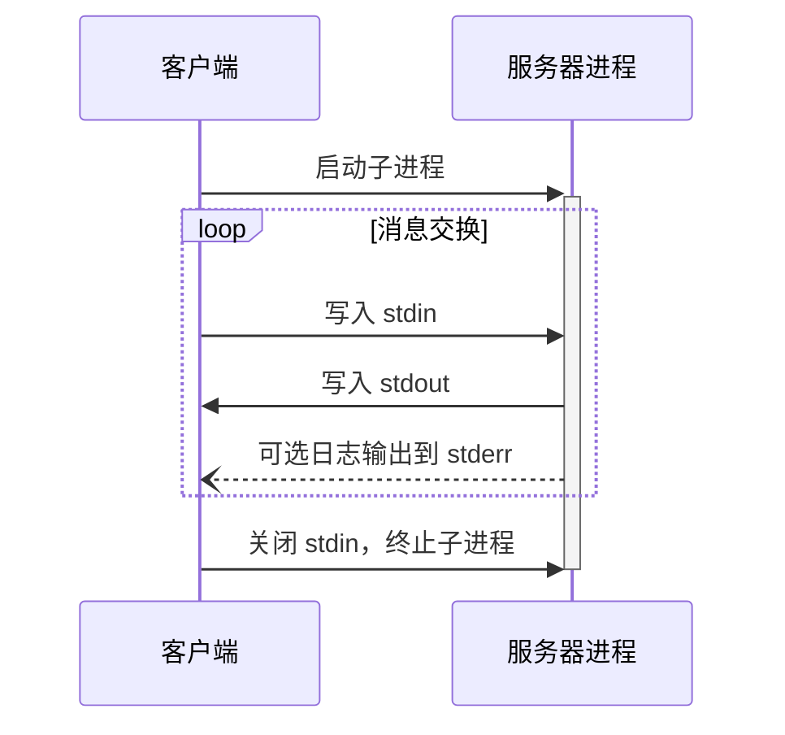
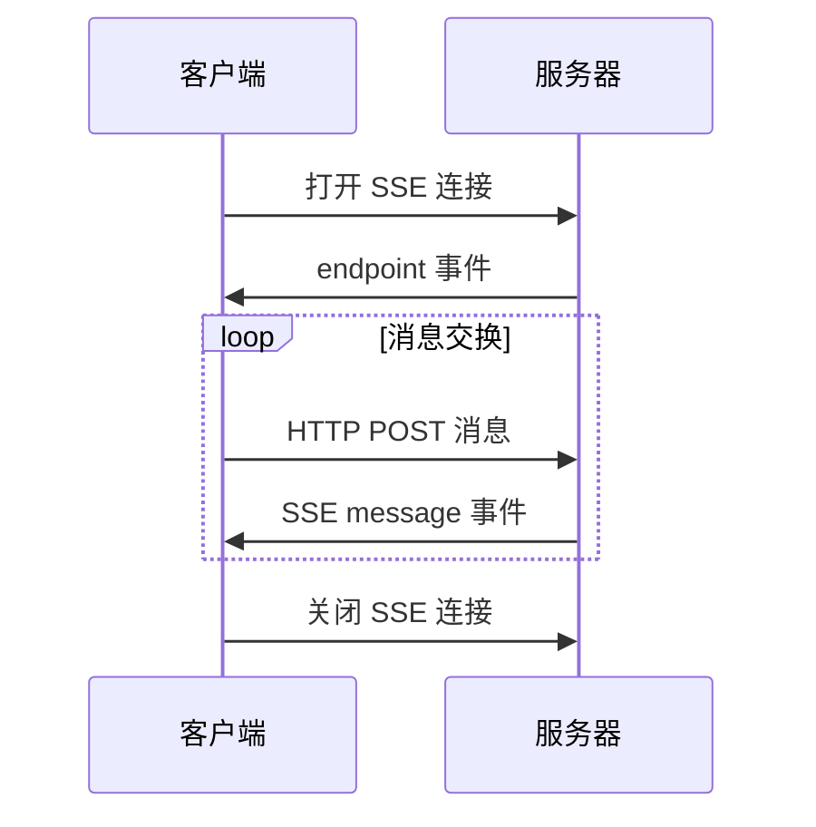

<Info>**协议版本**: 2024-11-05</Info>

MCP 目前定义了两种用于客户端与服务器通信的标准传输机制：

1. [stdio](#stdio)，通过标准输入和标准输出进行通信
2. [带服务端发送事件（SSE）的 HTTP](#http-with-sse)

客户端在可能的情况下**应**优先支持 stdio。

客户端和服务器也可以以可插拔的方式实现 [自定义传输协议](#custom-transports)。

## stdio

在 **stdio** 传输中：

- 客户端以子进程的方式启动 MCP 服务器。
- 服务器在其标准输入（`stdin`）上接收 JSON-RPC 消息，并将其响应写入标准输出（`stdout`）。
- 消息通过换行符分隔，**不得**包含嵌入的换行符。
- 服务器**可以**将 UTF-8 字符串写入标准错误（`stderr`）用于日志记录。客户端**可以**捕获、转发或忽略这些日志。
- 服务器**不得**在 `stdout` 中写入任何非有效的 MCP 消息。
- 客户端**不得**向服务器的 `stdin` 写入任何非有效的 MCP 消息。

## HTTP with SSE

在 **SSE** 传输中，服务器作为一个独立进程运行，能够处理多个客户端连接。

#### 安全警告

实现带 SSE 的 HTTP 传输时：

1. 服务器**必须**验证所有传入连接的 `Origin` 请求头，以防止 DNS 绑定攻击
2. 在本地运行时，服务器**应**仅绑定到本地回环地址（127.0.0.1），而不是所有网络接口（0.0.0.0）
3. 服务器**应**为所有连接实施适当的身份验证机制

如果没有这些保护措施，攻击者可能通过 DNS 绑定从远程网站与本地 MCP 服务器进行交互。

服务器**必须**提供两个端点：

1. 一个 SSE 端点，用于客户端建立连接并从服务器接收消息
2. 一个普通的 HTTP POST 端点，用于客户端向服务器发送消息

当客户端连接时，服务器**必须**发送一个包含客户端用于发送消息 URI 的 `endpoint` 事件。所有后续客户端消息**必须**作为 HTTP POST 请求发送到此端点。

服务器消息作为 SSE 的 `message` 事件发送，事件数据中包含以 JSON 编码的消息内容。

## 自定义传输协议

客户端和服务器**可以**根据其特定需求实现额外的自定义传输机制。该协议与传输方式无关，可以在任何支持双向消息交换的通信通道上实现。

选择支持自定义传输协议的实现者**必须**确保保留 MCP 定义的 JSON-RPC 消息格式和生命周期要求。自定义传输协议**应**记录其特定的连接建立和消息交换模式，以促进互操作性。