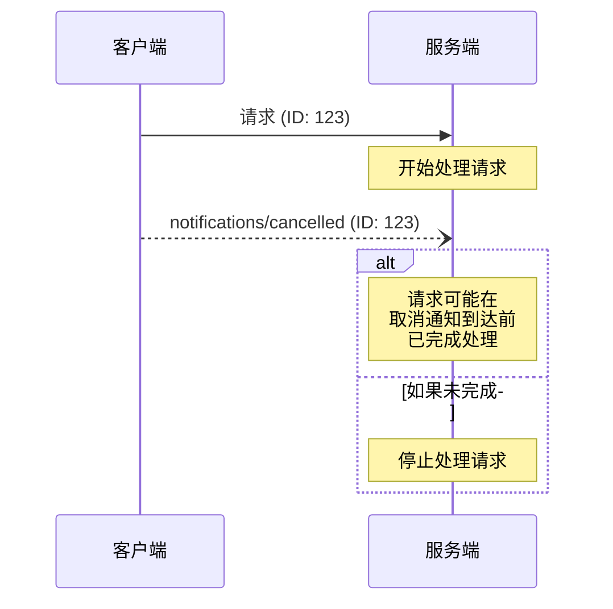

<Info>**协议修订日期**: 2024-11-05</Info>

模型上下文协议（MCP）支持通过通知消息可选地中止进行中的请求。任意一方都可以发送取消通知，以表明之前发出的请求应被终止。

## 取消流程

当某一方希望取消一个进行中的请求时，它将发送一个 `notifications/cancelled` 通知，其中包含：

- 要取消的请求的 ID
- 一个可选的描述字符串，可用于记录日志或显示

```json
{
  "jsonrpc": "2.0",
  "method": "notifications/cancelled",
  "params": {
    "requestId": "123",
    "reason": "用户请求取消"
  }
}
```

## 行为要求

1. 取消通知**只能引用**以下请求：
   - 之前在同一方向上发出的请求
   - 当前被认为仍在进行中的请求
2. 客户端**不得**取消 `initialize` 请求
3. 接收到取消通知的一方**应该**：
   - 停止处理被取消的请求
   - 释放相关资源
   - 不再为被取消的请求发送响应
4. 接收方**可以忽略**以下情况的取消通知：
   - 请求 ID 未知
   - 请求处理已经完成
   - 请求无法被取消
5. 发送取消通知的一方**应该**忽略之后收到的该请求的响应

## 时序考虑

由于网络延迟，取消通知可能在请求处理完成后才到达，甚至可能在响应已经发送之后才到达。

双方**必须**优雅地处理这些竞态条件：



## 实现建议

- 双方**应该**记录取消原因以供调试
- 应用界面**应该**在请求被取消时作出相应提示

## 错误处理

对于无效的取消通知，**应该忽略**：

- 未知的请求 ID
- 已完成的请求
- 格式错误的通知

这保持了通知“发送即忘”的特性，同时允许异步通信中存在竞态条件。