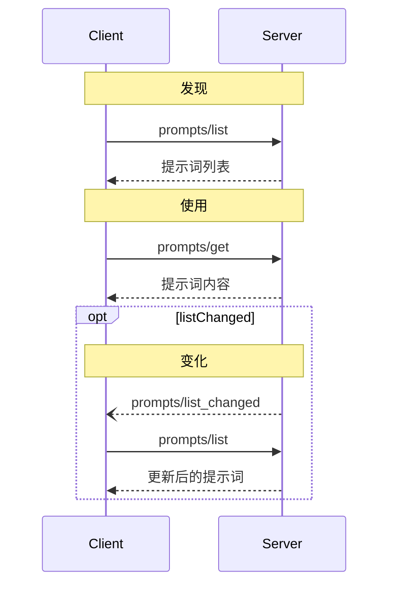

<Info>**协议修订**：2024-11-05</Info>

模型上下文协议（MCP）提供了一种标准化方式，允许服务器向客户端暴露提示词模板。提示词允许服务器提供结构化的消息和与语言模型交互的指令。客户端可以发现可用的提示词、检索其内容，并提供参数以自定义提示词。

## 用户交互模型

提示词的设计是**由用户控制的**，这意味着它们从服务器暴露给客户端，目的是让用户能够显式选择并使用它们。

通常，提示词会通过用户界面中的用户发起的命令触发，这允许用户自然地发现并调用可用的提示词。

例如，作为斜杠命令：


然而，实现者可以自由地通过任何适合其需求的界面模式暴露提示词——协议本身不强制要求任何特定的用户交互模型。

## 功能能力

支持提示词的服务器**必须**在[初始化](/specification/2024-11-05/basic/lifecycle#initialization)期间声明 `prompts` 能力：

```json
{
  "capabilities": {
    "prompts": {
      "listChanged": true
    }
  }
}
```

`listChanged` 表示服务器是否会在可用提示词列表发生变化时发送通知。

## 协议消息

### 列出提示词

要获取可用的提示词，客户端发送 `prompts/list` 请求。此操作支持[分页](/specification/2024-11-05/server/utilities/pagination)。

**请求：**

```json
{
  "jsonrpc": "2.0",
  "id": 1,
  "method": "prompts/list",
  "params": {
    "cursor": "可选的游标值"
  }
}
```

**响应：**

```json
{
  "jsonrpc": "2.0",
  "id": 1,
  "result": {
    "prompts": [
      {
        "name": "code_review",
        "description": "请求LLM分析代码质量并提出改进建议",
        "arguments": [
          {
            "name": "code",
            "description": "要审查的代码",
            "required": true
          }
        ]
      }
    ],
    "nextCursor": "下一页游标"
  }
}
```

### 获取提示词

要获取特定提示词，客户端发送 `prompts/get` 请求。参数可以通过[补全API](/specification/2024-11-05/server/utilities/completion)自动补全。

**请求：**

```json
{
  "jsonrpc": "2.0",
  "id": 2,
  "method": "prompts/get",
  "params": {
    "name": "code_review",
    "arguments": {
      "code": "def hello():\n    print('world')"
    }
  }
}
```

**响应：**

```json
{
  "jsonrpc": "2.0",
  "id": 2,
  "result": {
    "description": "代码审查提示词",
    "messages": [
      {
        "role": "user",
        "content": {
          "type": "text",
          "text": "请审查以下Python代码:\ndef hello():\n    print('world')"
        }
      }
    ]
  }
}
```

### 提示词列表变化通知

当可用提示词列表发生变化时，声明了 `listChanged` 能力的服务器**应该**发送通知：

```json
{
  "jsonrpc": "2.0",
  "method": "notifications/prompts/list_changed"
}
```

## 消息流程



## 数据类型

### 提示词（Prompt）

一个提示词定义包含：

- `name`：提示词的唯一标识符
- `description`：可选的、人类可读的描述
- `arguments`：可选的、用于自定义的参数列表

### 提示词消息（PromptMessage）

提示词中的消息可以包含：

- `role`：表示说话者，为 "user" 或 "assistant"
- `content`：以下内容类型之一：

#### 文本内容

文本内容表示纯文本消息：

```json
{
  "type": "text",
  "text": "消息的文本内容"
}
```

这是用于自然语言交互的最常见内容类型。

#### 图像内容

图像内容允许在消息中包含视觉信息：

```json
{
  "type": "image",
  "data": "base64编码的图像数据",
  "mimeType": "image/png"
}
```

图像数据**必须**为base64编码，并包含有效的MIME类型。这使得在需要视觉上下文的多模态交互中成为可能。

#### 嵌入式资源

嵌入式资源允许在消息中直接引用服务器端资源：

```json
{
  "type": "resource",
  "resource": {
    "uri": "resource://example",
    "mimeType": "text/plain",
    "text": "资源内容"
  }
}
```

资源可以包含文本或二进制（blob）数据，并且**必须**包括：

- 有效的资源URI
- 合适的MIME类型
- 文本内容或base64编码的blob数据

嵌入式资源使得提示词能够无缝地将服务器管理的内容（如文档、代码示例或其他参考资料）直接整合到对话流程中。

## 错误处理

服务器**应该**对常见失败情况返回标准的JSON-RPC错误：

- 无效的提示词名称：`-32602`（参数无效）
- 缺少必需的参数：`-32602`（参数无效）
- 内部错误：`-32603`（内部错误）

## 实现注意事项

1. 服务器**应该**在处理提示词参数前进行验证
2. 客户端**应该**处理大量提示词列表的分页
3. 双方**应该**遵守能力协商

## 安全性

实现**必须**仔细验证所有提示词输入和输出，以防止注入攻击或对资源的未授权访问。