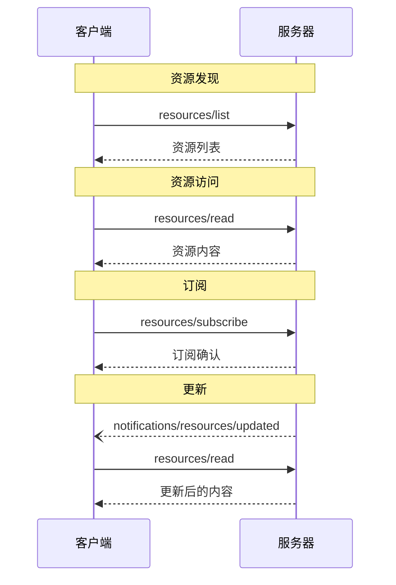

<Info>**协议修订**：2024-11-05</Info>

模型上下文协议（MCP）提供了一种标准化方式，允许服务器向客户端暴露资源。资源允许服务器共享为语言模型提供上下文的数据，例如文件、数据库结构或应用特定信息。每个资源都通过一个 [URI](https://datatracker.ietf.org/doc/html/rfc3986) 唯一标识。

## 用户交互模型

MCP 中的资源设计为**应用驱动**，由宿主应用根据其需求决定如何整合上下文。

例如，应用可以：

- 通过 UI 元素（如树状或列表视图）显式选择资源
- 允许用户搜索并过滤可用资源
- 基于启发式算法或 AI 模型的选择自动包含上下文


不过，实现可以自由选择适合其需求的任何界面模式来暴露资源——协议本身不强制任何特定的用户交互模型。

## 功能能力

支持资源的服务器**必须**声明 `resources` 能力：

```json
{
  "capabilities": {
    "resources": {
      "subscribe": true,
      "listChanged": true
    }
  }
}
```

该能力支持两个可选功能：

- `subscribe`：客户端是否可以订阅单个资源的变更通知。
- `listChanged`：当可用资源列表发生变化时，服务器是否发送通知。

`subscribe` 和 `listChanged` 都是可选的——服务器可以支持两者之一、两者都支持，或都不支持：

```json
{
  "capabilities": {
    "resources": {} // 不支持任何功能
  }
}
```

```json
{
  "capabilities": {
    "resources": {
      "subscribe": true // 仅支持订阅
    }
  }
}
```

```json
{
  "capabilities": {
    "resources": {
      "listChanged": true // 仅支持列表变更通知
    }
  }
}
```

## 协议消息

### 列出资源

客户端通过发送 `resources/list` 请求来发现可用资源。此操作支持[分页](/specification/2024-11-05/server/utilities/pagination)。

**请求：**

```json
{
  "jsonrpc": "2.0",
  "id": 1,
  "method": "resources/list",
  "params": {
    "cursor": "可选的游标值"
  }
}
```

**响应：**

```json
{
  "jsonrpc": "2.0",
  "id": 1,
  "result": {
    "resources": [
      {
        "uri": "file:///project/src/main.rs",
        "name": "main.rs",
        "description": "主程序入口点",
        "mimeType": "text/x-rust"
      }
    ],
    "nextCursor": "下一页游标"
  }
}
```

### 读取资源

客户端通过发送 `resources/read` 请求来获取资源内容：

**请求：**

```json
{
  "jsonrpc": "2.0",
  "id": 2,
  "method": "resources/read",
  "params": {
    "uri": "file:///project/src/main.rs"
  }
}
```

**响应：**

```json
{
  "jsonrpc": "2.0",
  "id": 2,
  "result": {
    "contents": [
      {
        "uri": "file:///project/src/main.rs",
        "mimeType": "text/x-rust",
        "text": "fn main() {\n    println!(\"Hello world!\");\n}"
      }
    ]
  }
}
```

### 资源模板

资源模板允许服务器使用 [URI 模板](https://datatracker.ietf.org/doc/html/rfc6570) 暴露参数化资源。参数可以通过 [补全 API](/specification/2024-11-05/server/utilities/completion) 自动补全。

**请求：**

```json
{
  "jsonrpc": "2.0",
  "id": 3,
  "method": "resources/templates/list"
}
```

**响应：**

```json
{
  "jsonrpc": "2.0",
  "id": 3,
  "result": {
    "resourceTemplates": [
      {
        "uriTemplate": "file:///{path}",
        "name": "项目文件",
        "description": "访问项目目录中的文件",
        "mimeType": "application/octet-stream"
      }
    ]
  }
}
```

### 列表变更通知

当可用资源列表发生变化时，声明了 `listChanged` 能力的服务器**应该**发送通知：

```json
{
  "jsonrpc": "2.0",
  "method": "notifications/resources/list_changed"
}
```

### 订阅

协议支持可选的资源变更订阅。客户端可以订阅特定资源，并在资源变更时接收通知：

**订阅请求：**

```json
{
  "jsonrpc": "2.0",
  "id": 4,
  "method": "resources/subscribe",
  "params": {
    "uri": "file:///project/src/main.rs"
  }
}
```

**更新通知：**

```json
{
  "jsonrpc": "2.0",
  "method": "notifications/resources/updated",
  "params": {
    "uri": "file:///project/src/main.rs"
  }
}
```

## 消息流程



## 数据类型

### 资源

资源定义包括：

- `uri`：资源的唯一标识
- `name`：人类可读的名称
- `description`：可选描述
- `mimeType`：可选的 MIME 类型

### 资源内容

资源可以包含文本或二进制数据：

#### 文本内容

```json
{
  "uri": "file:///example.txt",
  "mimeType": "text/plain",
  "text": "资源内容"
}
```

#### 二进制内容

```json
{
  "uri": "file:///example.png",
  "mimeType": "image/png",
  "blob": "base64-encoded-data"
}
```

## 常见 URI 协议

协议定义了若干标准 URI 协议。此列表**不完整**——实现可以自由使用其他自定义 URI 协议。

### https://

用于表示网络上的资源。

服务器**应该**仅在客户端能够自行从网络上直接获取和加载资源时才使用此协议——即客户端不需要通过 MCP 服务器读取该资源。

对于其他用例，服务器**应该**优先使用其他 URI 协议，或定义自定义协议，即使服务器本身将通过互联网下载资源内容。

### file://

用于标识行为类似文件系统的资源，但资源不需要映射到实际的物理文件系统。

MCP 服务器**可以**使用 [XDG MIME 类型](https://specifications.freedesktop.org/shared-mime-info-spec/0.14/ar01s02.html#id-1.3.14)（如 `inode/directory`）来标识非普通文件（如目录）资源，这些资源没有标准 MIME 类型。

### git://

Git 版本控制集成。

## 错误处理

服务器**应该**为常见失败情况返回标准 JSON-RPC 错误：

- 资源未找到：`-32002`
- 内部错误：`-32603`

示例错误：

```json
{
  "jsonrpc": "2.0",
  "id": 5,
  "error": {
    "code": -32002,
    "message": "资源未找到",
    "data": {
      "uri": "file:///nonexistent.txt"
    }
  }
}
```

## 安全考虑

1. 服务器**必须**验证所有资源 URI
2. 对敏感资源**应该**实施访问控制
3. 二进制数据**必须**正确编码
4. 在执行操作前**应该**检查资源权限