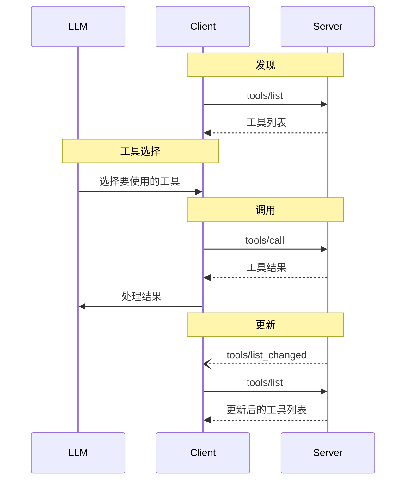

<Info>**协议修订**：2024-11-05</Info>

模型上下文协议（MCP）允许服务器暴露可以被语言模型调用的工具。这些工具使模型能够与外部系统交互，例如查询数据库、调用 API 或执行计算。每个工具由一个唯一名称标识，并包含描述其模式的元数据。

## 用户交互模型

MCP 中的工具设计为由**模型控制**，这意味着语言模型可以根据其上下文理解和用户的提示自动发现并调用工具。

然而，实现可以自由地通过任何适合其需求的接口模式暴露工具——协议本身不强制任何特定的用户交互模型。

<Warning>

出于信任、安全和隐私的考虑，**始终**应该有一个人在调用工具的流程中，具备拒绝调用的能力。

应用程序**应该**：

- 提供明确显示哪些工具暴露给 AI 模型的用户界面
- 在调用工具时插入清晰的视觉指示
- 在执行操作时向用户显示确认提示，以确保人在流程中

</Warning>

## 功能

支持工具的服务器**必须**声明 `tools` 能力：

```json
{
  "capabilities": {
    "tools": {
      "listChanged": true
    }
  }
}
```

`listChanged` 表示当可用工具列表发生变化时，服务器是否会发送通知。

## 协议消息

### 列出工具

要发现可用工具，客户端发送 `tools/list` 请求。该操作支持[分页](/specification/2024-11-05/server/utilities/pagination)。

**请求：**

```json
{
  "jsonrpc": "2.0",
  "id": 1,
  "method": "tools/list",
  "params": {
    "cursor": "可选的游标值"
  }
}
```

**响应：**

```json
{
  "jsonrpc": "2.0",
  "id": 1,
  "result": {
    "tools": [
      {
        "name": "get_weather",
        "description": "获取某个地点的当前天气信息",
        "inputSchema": {
          "type": "object",
          "properties": {
            "location": {
              "type": "string",
              "description": "城市名称或邮编"
            }
          },
          "required": ["location"]
        }
      }
    ],
    "nextCursor": "下一页游标"
  }
}
```

### 调用工具

要调用工具，客户端发送 `tools/call` 请求：

**请求：**

```json
{
  "jsonrpc": "2.0",
  "id": 2,
  "method": "tools/call",
  "params": {
    "name": "get_weather",
    "arguments": {
      "location": "纽约"
    }
  }
}
```

**响应：**

```json
{
  "jsonrpc": "2.0",
  "id": 2,
  "result": {
    "content": [
      {
        "type": "text",
        "text": "纽约当前天气：\n温度：72°F\n天气状况：多云"
      }
    ],
    "isError": false
  }
}
```

### 工具列表变更通知

当可用工具列表发生变化时，声明了 `listChanged` 能力的服务器**应该**发送通知：

```json
{
  "jsonrpc": "2.0",
  "method": "notifications/tools/list_changed"
}
```

## 消息流程



## 数据类型

### 工具（Tool）

一个工具定义包括：

- `name`：工具的唯一标识符
- `description`：功能的可读性描述
- `inputSchema`：定义预期参数的 JSON Schema

### 工具结果（Tool Result）

工具结果可以包含多个不同类型的内容项：

#### 文本内容

```json
{
  "type": "text",
  "text": "工具结果文本"
}
```

#### 图像内容

```json
{
  "type": "image",
  "data": "base64编码的数据",
  "mimeType": "image/png"
}
```

#### 嵌入式资源

[资源](/specification/2024-11-05/server/resources) **可以**嵌入，以提供额外的上下文或数据，通过客户端稍后可以订阅或再次获取的 URI：

```json
{
  "type": "resource",
  "resource": {
    "uri": "resource://example",
    "mimeType": "text/plain",
    "text": "资源内容"
  }
}
```

## 错误处理

工具使用两种错误报告机制：

1. **协议错误**：标准的 JSON-RPC 错误，用于以下问题：
   - 未知工具
   - 参数无效
   - 服务器错误

2. **工具执行错误**：在工具结果中使用 `isError: true` 报告：
   - API 调用失败
   - 输入数据无效
   - 业务逻辑错误

示例协议错误：

```json
{
  "jsonrpc": "2.0",
  "id": 3,
  "error": {
    "code": -32602,
    "message": "未知工具：invalid_tool_name"
  }
}
```

示例工具执行错误：

```json
{
  "jsonrpc": "2.0",
  "id": 4,
  "result": {
    "content": [
      {
        "type": "text",
        "text": "无法获取天气数据：API 调用频率超出限制"
      }
    ],
    "isError": true
  }
}
```

## 安全考虑

1. 服务器**必须**：
   - 验证所有工具输入
   - 实现适当的访问控制
   - 对工具调用进行速率限制
   - 对工具输出进行清理

2. 客户端**应该**：
   - 对敏感操作提示用户确认
   - 在调用服务器前向用户显示工具输入，以防止恶意或意外的数据泄露
   - 在传递给 LLM 前验证工具结果
   - 为工具调用实现超时机制
   - 记录工具使用情况以便审计