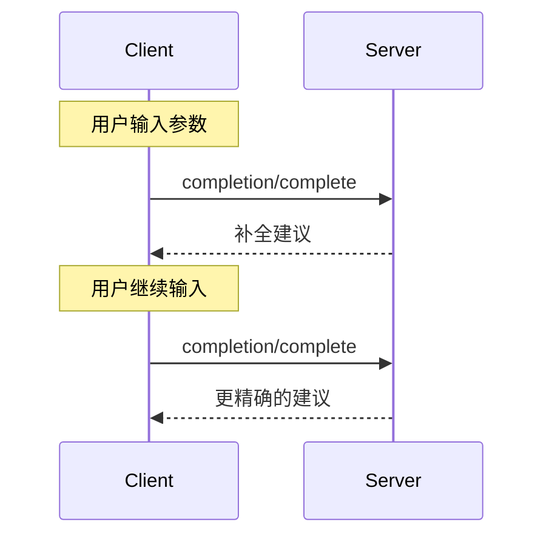

<Info>**协议修订**: 2024-11-05</Info>

模型上下文协议（MCP）提供了一种标准化方式，使服务器能够为提示词和资源URI提供参数自动补全建议。这使得可以实现类似IDE的丰富交互体验，用户在输入参数值时能够获得上下文相关的建议。

## 用户交互模型

MCP中的补全功能旨在支持类似IDE代码补全的交互式用户体验。

例如，应用程序可以在用户输入时通过下拉菜单或弹出窗口显示补全建议，并具备过滤和选择可用选项的能力。

然而，实现方可以自由选择适合其需求的任何界面模式来暴露补全功能——协议本身不强制规定任何特定的用户交互模型。

## 协议消息

### 请求补全

要获取补全建议，客户端发送一个`completion/complete`请求，通过引用类型指定正在补全的内容：

**请求：**

```json
{
  "jsonrpc": "2.0",
  "id": 1,
  "method": "completion/complete",
  "params": {
    "ref": {
      "type": "ref/prompt",
      "name": "code_review"
    },
    "argument": {
      "name": "language",
      "value": "py"
    }
  }
}
```

**响应：**

```json
{
  "jsonrpc": "2.0",
  "id": 1,
  "result": {
    "completion": {
      "values": ["python", "pytorch", "pyside"],
      "total": 10,
      "hasMore": true
    }
  }
}
```

### 引用类型

协议支持两种类型的补全引用：

| 类型           | 描述                 | 示例                                             |
| -------------- | --------------------------- | --------------------------------------------------- |
| `ref/prompt`   | 按名称引用提示词 | `{"type": "ref/prompt", "name": "code_review"}`     |
| `ref/resource` | 引用资源URI   | `{"type": "ref/resource", "uri": "file:///{path}"}` |

### 补全结果

服务器返回一个按相关性排序的补全值数组，包含：

- 每次响应最多100项
- 可选的匹配总数
- 表示是否存在更多结果的布尔值

## 消息流程



## 数据类型

### CompleteRequest

- `ref`: 一个 `PromptReference` 或 `ResourceReference`
- `argument`: 包含以下字段的对象：
  - `name`: 参数名
  - `value`: 当前值

### CompleteResult

- `completion`: 包含以下字段的对象：
  - `values`: 建议数组（最多100项）
  - `total`: 可选的匹配总数
  - `hasMore`: 表示是否有更多结果的标志

## 实现考虑

1. 服务器 **应该**：
   - 返回按相关性排序的建议
   - 在适当的情况下实现模糊匹配
   - 对补全请求进行速率限制
   - 验证所有输入

2. 客户端 **应该**：
   - 对快速连续的补全请求进行防抖处理
   - 在适当情况下缓存补全结果
   - 优雅地处理缺失或部分结果

## 安全性

实现方 **必须**：

- 验证所有补全输入
- 实现适当的速率限制
- 控制对敏感建议的访问
- 防止基于补全的信息泄露