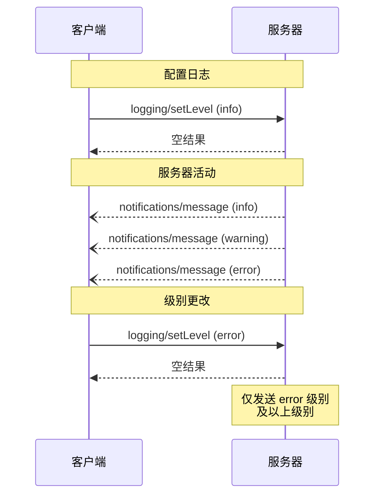

<Info>**协议修订**：2024-11-05</Info>

Model Context Protocol (MCP) 提供了一种标准化的方式，使服务器可以向客户端发送结构化的日志消息。客户端可以通过设置最低日志级别来控制日志的详细程度，服务器发送的通知中将包含严重级别、可选的记录器名称以及任意可序列化为 JSON 的数据。

## 用户交互模型

实现方可以自由选择适合其需求的任何接口模式来暴露日志功能——协议本身不强制要求任何特定的用户交互模型。

## 功能能力

发送日志消息通知的服务器 **必须** 声明 `logging` 功能：

```json
{
  "capabilities": {
    "logging": {}
  }
}
```

## 日志级别

该协议遵循 [RFC 5424](https://datatracker.ietf.org/doc/html/rfc5424#section-6.2.1) 中指定的标准 syslog 严重级别：

| 级别      | 描述                             | 示例使用场景             |
| --------- | ---------------------------------- | ------------------------ |
| debug     | 详细的调试信息                    | 函数进入/退出点          |
| info      | 一般性信息消息                    | 操作进度更新             |
| notice    | 正常但重要的事件                  | 配置更改                 |
| warning   | 警告条件                          | 弃用功能的使用           |
| error     | 错误条件                          | 操作失败                 |
| critical  | 严重条件                          | 系统组件故障             |
| alert     | 必须立即采取行动                  | 检测到数据损坏           |
| emergency | 系统无法使用                      | 完全系统故障             |

## 协议消息

### 设置日志级别

要配置最低日志级别，客户端 **可以** 发送 `logging/setLevel` 请求：

**请求：**

```json
{
  "jsonrpc": "2.0",
  "id": 1,
  "method": "logging/setLevel",
  "params": {
    "level": "info"
  }
}
```

### 日志消息通知

服务器使用 `notifications/message` 通知发送日志消息：

```json
{
  "jsonrpc": "2.0",
  "method": "notifications/message",
  "params": {
    "level": "error",
    "logger": "数据库",
    "data": {
      "错误": "连接失败",
      "详细信息": {
        "主机": "localhost",
        "端口": 5432
      }
    }
  }
}
```

## 消息流程



## 错误处理

服务器 **应该** 为常见的失败情况返回标准的 JSON-RPC 错误：

- 无效的日志级别：`-32602`（参数无效）
- 配置错误：`-32603`（内部错误）

## 实现考虑

1. 服务器 **应该**：
   - 对日志消息进行速率限制
   - 在 data 字段中包含相关上下文
   - 使用一致的记录器名称
   - 移除敏感信息

2. 客户端 **可以**：
   - 在 UI 中显示日志消息
   - 实现日志过滤/搜索
   - 以视觉方式显示严重级别
   - 持久化日志消息

## 安全性

1. 日志消息 **不得** 包含：
   - 凭据或密钥
   - 个人身份信息
   - 可能帮助攻击者的内部系统细节

2. 实现 **应该**：
   - 对消息进行速率限制
   - 验证所有数据字段
   - 控制日志访问
   - 监控敏感内容