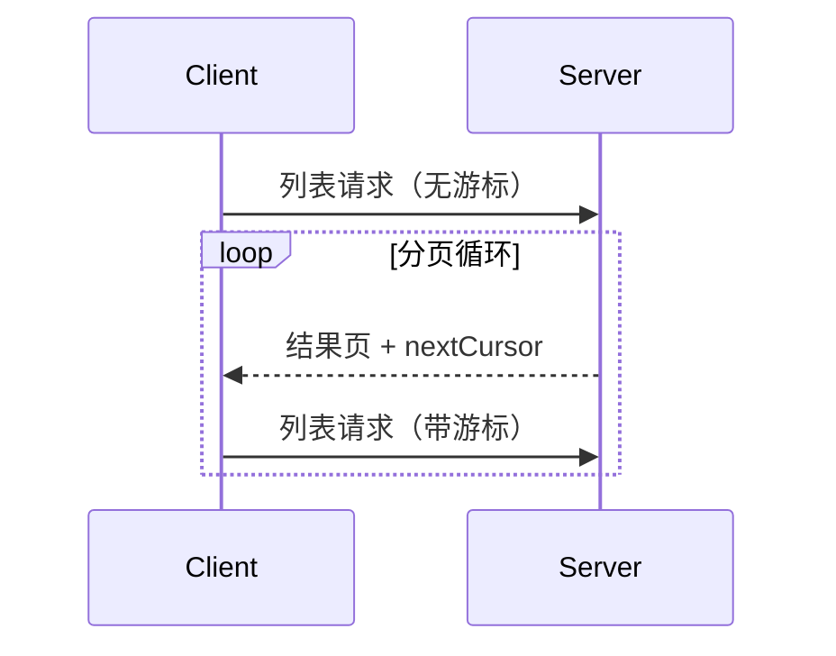

<Info>**协议修订**：2024-11-05</Info>

模型上下文协议（MCP）支持对可能返回大量结果集的列表操作进行分页。分页允许服务器将结果分成较小的块返回，而不是一次性全部返回。

当通过互联网连接到外部服务时，分页尤其重要。但即使在本地集成中，分页也非常有用，可以避免处理大型数据集时的性能问题。

## 分页模型

MCP 的分页使用基于不透明游标的机制，而不是使用编号页码。

- **游标（cursor）** 是一个不透明的字符串令牌，表示结果集中的某个位置
- **页面大小（page size）** 由服务器决定，客户端**不得**假设页面大小是固定的

## 响应格式

当服务器发送包含以下内容的**响应**时，分页开始：

- 当前页的结果
- 如果存在更多结果，则包含一个可选的 `nextCursor` 字段

```json
{
  "jsonrpc": "2.0",
  "id": "123",
  "result": {
    "resources": [...],
    "nextCursor": "eyJwYWdlIjogM30="
  }
}
```

## 请求格式

收到游标后，客户端可以通过发送包含该游标的请求来继续分页：

```json
{
  "jsonrpc": "2.0",
  "method": "resources/list",
  "params": {
    "cursor": "eyJwYWdlIjogMn0="
  }
}
```

## 分页流程



## 支持分页的操作

以下 MCP 操作支持分页：

- `resources/list` - 列出可用资源
- `resources/templates/list` - 列出资源模板
- `prompts/list` - 列出可用提示
- `tools/list` - 列出可用工具

## 实现指南

1. 服务器**应该**：
   - 提供稳定的游标
   - 优雅地处理无效的游标

2. 客户端**应该**：
   - 将缺失的 `nextCursor` 视为结果结束
   - 支持分页和非分页流程

3. 客户端**必须**将游标视为不透明令牌：
   - 不要假设游标的格式
   - 不要尝试解析或修改游标
   - 不要在会话之间持久化游标

## 错误处理

无效的游标**应该**返回错误码 -32602（参数无效）。