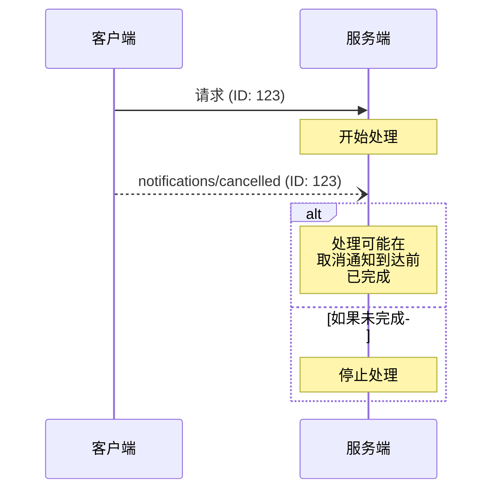

<Info>**协议修订版本**: 2025-03-26</Info>

模型上下文协议（MCP）通过通知消息支持对进行中的请求进行可选的取消操作。通信的任意一方都可以发送取消通知，以表明某个先前发出的请求应当被终止。

## 取消流程

当一方希望取消一个进行中的请求时，它将发送一个 `notifications/cancelled` 通知，其中包含：

- 要取消的请求的ID
- 一个可选的原因字符串，可用于记录日志或显示

```json
{
  "jsonrpc": "2.0",
  "method": "notifications/cancelled",
  "params": {
    "requestId": "123",
    "reason": "用户请求取消"
  }
}
```

## 行为要求

1. 取消通知 **必须** 仅引用以下请求：
   - 在同一方向上先前已发出的请求
   - 当前认为仍在进行中的请求
2. `initialize` 请求 **不得** 被客户端取消
3. 取消通知的接收方 **应该**：
   - 停止处理被取消的请求
   - 释放相关资源
   - 不再为被取消的请求发送响应
4. 接收方 **可以** 忽略取消通知，如果：
   - 所引用的请求未知
   - 处理已经完成
   - 该请求无法被取消
5. 取消通知的发送方 **应该** 忽略在那之后到达的、对该请求的任何响应

## 时序考虑

由于网络延迟，取消通知可能会在请求处理完成之后到达，甚至可能在响应已经发送之后到达。

通信双方 **必须** 优雅地处理这些竞争情况：



## 实现注意事项

- 通信双方 **应该** 记录取消原因以便调试
- 应用程序的用户界面 **应该** 在请求取消时给出提示

## 错误处理

无效的取消通知 **应该** 被忽略：

- 未知的请求ID
- 已完成的请求
- 格式错误的通知

这保持了通知“发送即忘（fire and forget）”的特性，同时允许在异步通信中处理竞争条件。