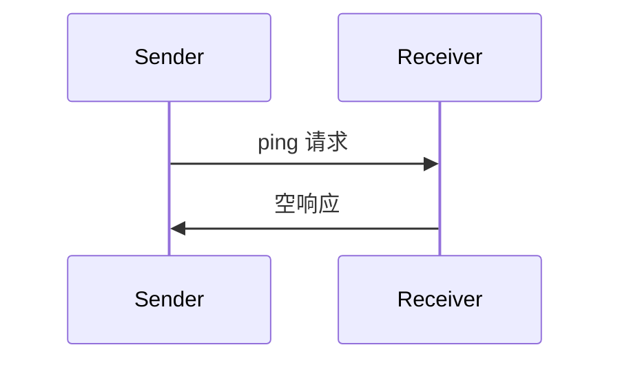

<Info>**协议版本**：2025-03-26</Info>

模型上下文协议包含一个可选的 ping 机制，允许通信双方验证对方是否仍然有响应，并且连接仍然有效。

## 概述

Ping 功能通过一个简单的请求/响应模式实现。客户端或服务器都可以通过发送 `ping` 请求来发起 ping 操作。

## 消息格式

一个 ping 请求是一个没有参数的标准 JSON-RPC 请求：

```json
{
  "jsonrpc": "2.0",
  "id": "123",
  "method": "ping"
}
```

## 行为要求

1. 接收方 **必须** 立即响应一个空响应：

```json
{
  "jsonrpc": "2.0",
  "id": "123",
  "result": {}
}
```

2. 如果在合理的超时时间内未收到响应，发送方 **可以**：
   - 认为连接已失效
   - 终止连接
   - 尝试重新连接流程

## 使用模式



## 实现注意事项

- 实现 **应该** 定期发送 ping 请求以检测连接状态
- ping 的频率 **应该** 可配置
- 超时时间 **应该** 根据网络环境合理设置
- 应 **避免** 过度的 ping 操作以减少网络开销

## 错误处理

- 超时 **应该** 被视为连接失败
- 多次 ping 失败 **可以** 触发连接重置
- 实现 **应该** 记录 ping 失败用于诊断分析