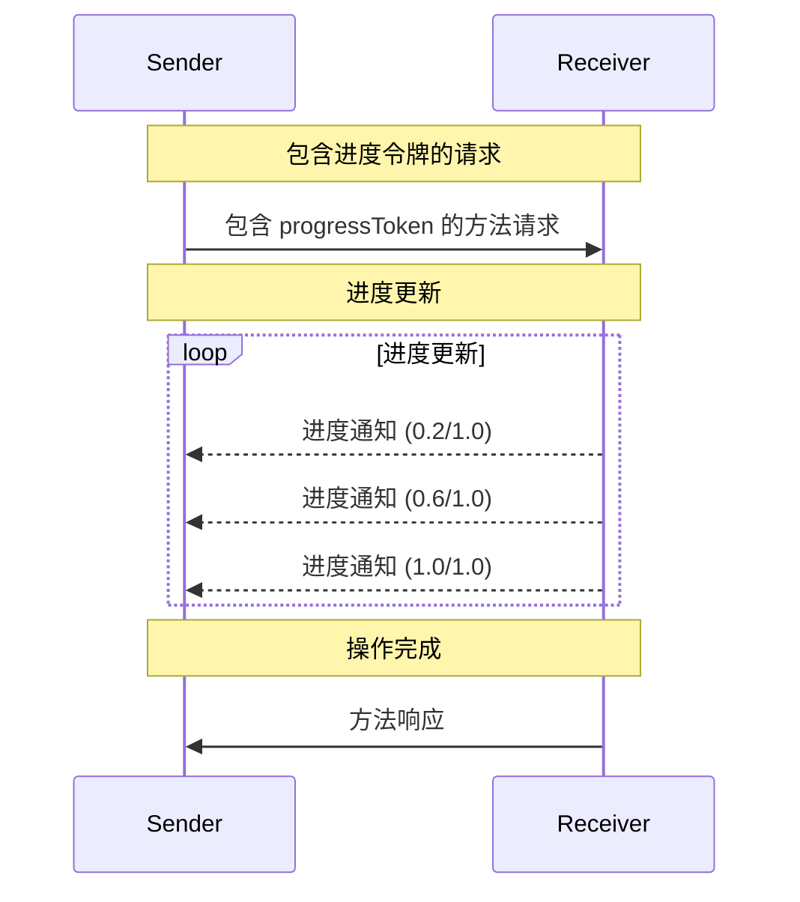

<Info>**协议修订版本**: 2025-03-26</Info>

Model Context Protocol (MCP) 支持通过通知消息对长时间运行的操作进行可选的进度跟踪。任意一方都可以发送进度通知以提供操作状态的更新。

## 进度跟踪流程

当一方希望为某个请求接收进度更新时，它会在请求的元数据中包含一个 `progressToken`。

- 进度令牌 **必须** 是字符串或整数类型
- 进度令牌可以由发送方任意选择，但 **必须** 在所有活跃请求中保持唯一

```json
{
  "jsonrpc": "2.0",
  "id": 1,
  "method": "some_method",
  "params": {
    "_meta": {
      "progressToken": "abc123"
    }
  }
}
```

接收方随后 **可以** 发送包含以下内容的进度通知：

- 原始的进度令牌
- 当前的进度值
- 可选的 "total"（总量）值
- 可选的 "message"（消息）值

```json
{
  "jsonrpc": "2.0",
  "method": "notifications/progress",
  "params": {
    "progressToken": "abc123",
    "progress": 50,
    "total": 100,
    "message": "正在调整曲线..."
  }
}
```

- 每次通知中的 `progress` 值 **必须** 递增，即使总量未知也是如此。
- `progress` 和 `total` 值 **可以** 是浮点数。
- `message` 字段 **应该** 提供相关的人类可读的进度信息。

## 行为要求

1. 进度通知 **必须仅** 引用以下令牌：
   - 在活跃请求中提供的令牌
   - 与正在进行的操作相关联的令牌

2. 进度请求的接收方 **可以**：
   - 选择不发送任何进度通知
   - 按照其认为合适的频率发送通知
   - 在未知总量时省略 `total` 值



## 实现注意事项

- 发送方和接收方 **应该** 跟踪当前活跃的进度令牌
- 双方 **应该** 实现速率限制以防止消息泛洪
- 完成后 **必须** 停止发送进度通知