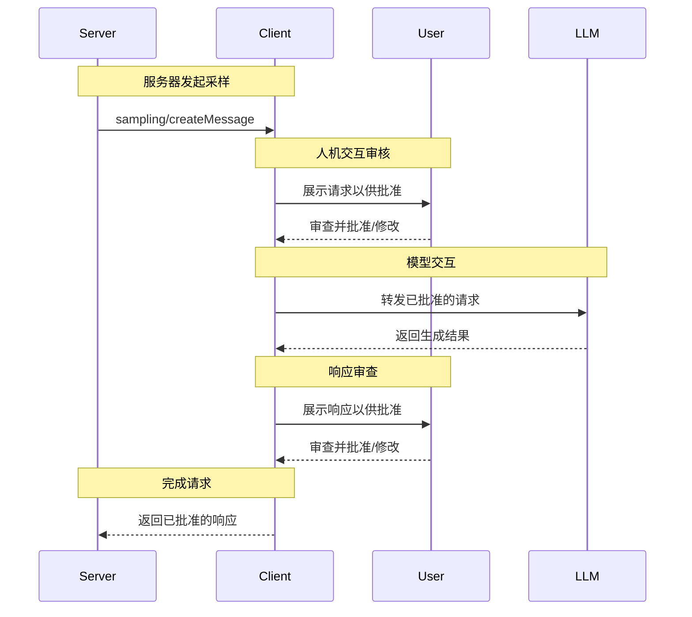

<Info>**协议版本**: 2025-03-26</Info>

模型上下文协议（MCP）为服务器通过客户端请求语言模型的采样（“补全”或“生成”）提供了一种标准化的方式。该流程允许客户端保持对模型访问、选择和权限的控制，同时使服务器能够利用AI能力——无需服务器API密钥。
服务器可以请求文本、音频或图像交互，并可选择性地在其提示中包含来自MCP服务器的上下文。

## 用户交互模型

MCP中的采样允许服务器实现代理行为，通过在其他MCP服务器功能内部嵌套LLM调用。

实现可以自由地通过任何适合其需求的接口模式暴露采样功能——协议本身不规定任何特定的用户交互模型。

<Warning>

出于信任与安全以及安全性的考虑，**必须**始终有能够拒绝采样请求的人参与其中。

应用程序**应该**：

- 提供易于直观地审查采样请求的UI
- 允许用户在发送前查看和编辑提示
- 在交付前展示生成的响应以供审查

</Warning>

## 功能

支持采样的客户端**必须**在[初始化](/specification/2025-03-26/basic/lifecycle#initialization)期间声明`sampling`功能：

```json
{
  "capabilities": {
    "sampling": {}
  }
}
```

## 协议消息

### 创建消息

要请求语言模型生成，服务器发送一个`sampling/createMessage`请求：

**请求：**

```json
{
  "jsonrpc": "2.0",
  "id": 1,
  "method": "sampling/createMessage",
  "params": {
    "messages": [
      {
        "role": "user",
        "content": {
          "type": "text",
          "text": "法国的首都是哪里？"
        }
      }
    ],
    "modelPreferences": {
      "hints": [
        {
          "name": "claude-3-sonnet"
        }
      ],
      "intelligencePriority": 0.8,
      "speedPriority": 0.5
    },
    "systemPrompt": "你是一个有帮助的助手。",
    "maxTokens": 100
  }
}
```

**响应：**

```json
{
  "jsonrpc": "2.0",
  "id": 1,
  "result": {
    "role": "assistant",
    "content": {
      "type": "text",
      "text": "法国的首都是巴黎。"
    },
    "model": "claude-3-sonnet-20240307",
    "stopReason": "endTurn"
  }
}
```

## 消息流程



## 数据类型

### 消息

采样消息可以包含以下内容：

#### 文本内容

```json
{
  "type": "text",
  "text": "消息内容"
}
```

#### 图像内容

```json
{
  "type": "image",
  "data": "base64编码的图像数据",
  "mimeType": "image/jpeg"
}
```

#### 音频内容

```json
{
  "type": "audio",
  "data": "base64编码的音频数据",
  "mimeType": "audio/wav"
}
```

### 模型偏好

由于服务器和客户端可能使用不同AI提供商的不同模型，因此MCP中的模型选择需要仔细抽象。服务器不能简单地通过名称请求特定模型，因为客户端可能无法访问该模型，或者可能更倾向于使用其他提供商的等效模型。

为了解决这个问题，MCP实现了一个偏好系统，将抽象能力优先级与可选模型提示相结合：

#### 能力优先级

服务器通过三个标准化的优先级值（0-1）表达其需求：

- `costPriority`：成本最小化有多重要？更高的值表示更倾向于低成本模型。
- `speedPriority`：低延迟有多重要？更高的值表示更倾向于高速模型。
- `intelligencePriority`：高级功能有多重要？更高的值表示更倾向于功能强大的模型。

#### 模型提示

虽然优先级有助于根据特征选择模型，但`hints`允许服务器建议特定模型或模型系列：

- 提示被视为可以灵活匹配模型名称的子字符串
- 多个提示按偏好顺序进行评估
- 客户端**可以**将提示映射到不同提供商的等效模型
- 提示是建议性的——客户端做出最终模型选择

例如：

```json
{
  "hints": [
    { "name": "claude-3-sonnet" }, // 偏好Sonnet类模型
    { "name": "claude" } // 回退到任何Claude模型
  ],
  "costPriority": 0.3, // 成本不太重要
  "speedPriority": 0.8, // 速度非常重要
  "intelligencePriority": 0.5 // 中等能力需求
}
```

客户端处理这些偏好以从其可用选项中选择合适的模型。例如，如果客户端无法访问Claude模型但有Gemini，它可以根据相似功能将sonnet提示映射到`gemini-1.5-pro`。

## 错误处理

客户端**应该**为常见失败情况返回错误：

示例错误：

```json
{
  "jsonrpc": "2.0",
  "id": 1,
  "error": {
    "code": -1,
    "message": "用户拒绝了采样请求"
  }
}
```

## 安全考虑

1. 客户端**应该**实施用户批准控制
2. 双方**应该**验证消息内容
3. 客户端**应该**尊重模型偏好提示
4. 客户端**应该**实施速率限制
5. 双方**必须**妥善处理敏感数据