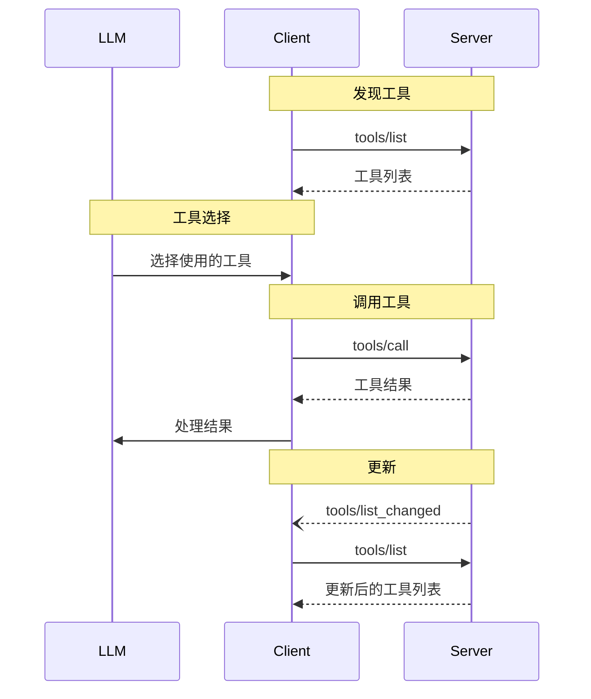

<Info>**协议修订版本**: 2025-03-26</Info>

模型上下文协议（MCP）允许服务器暴露可供语言模型调用的工具。工具使模型能够与外部系统交互，例如查询数据库、调用API或执行计算。每个工具通过唯一的名称标识，并包含描述其模式的元数据。

## 用户交互模型

MCP中的工具设计为**由模型控制**，这意味着语言模型可以根据其上下文理解及用户的提示自动发现并调用工具。

然而，实现方可以自由地通过任何适合其需求的接口模式暴露工具——协议本身不限定特定的用户交互模型。

<Warning>

出于信任与安全考虑，**始终应当**有人参与其中，并能够拒绝工具调用。

应用程序**应当**：

- 提供清晰的UI界面，显示暴露给AI模型的工具
- 在调用工具时插入明显的视觉指示
- 在执行操作前向用户显示确认提示，确保有人参与其中

</Warning>

## 能力声明

支持工具的服务器**必须**声明 `tools` 能力：

```json
{
  "capabilities": {
    "tools": {
      "listChanged": true
    }
  }
}
```

`listChanged` 表示当可用工具列表发生变化时，服务器是否会发送通知。

## 协议消息

### 列出工具

要发现可用工具，客户端发送 `tools/list` 请求。此操作支持[分页](/specification/2025-03-26/server/utilities/pagination)。

**请求：**

```json
{
  "jsonrpc": "2.0",
  "id": 1,
  "method": "tools/list",
  "params": {
    "cursor": "可选游标值"
  }
}
```

**响应：**

```json
{
  "jsonrpc": "2.0",
  "id": 1,
  "result": {
    "tools": [
      {
        "name": "get_weather",
        "description": "获取指定地点的当前天气信息",
        "inputSchema": {
          "type": "object",
          "properties": {
            "location": {
              "type": "string",
              "description": "城市名称或邮编"
            }
          },
          "required": ["location"]
        }
      }
    ],
    "nextCursor": "下一页游标"
  }
}
```

### 调用工具

要调用工具，客户端发送 `tools/call` 请求：

**请求：**

```json
{
  "jsonrpc": "2.0",
  "id": 2,
  "method": "tools/call",
  "params": {
    "name": "get_weather",
    "arguments": {
      "location": "纽约"
    }
  }
}
```

**响应：**

```json
{
  "jsonrpc": "2.0",
  "id": 2,
  "result": {
    "content": [
      {
        "type": "text",
        "text": "纽约当前天气：\n温度：72°F\n天气状况：多云"
      }
    ],
    "isError": false
  }
}
```

### 工具列表变更通知

当可用工具列表发生变更时，声明了 `listChanged` 能力的服务器**应当**发送通知：

```json
{
  "jsonrpc": "2.0",
  "method": "notifications/tools/list_changed"
}
```

## 消息流程



## 数据类型

### 工具

工具定义包含：

- `name`: 工具的唯一标识符
- `description`: 可读的功能描述
- `inputSchema`: JSON Schema，定义预期参数
- `annotations`: 描述工具行为的可选属性

<Warning>

出于信任与安全考虑，除非来自可信服务器，否则客户端**必须**将工具注解视为不可信。

</Warning>

### 工具结果

工具结果可以包含多种类型的内容项：

#### 文本内容

```json
{
  "type": "text",
  "text": "工具结果文本"
}
```

#### 图像内容

```json
{
  "type": "image",
  "data": "base64编码数据",
  "mimeType": "image/png"
}
```

#### 音频内容

```json
{
  "type": "audio",
  "data": "base64编码音频数据",
  "mimeType": "audio/wav"
}
```

#### 嵌入式资源

[资源](/specification/2025-03-26/server/resources) **可以**被嵌入以提供额外的上下文或数据，其位于客户端可以订阅或再次获取的URI之后：

```json
{
  "type": "resource",
  "resource": {
    "uri": "resource://example",
    "mimeType": "text/plain",
    "text": "资源内容"
  }
}
```

## 错误处理

工具使用两种错误报告机制：

1. **协议错误**：标准JSON-RPC错误，用于以下问题：
   - 未知工具
   - 参数无效
   - 服务器错误

2. **工具执行错误**：在工具结果中通过 `isError: true` 报告：
   - API调用失败
   - 输入数据无效
   - 业务逻辑错误

协议错误示例：

```json
{
  "jsonrpc": "2.0",
  "id": 3,
  "error": {
    "code": -32602,
    "message": "未知工具：invalid_tool_name"
  }
}
```

工具执行错误示例：

```json
{
  "jsonrpc": "2.0",
  "id": 4,
  "result": {
    "content": [
      {
        "type": "text",
        "text": "获取天气数据失败：API调用超出速率限制"
      }
    ],
    "isError": true
  }
}
```

## 安全考虑

1. 服务器**必须**：
   - 验证所有工具输入
   - 实施适当的访问控制
   - 对工具调用进行速率限制
   - 对工具输出进行清理

2. 客户端**应当**：
   - 在执行敏感操作前提示用户确认
   - 在调用服务器前向用户展示工具输入，以避免恶意或意外的数据泄露
   - 在将工具结果传递给LLM前进行验证
   - 为工具调用设置超时
   - 记录工具使用情况以便审计