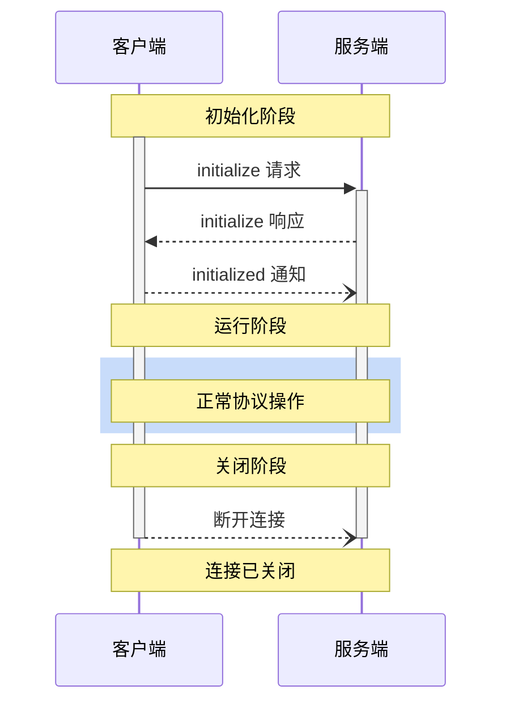

<div id="enable-section-numbers" />

<Info>**协议修订版本**: 2025-06-18</Info>

模型上下文协议（MCP）定义了客户端与服务器之间连接的严格生命周期，以确保正确的能力协商和状态管理。

1. **初始化**：能力协商和协议版本确认  
2. **运行**：正常协议通信  
3. **关闭**：连接的优雅终止  



## 生命周期阶段

### 初始化

初始化阶段 **必须** 是客户端与服务端之间的首次交互。在此阶段，客户端与服务端会：

- 建立协议版本兼容性  
- 交换并协商能力  
- 共享实现细节  

客户端 **必须** 通过发送包含以下内容的 `initialize` 请求来启动此阶段：

- 支持的协议版本  
- 客户端能力  
- 客户端实现信息  

```json
{
  "jsonrpc": "2.0",
  "id": 1,
  "method": "initialize",
  "params": {
    "protocolVersion": "2024-11-05",
    "capabilities": {
      "roots": {
        "listChanged": true
      },
      "sampling": {},
      "elicitation": {}
    },
    "clientInfo": {
      "name": "示例客户端",
      "title": "示例客户端显示名称",
      "version": "1.0.0"
    }
  }
}
```

服务端 **必须** 以其自身的能力和信息进行响应：

```json
{
  "jsonrpc": "2.0",
  "id": 1,
  "result": {
    "protocolVersion": "2024-11-05",
    "capabilities": {
      "logging": {},
      "prompts": {
        "listChanged": true
      },
      "resources": {
        "subscribe": true,
        "listChanged": true
      },
      "tools": {
        "listChanged": true
      }
    },
    "serverInfo": {
      "name": "示例服务端",
      "title": "示例服务端显示名称",
      "version": "1.0.0"
    },
    "instructions": "可选的客户端说明"
  }
}
```

成功初始化后，客户端 **必须** 发送 `initialized` 通知以表明其已准备好开始正常操作：

```json
{
  "jsonrpc": "2.0",
  "method": "notifications/initialized"
}
```

- 客户端在服务端响应 `initialize` 请求之前，**不应** 发送除 [ping](/specification/2025-06-18/basic/utilities/ping) 之外的其他请求。  
- 服务端在收到 `initialized` 通知之前，**不应** 发送除 [ping](/specification/2025-06-18/basic/utilities/ping) 和 [logging](/specification/2025-06-18/server/utilities/logging) 之外的其他请求。

#### 版本协商

在 `initialize` 请求中，客户端 **必须** 发送其支持的协议版本。这 **应该** 是客户端支持的 _最新_ 版本。

如果服务端支持所请求的协议版本，它 **必须** 以相同的版本进行响应。否则，服务端 **必须** 以它支持的另一个协议版本进行响应。这 **应该** 是服务端支持的 _最新_ 版本。

如果客户端不支持服务端响应中的版本，它 **应该** 断开连接。

<Note>
如果使用 HTTP，客户端 **必须** 在所有后续请求中包含 `MCP-Protocol-Version:
<protocol-version>` HTTP 头，以告知 MCP 服务端所使用的协议版本。
详细信息，请参见 [Transports 中的协议版本头部分](/specification/2025-06-18/basic/transports#protocol-version-header)。
</Note>

#### 能力协商

客户端与服务端的能力用于确定会话期间可用的可选协议功能。

关键能力包括：

| 类别 | 能力     | 描述                                                                               |
| -------- | -------------- | ----------------------------------------------------------------------------------------- |
| 客户端   | `roots`        | 提供文件系统 [roots](/specification/2025-06-18/client/roots) 的能力             |
| 客户端   | `sampling`     | 支持 LLM [sampling](/specification/2025-06-18/client/sampling) 请求            |
| 客户端   | `elicitation`  | 支持服务端 [elicitation](/specification/2025-06-18/client/elicitation) 请求   |
| 客户端   | `experimental` | 描述对非标准实验性功能的支持                                  |
| 服务端   | `prompts`      | 提供 [提示模板](/specification/2025-06-18/server/prompts)                       |
| 服务端   | `resources`    | 提供可读的 [资源](/specification/2025-06-18/server/resources)                 |
| 服务端   | `tools`        | 暴露可调用的 [工具](/specification/2025-06-18/server/tools)                          |
| 服务端   | `logging`      | 发出结构化的 [日志消息](/specification/2025-06-18/server/utilities/logging)       |
| 服务端   | `completions`  | 支持参数 [自动补全](/specification/2025-06-18/server/utilities/completion) |
| 服务端   | `experimental` | 描述对非标准实验性功能的支持                                  |

能力对象可以描述子能力，例如：

- `listChanged`: 支持列表变更通知（适用于提示、资源和工具）  
- `subscribe`: 支持订阅单个项的变化（仅限资源）

### 运行

在运行阶段，客户端与服务端根据协商的能力交换消息。

双方 **必须**：

- 遵守协商的协议版本  
- 仅使用成功协商的能力  

### 关闭

在关闭阶段，一方（通常是客户端）优雅地终止协议连接。协议中未定义特定的关闭消息——取而代之的是使用底层传输机制来表示连接终止：

#### stdio

对于 [stdio 传输](/specification/2025-06-18/basic/transports)，客户端 **应该** 通过以下方式启动关闭：

1. 首先关闭子进程（服务端）的输入流  
2. 等待服务端退出，或在服务端未在合理时间内退出时发送 `SIGTERM`  
3. 如果服务端在 `SIGTERM` 后仍未在合理时间内退出，则发送 `SIGKILL`  

服务端 **可以** 通过关闭其输出流给客户端并退出来启动关闭。

#### HTTP

对于 HTTP [传输](/specification/2025-06-18/basic/transports)，关闭通过关闭相关的 HTTP 连接来表示。

## 超时

实现 **应该** 为所有发出的请求设置超时机制，以防止连接挂起和资源耗尽。当请求在超时时间内未收到成功或错误响应时，发送方 **应该** 对该请求发出 [取消通知](/specification/2025-06-18/basic/utilities/cancellation) 并停止等待响应。

SDK 和其他中间件 **应该** 允许按每个请求配置这些超时。

实现 **可以** 在收到对应请求的 [进度通知](/specification/2025-06-18/basic/utilities/progress) 时重置超时计时器，因为这表明实际工作正在进行中。但是，无论是否收到进度通知，实现 **应该** 始终强制设置最大超时时间，以限制异常客户端或服务端的影响。

## 错误处理

实现 **应该** 准备处理以下错误情况：

- 协议版本不匹配  
- 无法协商必需的能力  
- 请求 [超时](#timeouts)  

初始化错误示例：

```json
{
  "jsonrpc": "2.0",
  "id": 1,
  "error": {
    "code": -32602,
    "message": "不支持的协议版本",
    "data": {
      "supported": ["2024-11-05"],
      "requested": "1.0.0"
    }
  }
}
```