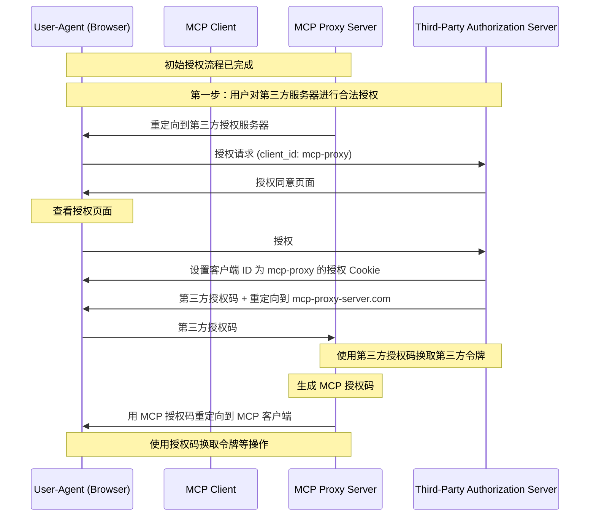
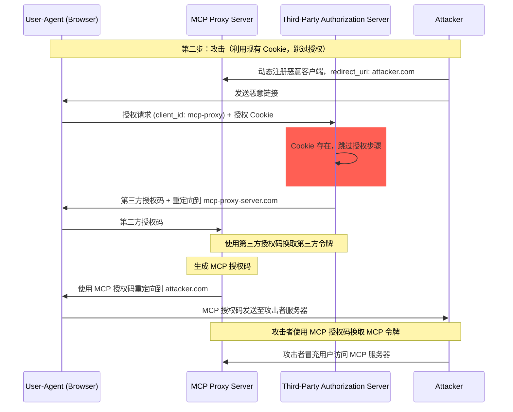
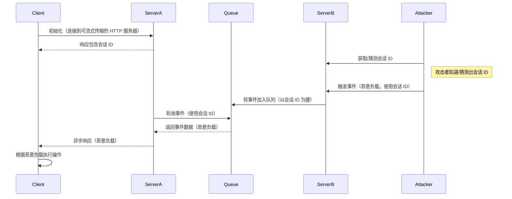
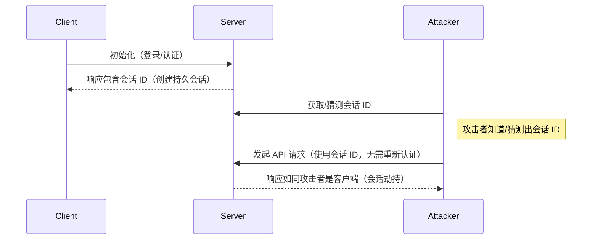

## 简介

### 目的与范围

本文档提供了 Model Context Protocol (MCP) 的安全考量，作为 MCP 授权规范的补充。文档中识别了与 MCP 实现相关的安全风险、攻击向量及最佳实践。

本文档的主要读者包括实现 MCP 授权流程的开发人员、运行 MCP 服务器的运维人员，以及评估基于 MCP 系统的安全专业人员。建议将本文档与 [MCP 授权规范](/specification/2025-06-18/basic/authorization) 和 [OAuth 2.0 安全最佳实践](https://datatracker.ietf.org/doc/html/rfc9700) 一起阅读。

## 攻击与缓解措施

本节详细描述了针对 MCP 实现的攻击及其潜在的缓解措施。

### 混淆代理人问题（Confused Deputy Problem）

攻击者可以利用 MCP 服务器代理其他资源服务器的特性，制造“[混淆代理人](https://en.wikipedia.org/wiki/Confused_deputy_problem)”漏洞。

#### 术语

**MCP 代理服务器**
: 一种 MCP 服务器，它将 MCP 客户端连接到第三方 API，提供 MCP 功能，同时将操作委托给第三方 API 并作为其单一 OAuth 客户端。

**第三方授权服务器**
: 保护第三方 API 的授权服务器。该服务器可能不支持动态客户端注册，要求 MCP 代理使用静态客户端 ID 发起所有请求。

**第三方 API**
: 提供实际 API 功能的受保护资源服务器。访问该 API 需要由第三方授权服务器颁发的令牌。

**静态客户端 ID**
: MCP 代理服务器在与第三方授权服务器通信时使用的固定 OAuth 2.0 客户端标识符。该客户端 ID 表示 MCP 服务器作为第三方 API 的客户端。无论哪个 MCP 客户端发起请求，该客户端 ID 在所有 MCP 服务器与第三方 API 的交互中保持一致。

#### 架构与攻击流程

##### 正常 OAuth 代理使用（保留用户授权）

##### 恶意 OAuth 代理使用（跳过用户授权）

#### 攻击描述

当 MCP 代理服务器使用静态客户端 ID 对不支持动态客户端注册的第三方授权服务器进行身份验证时，可能发生以下攻击：

1. 用户通过 MCP 代理服务器正常认证以访问第三方 API
2. 在此流程中，第三方授权服务器在用户代理中设置 Cookie，表明对静态客户端 ID 的授权
3. 攻击者随后向用户发送包含恶意重定向 URI 和新动态注册客户端 ID 的构造授权请求的恶意链接
4. 当用户点击该链接时，浏览器仍保留之前合法请求的授权 Cookie
5. 第三方授权服务器检测到 Cookie 并跳过授权页面
6. MCP 授权码被重定向到攻击者的服务器（在动态客户端注册期间指定的恶意 redirect_uri）
7. 攻击者使用窃取的授权码换取 MCP 服务器的访问令牌，而无需用户的明确授权
8. 攻击者现在可以以受侵害用户的身份访问第三方 API

#### 缓解措施

使用静态客户端 ID 的 MCP 代理服务器 **必须** 在将请求转发到第三方授权服务器之前，对每个动态注册的客户端获取用户的授权（可能需要额外的授权步骤）。

### 令牌透传（Token Passthrough）

“令牌透传”是一种反模式，指 MCP 服务器接受 MCP 客户端提供的令牌，但未验证这些令牌是否是**专门颁发给 MCP 服务器的**，而是“透传”给下游 API。

#### 风险

根据 [授权规范](/specification/2025-06-18/basic/authorization)，令牌透传明确禁止，因为它引入了多种安全风险，包括：

- **安全控制绕过**
  - MCP 服务器或下游 API 可能实施了重要的安全控制措施，如速率限制、请求验证或流量监控，这些措施依赖于令牌的受众或其他凭证限制。如果客户端可以绕过 MCP 服务器的验证，直接使用下游 API 的令牌，即可绕过这些控制。
- **可追溯性和审计日志问题**
  - 当客户端使用上游颁发的访问令牌调用时，MCP 服务器将无法识别或区分不同的 MCP 客户端。
  - 下游资源服务器日志可能显示请求来自不同来源、不同身份，而不是实际转发令牌的 MCP 服务器。
  - 这两个因素都使得事件调查、控制和审计变得更加困难。
  - 如果 MCP 服务器在未验证令牌声明（如角色、权限或受众）或其他元数据的情况下传递令牌，拥有被盗令牌的恶意行为者可以利用该服务器进行数据泄露。
- **信任边界问题**
  - 下游资源服务器向特定实体授予信任。这种信任可能包含对来源或客户端行为模式的假设。破坏该信任边界可能导致意外问题。
  - 如果令牌在未经适当验证的情况下被多个服务接受，攻击者攻破一个服务后可以使用该令牌访问其他连接的服务。
- **未来兼容性风险**
  - 即使 MCP 服务器目前作为“纯代理”运行，未来也可能需要添加安全控制。从一开始就正确分离令牌受众，可以更容易地演进安全模型。

#### 缓解措施

MCP 服务器 **不得** 接受任何未明确颁发给 MCP 服务器的令牌。

### 会话劫持（Session Hijacking）

会话劫持是一种攻击方式，客户端从服务器获取会话 ID 后，未经授权的第三方获得并使用该会话 ID 冒充原始客户端并执行未经授权的操作。

#### 会话劫持 - 提示注入（Prompt Injection）

#### 会话劫持 - 身份冒充（Impersonation）

#### 攻击描述

当有多个有状态的 HTTP 服务器处理 MCP 请求时，可能出现以下攻击向量：

**会话劫持 - 提示注入**

1. 客户端连接到 **Server A** 并收到会话 ID。
2. 攻击者获取已有会话 ID，并向 **Server B** 发送包含恶意负载的事件。
   - 当服务器支持 [消息重传/流恢复](/specification/2025-06-18/basic/transports#resumability-and-redelivery) 功能时，故意在收到响应前终止请求，可能导致客户端通过 GET 请求服务器发送事件（SSE）来恢复请求。
   - 如果某个服务器因调用如 `notifications/tools/list_changed` 的工具调用而发起服务器事件（SSE），攻击者可能影响服务器提供的工具列表，导致客户端在不知情的情况下启用某些工具。

3. **Server B** 将与会话 ID 关联的事件加入共享队列。
4. **Server A** 使用会话 ID 轮询队列并获取恶意负载。
5. **Server A** 将恶意负载作为异步或恢复的响应发送给客户端。
6. 客户端接收并执行恶意负载，可能导致被攻击。

**会话劫持 - 身份冒充**

1. MCP 客户端与 MCP 服务器认证，创建持久会话 ID。
2. 攻击者获取会话 ID。
3. 攻击者使用该会话 ID 向 MCP 服务器发起调用。
4. MCP 服务器未检查额外的授权信息，将攻击者视为合法用户，导致未经授权的访问或操作。

#### 缓解措施

为防止会话劫持和事件注入攻击，应实施以下缓解措施：

实现授权的 MCP 服务器 **必须** 验证所有传入请求。  
MCP 服务器 **不得** 使用会话进行身份验证。

MCP 服务器 **必须** 使用安全、不可预测的会话 ID。  
生成的会话 ID（例如 UUID）**应** 使用安全随机数生成器。避免使用攻击者可能猜测的可预测或顺序会话标识符。轮换或过期会话 ID 也可以降低风险。

MCP 服务器 **应** 将会话 ID 绑定到用户特定信息。  
在存储或传输会话相关数据时（例如在队列中），将会话 ID 与授权用户的唯一信息结合，例如其内部用户 ID。使用类似 `<user_id>:<session_id>` 的键格式。这样即使攻击者猜测出会话 ID，也无法冒充其他用户，因为用户 ID 来自用户令牌而非客户端提供。

MCP 服务器可选择性地使用其他唯一标识符。