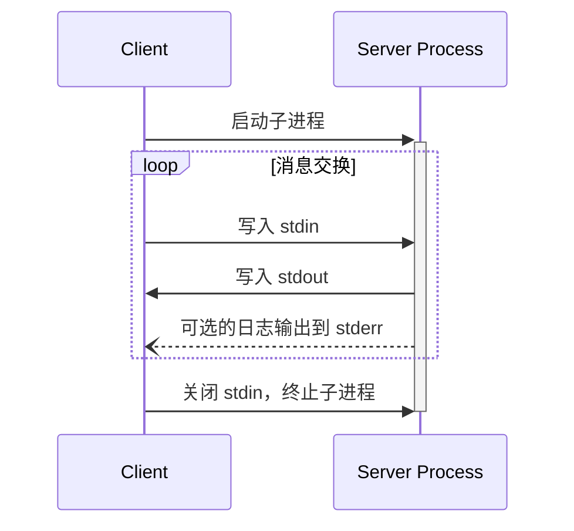
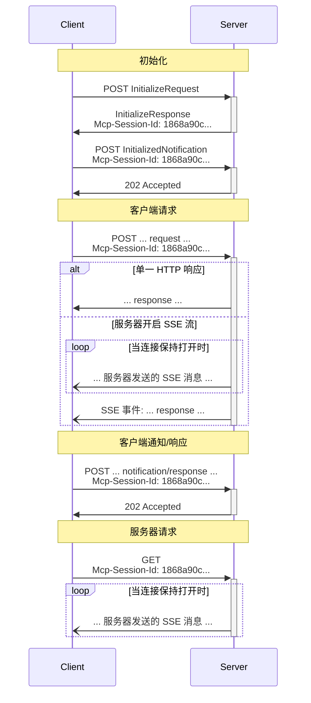

<Info>**协议版本**：2025-06-18</Info>

MCP 使用 JSON-RPC 编码消息。JSON-RPC 消息 **必须** 使用 UTF-8 编码。

当前协议为客户端与服务器之间的通信定义了两种标准传输机制：

1. [stdio](#stdio)，通过标准输入和标准输出进行通信
2. [可流式 HTTP](#streamable-http)

客户端 **应尽可能** 支持 stdio。

客户端和服务器也可以以可插拔的方式实现 [自定义传输](#custom-transports)。

## stdio

在 **stdio** 传输中：

- 客户端将 MCP 服务器作为子进程启动。
- 服务器从其标准输入（`stdin`）读取 JSON-RPC 消息，并通过其标准输出（`stdout`）发送消息。
- 消息是单独的 JSON-RPC 请求、通知或响应。
- 消息以换行符分隔，**不能** 包含嵌入的换行符。
- 服务器 **可以** 将 UTF-8 字符串写入其标准错误（`stderr`）用于日志记录。客户端 **可以** 捕获、转发或忽略这些日志。
- 服务器 **不能** 在其 `stdout` 中写入任何非有效的 MCP 消息。
- 客户端 **不能** 向服务器的 `stdin` 写入任何非有效的 MCP 消息。

## 可流式 HTTP

<Info>

这替代了协议版本 2024-11-05 中的 [HTTP+SSE 传输](/specification/2024-11-05/basic/transports#http-with-sse)。请参阅下面的 [向后兼容性](#backwards-compatibility) 指南。

</Info>

在 **可流式 HTTP** 传输中：

- 服务器作为一个独立进程运行，能够处理多个客户端连接。
- 此传输使用 HTTP POST 和 GET 请求。
- 服务器可以可选地使用 [Server-Sent Events](https://en.wikipedia.org/wiki/Server-sent_events) (SSE) 来流式传输多个服务器消息。
- 这允许基本的 MCP 服务器以及支持流式传输和服务器到客户端通知与请求的更高级服务器。

服务器 **必须** 提供一个单一的 HTTP 端点路径（以下简称 **MCP 端点**），该端点支持 POST 和 GET 方法。例如，可以是类似 `https://example.com/mcp` 的 URL。

### 安全警告

实现可流式 HTTP 传输时：

1. 服务器 **必须** 验证所有传入连接的 `Origin` 头，以防止 DNS 重绑定攻击。
2. 本地运行时，服务器 **应** 仅绑定到 localhost（127.0.0.1），而不是所有网络接口（0.0.0.0）。
3. 服务器 **应** 为所有连接实现适当的身份验证。

如果没有这些保护措施，攻击者可以利用 DNS 重绑定通过远程网站与本地 MCP 服务器交互。

### 向服务器发送消息

客户端发送的每条 JSON-RPC 消息 **必须** 是一个发送到 MCP 端点的新 HTTP POST 请求。

1. 客户端 **必须** 使用 HTTP POST 将 JSON-RPC 消息发送到 MCP 端点。
2. 客户端 **必须** 包含一个 `Accept` 头，列出 `application/json` 和 `text/event-stream` 作为支持的内容类型。
3. POST 请求的正文 **必须** 是一个单独的 JSON-RPC _请求_、_通知_ 或 _响应_。
4. 如果输入是 JSON-RPC _响应_ 或 _通知_：
   - 如果服务器接受输入，**必须** 返回 HTTP 状态码 202 Accepted，且无响应体。
   - 如果服务器无法接受输入，**必须** 返回 HTTP 错误状态码（如 400 Bad Request）。HTTP 响应体 **可以** 包含一个没有 `id` 的 JSON-RPC _错误响应_。
5. 如果输入是 JSON-RPC _请求_，服务器 **必须** 返回 `Content-Type: text/event-stream` 以启动 SSE 流，或返回 `Content-Type: application/json` 以返回一个 JSON 对象。客户端 **必须** 支持这两种情况。
6. 如果服务器启动了 SSE 流：
   - SSE 流 **应该** 最终包含与 POST 请求体中 JSON-RPC _请求_ 对应的 JSON-RPC _响应_。
   - 服务器 **可以** 在发送 JSON-RPC _响应_ 前发送 JSON-RPC _请求_ 和 _通知_。这些消息 **应该** 与原始客户端 _请求_ 相关。
   - 除非 [会话](#session-management) 过期，服务器 **不应** 在发送 JSON-RPC _响应_ 前关闭 SSE 流。
   - 发送 JSON-RPC _响应_ 后，服务器 **应该** 关闭 SSE 流。
   - 断开连接 **可能** 随时发生（如由于网络状况）。因此：
     - 断开连接 **不应** 被解释为客户端取消了请求。
     - 要取消，客户端 **应** 显式发送一个 MCP `CancelledNotification`。
     - 为避免因断开连接导致消息丢失，服务器 **可以** 使流 [可恢复](#resumability-and-redelivery)。

### 监听来自服务器的消息

1. 客户端 **可以** 向 MCP 端点发送 HTTP GET 请求。这可用于打开 SSE 流，使服务器可以在客户端未先通过 HTTP POST 发送数据的情况下向客户端通信。
2. 客户端 **必须** 包含一个 `Accept` 头，列出 `text/event-stream` 作为支持的内容类型。
3. 服务器 **必须** 在响应此 HTTP GET 请求时返回 `Content-Type: text/event-stream`，或返回 HTTP 405 Method Not Allowed，表示服务器在此端点不提供 SSE 流。
4. 如果服务器启动了 SSE 流：
   - 服务器 **可以** 在流上发送 JSON-RPC _请求_ 和 _通知_。
   - 这些消息 **应该** 与客户端当前运行的任何 JSON-RPC _请求_ 无关。
   - 除非 [恢复](#resumability-and-redelivery) 与之前客户端请求关联的流，否则服务器 **不能** 在流上发送 JSON-RPC _响应_。
   - 服务器 **可以** 在任何时候关闭 SSE 流。
   - 客户端 **可以** 在任何时候关闭 SSE 流。

### 多连接

1. 客户端 **可以** 同时保持多个 SSE 流连接。
2. 服务器 **必须** 将其每条 JSON-RPC 消息只发送到其中一个连接流；也就是说，**不能** 在多个流上广播相同的消息。
   - 可通过使流 [可恢复](#resumability-and-redelivery) 来减轻消息丢失的风险。

### 可恢复性与重传

为支持断开连接后的恢复以及可能丢失的消息重传：

1. 服务器 **可以** 按照 [SSE 标准](https://html.spec.whatwg.org/multipage/server-sent-events.html#event-stream-interpretation) 在其 SSE 事件中附加一个 `id` 字段：
   - 如果存在，ID **必须** 在该 [会话](#session-management) 内的所有流中全局唯一——或在未使用会话管理的情况下，与该特定客户端的所有流中全局唯一。
2. 如果客户端希望在断开连接后恢复，**应该** 向 MCP 端点发送一个 HTTP GET 请求，并包含 [`Last-Event-ID`](https://html.spec.whatwg.org/multipage/server-sent-events.html#the-last-event-id-header) 头，以指示其接收到的最后一个事件 ID：
   - 服务器 **可以** 使用此头在断开连接的流上重放在最后一个事件 ID 之后应发送的消息，并从该点恢复流。
   - 服务器 **不能** 重放应发送到其他流的消息。

换句话说，这些事件 ID 应由服务器按 _每个流_ 分配，作为该流中的游标。

### 会话管理

一个 MCP “会话” 包括客户端与服务器之间的一系列逻辑相关交互，始于 [初始化阶段](/specification/2025-06-18/basic/lifecycle)。为支持希望建立有状态会话的服务器：

1. 使用可流式 HTTP 传输的服务器 **可以** 在初始化时通过在包含 `InitializeResult` 的 HTTP 响应中添加 `Mcp-Session-Id` 头来分配会话 ID：
   - 会话 ID **应** 是全局唯一且加密安全的（如安全生成的 UUID、JWT 或加密哈希）。
   - 会话 ID **必须** 仅包含可见 ASCII 字符（范围 0x21 到 0x7E）。
2. 如果服务器在初始化期间返回了 `Mcp-Session-Id`，使用可流式 HTTP 传输的客户端 **必须** 在其后续所有 HTTP 请求的 `Mcp-Session-Id` 头中包含该 ID：
   - 要求会话 ID 的服务器 **应** 对未包含 `Mcp-Session-Id` 头的请求（除初始化请求外）返回 HTTP 400 Bad Request。
3. 服务器 **可以** 随时终止会话，之后 **必须** 对包含该会话 ID 的请求返回 HTTP 404 Not Found。
4. 当客户端收到包含 `Mcp-Session-Id` 的请求返回 HTTP 404 时，**必须** 通过发送不带会话 ID 的新 `InitializeRequest` 开始一个新会话。
5. 不再需要特定会话的客户端（如用户退出客户端应用）**应** 向 MCP 端点发送一个带有 `Mcp-Session-Id` 头的 HTTP DELETE 请求，以显式终止会话：
   - 服务器 **可以** 对此请求返回 HTTP 405 Method Not Allowed，表示服务器不允许客户端终止会话。

### 时序图

### 协议版本头

如果使用 HTTP，客户端 **必须** 在所有后续请求中包含 `MCP-Protocol-Version: <protocol-version>` HTTP 头，以便 MCP 服务器可以根据 MCP 协议版本进行响应。

例如：`MCP-Protocol-Version: 2025-06-18`

客户端发送的协议版本 **应** 是 [初始化期间协商的版本](/specification/2025-06-18/basic/lifecycle#version-negotiation)。

为向后兼容，如果服务器 **未** 收到 `MCP-Protocol-Version` 头，并且没有其他方式识别版本——例如，通过初始化期间协商的协议版本——服务器 **应** 假定协议版本为 `2025-03-26`。

如果服务器收到带有无效或不支持的 `MCP-Protocol-Version` 的请求，**必须** 返回 `400 Bad Request`。

### 向后兼容性

客户端和服务器可以通过以下方式保持与废弃的 [HTTP+SSE 传输](/specification/2024-11-05/basic/transports#http-with-sse)（协议版本 2024-11-05）的兼容性：

**希望支持旧客户端的服务器** 应该：

- 继续托管旧传输的 SSE 和 POST 端点，同时提供新“MCP 端点”用于可流式 HTTP 传输。
  - 也可以将旧 POST 端点和新 MCP 端点合并，但这可能引入不必要的复杂性。

**希望支持旧服务器的客户端** 应该：

1. 接收用户提供的 MCP 服务器 URL，该 URL 可能指向使用旧传输或新传输的服务器。
2. 尝试向服务器 URL 发送一个带有上述 `Accept` 头的 `InitializeRequest` POST 请求：
   - 如果成功，客户端可以假设这是一个支持新可流式 HTTP 传输的服务器。
   - 如果失败并返回 HTTP 4xx 状态码（如 405 Method Not Allowed 或 404 Not Found）：
     - 向服务器 URL 发送 GET 请求，期望这将打开一个 SSE 流，并在第一个事件中返回一个 `endpoint` 事件。
     - 当 `endpoint` 事件到达时，客户端可以假设这是一个运行旧 HTTP+SSE 传输的服务器，并应使用该传输进行所有后续通信。

## 自定义传输

客户端和服务器 **可以** 实现额外的自定义传输机制以满足其特定需求。该协议与传输无关，可以在任何支持双向消息交换的通信通道上实现。

选择支持自定义传输的实现者 **必须** 确保保留 MCP 定义的 JSON-RPC 消息格式和生命周期要求。自定义传输 **应** 记录其特定的连接建立和消息交换模式，以帮助互操作性。