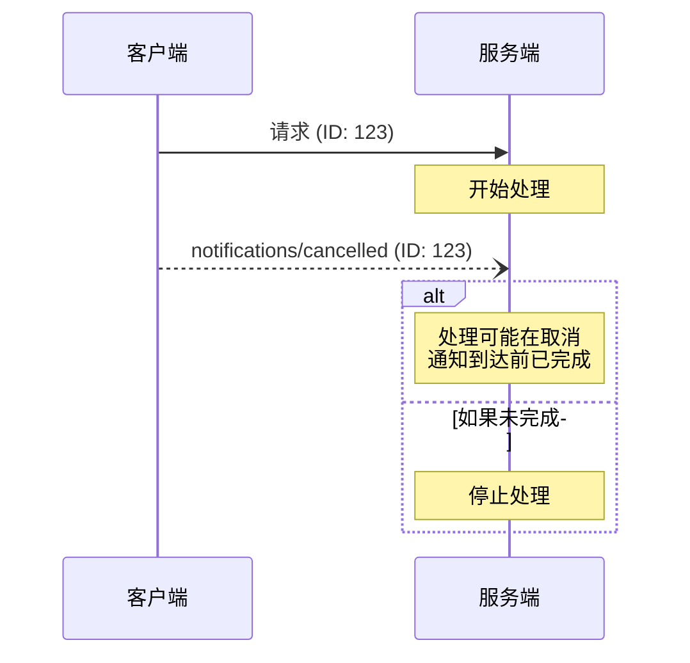

<div id="enable-section-numbers" />

<Info>**协议修订日期**: 2025-06-18</Info>

模型上下文协议（MCP）通过通知消息支持对进行中的请求进行可选的取消操作。
通信的任意一方都可以发送取消通知，以表明之前发出的请求应当被终止。

## 取消流程

当某一方想要取消一个进行中的请求时，它会发送一个 `notifications/cancelled` 通知，其中包含：

- 要取消的请求的 ID
- 一个可选的原因字符串，可用于记录日志或显示

```json
{
  "jsonrpc": "2.0",
  "method": "notifications/cancelled",
  "params": {
    "requestId": "123",
    "reason": "用户请求取消"
  }
}
```

## 行为要求

1. 取消通知 **必须** 仅引用以下请求：
   - 在相同方向上先前发出的请求
   - 被认为仍在进行中的请求
2. `initialize` 请求 **不得** 被客户端取消
3. 取消通知的接收方 **应当**：
   - 停止处理被取消的请求
   - 释放相关资源
   - 不再发送被取消请求的响应
4. 在以下情况下，接收方 **可以** 忽略取消通知：
   - 被引用的请求未知
   - 处理已经完成
   - 请求无法被取消
5. 取消通知的发送方 **应当** 忽略在之后收到的针对该请求的任何响应

## 时序考虑

由于网络延迟，取消通知可能在请求处理完成后才到达，甚至可能在响应已经发送之后才到达。

通信双方 **必须** 优雅地处理这些竞态条件：



## 实现说明

- 通信双方 **应当** 记录取消原因以便调试
- 应用程序界面 **应当** 在请求取消时给出提示

## 错误处理

无效的取消通知 **应当** 被忽略：

- 未知的请求 ID
- 已经完成的请求
- 格式错误的通知

这保持了通知“发送即忘”的特性，同时允许异步通信中存在竞态条件。