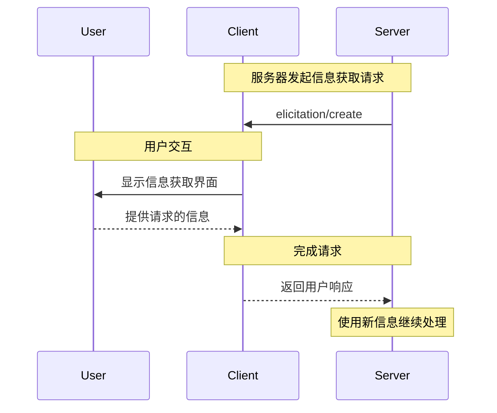

<div id="enable-section-numbers" />

<Info>**协议修订**：2025-06-18</Info>

<Note>

信息获取（Elicitation）是在本版MCP规范中首次引入的功能，其设计可能在未来的协议版本中继续演进。

</Note>

模型上下文协议（MCP）提供了一种标准化方式，使服务器在与用户交互过程中可以通过客户端请求额外信息。这种流程允许客户端在维持用户交互与数据共享控制权的同时，使服务器能够动态获取所需信息。
服务器使用JSON Schema来验证用户响应，从而请求结构化数据。

## 用户交互模型

MCP中的信息获取功能允许服务器通过在其他MCP服务器功能中嵌套用户输入请求，实现交互式工作流。

实现方可以自由选择任何适合其需求的界面模式来呈现信息获取流程——协议本身不规定特定的用户交互模型。

<Warning>

出于信任、安全与隐私考虑：

- 服务器 **不得** 使用信息获取功能请求敏感信息。

应用程序 **应该**：

- 提供清晰的界面，使用户明确知道是哪个服务器在请求信息
- 允许用户在发送前查看和修改其响应
- 尊重用户隐私，并提供清晰的拒绝和取消选项

</Warning>

## 能力声明

支持信息获取功能的客户端必须在[初始化](/specification/2025-06-18/basic/lifecycle#initialization)期间声明 `elicitation` 能力：

```json
{
  "capabilities": {
    "elicitation": {}
  }
}
```

## 协议消息

### 创建信息获取请求

服务器通过发送 `elicitation/create` 请求来获取用户信息：

#### 简单文本请求

**请求：**

```json
{
  "jsonrpc": "2.0",
  "id": 1,
  "method": "elicitation/create",
  "params": {
    "message": "请输入你的GitHub用户名",
    "requestedSchema": {
      "type": "object",
      "properties": {
        "name": {
          "type": "string"
        }
      },
      "required": ["name"]
    }
  }
}
```

**响应：**

```json
{
  "jsonrpc": "2.0",
  "id": 1,
  "result": {
    "action": "accept",
    "content": {
      "name": "octocat"
    }
  }
}
```

#### 结构化数据请求

**请求：**

```json
{
  "jsonrpc": "2.0",
  "id": 2,
  "method": "elicitation/create",
  "params": {
    "message": "请提供你的联系方式",
    "requestedSchema": {
      "type": "object",
      "properties": {
        "name": {
          "type": "string",
          "description": "你的全名"
        },
        "email": {
          "type": "string",
          "format": "email",
          "description": "你的电子邮件地址"
        },
        "age": {
          "type": "number",
          "minimum": 18,
          "description": "你的年龄"
        }
      },
      "required": ["name", "email"]
    }
  }
}
```

**响应：**

```json
{
  "jsonrpc": "2.0",
  "id": 2,
  "result": {
    "action": "accept",
    "content": {
      "name": "Monalisa Octocat",
      "email": "octocat@github.com",
      "age": 30
    }
  }
}
```

**拒绝响应示例：**

```json
{
  "jsonrpc": "2.0",
  "id": 2,
  "result": {
    "action": "decline"
  }
}
```

**取消响应示例：**

```json
{
  "jsonrpc": "2.0",
  "id": 2,
  "result": {
    "action": "cancel"
  }
}
```

## 消息流程



## 请求Schema

`requestedSchema` 字段允许服务器使用受限的JSON Schema子集定义预期响应的结构。为了简化客户端实现，信息获取Schema仅限于仅包含基本属性的扁平对象：

```json
"requestedSchema": {
  "type": "object",
  "properties": {
    "propertyName": {
      "type": "string",
      "title": "显示名称",
      "description": "属性描述"
    },
    "anotherProperty": {
      "type": "number",
      "minimum": 0,
      "maximum": 100
    }
  },
  "required": ["propertyName"]
}
```

### 支持的Schema类型

Schema被限制为以下基本类型：

1. **字符串Schema**

   ```json
   {
     "type": "string",
     "title": "显示名称",
     "description": "描述文本",
     "minLength": 3,
     "maxLength": 50,
     "format": "email" // 支持: "email", "uri", "date", "date-time"
   }
   ```

   支持的格式：`email`、`uri`、`date`、`date-time`

2. **数字Schema**

   ```json
   {
     "type": "number", // 或 "integer"
     "title": "显示名称",
     "description": "描述文本",
     "minimum": 0,
     "maximum": 100
   }
   ```

3. **布尔Schema**

   ```json
   {
     "type": "boolean",
     "title": "显示名称",
     "description": "描述文本",
     "default": false
   }
   ```

4. **枚举Schema**
   ```json
   {
     "type": "string",
     "title": "显示名称",
     "description": "描述文本",
     "enum": ["option1", "option2", "option3"],
     "enumNames": ["选项1", "选项2", "选项3"]
   }
   ```

客户端可以使用该Schema来：

1. 生成适当的输入表单
2. 在发送前验证用户输入
3. 为用户提供更好的引导

请注意，为了简化客户端实现，有意不支持复杂的嵌套结构、对象数组和其他高级JSON Schema特性。

## 响应动作

信息获取响应使用三态动作模型来明确区分不同的用户操作：

```json
{
  "jsonrpc": "2.0",
  "id": 1,
  "result": {
    "action": "accept", // 或 "decline" 或 "cancel"
    "content": {
      "propertyName": "value",
      "anotherProperty": 42
    }
  }
}
```

三种响应动作如下：

1. **接受** (`action: "accept"`)：用户明确批准并提交了数据
   - `content` 字段包含符合请求Schema的提交数据
   - 示例：用户点击了"提交"、"确定"、"确认"等

2. **拒绝** (`action: "decline"`)：用户明确拒绝请求
   - `content` 字段通常被省略
   - 示例：用户点击了"拒绝"、"否"、"关闭"等

3. **取消** (`action: "cancel"`)：用户在未明确选择的情况下关闭了界面
   - `content` 字段通常被省略
   - 示例：用户关闭对话框、点击外部区域、按下Esc键等

服务器应适当处理每种状态：

- **接受**：处理提交的数据
- **拒绝**：处理明确拒绝（例如提供替代方案）
- **取消**：处理界面关闭（例如稍后再次提示）

## 安全考量

1. 服务器 **不得** 通过信息获取请求敏感信息
2. 客户端 **应该** 实现用户审批控制
3. 双方 **应该** 根据提供的Schema验证信息获取内容
4. 客户端 **应该** 明确显示是哪个服务器在请求信息
5. 客户端 **应该** 允许用户随时拒绝信息获取请求
6. 客户端 **应该** 实现速率限制
7. 客户端 **应该** 以清楚表明请求内容及原因的方式呈现信息获取请求