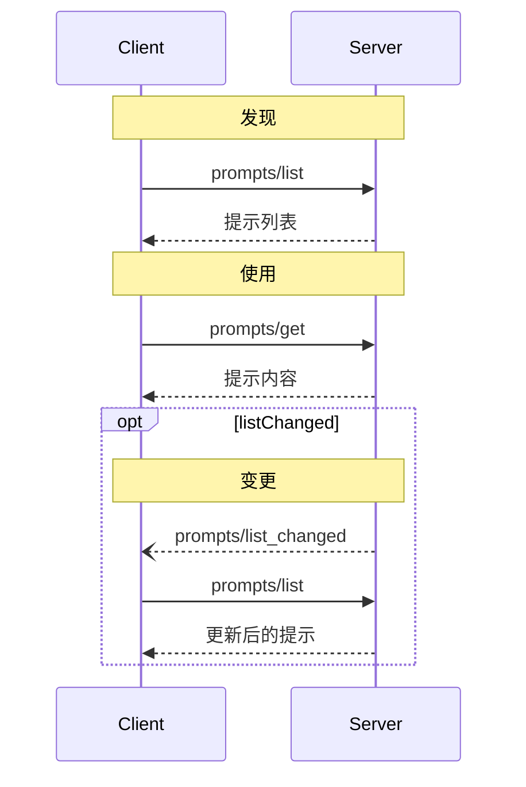

<div id="enable-section-numbers" />

<Info>**协议修订**：2025-06-18</Info>

模型上下文协议 (MCP) 提供了一种标准化方式，让服务器将提示模板暴露给客户端。提示允许服务器提供结构化的消息和与语言模型交互的指令。客户端可以发现可用的提示，检索其内容，并提供参数以自定义提示。

## 用户交互模型

提示的设计是 **用户可控的**，意味着它们从服务器暴露给客户端时，旨在让用户能够显式地选择使用。

通常，提示会通过用户界面上的用户发起命令触发，这样用户可以自然地发现和调用可用提示。

例如，作为斜杠命令：


然而，实现者可以自由选择任何适合其需求的界面模式来暴露提示——协议本身不限定特定的用户交互模型。

## 能力

支持提示的服务器**必须**在[初始化](/specification/2025-06-18/basic/lifecycle#initialization)期间声明 `prompts` 能力：

```json
{
  "capabilities": {
    "prompts": {
      "listChanged": true
    }
  }
}
```

`listChanged` 表示服务器是否会在可用提示列表发生变化时发出通知。

## 协议消息

### 列出提示

要检索可用提示，客户端发送 `prompts/list` 请求。此操作支持[分页](/specification/2025-06-18/server/utilities/pagination)。

**请求：**

```json
{
  "jsonrpc": "2.0",
  "id": 1,
  "method": "prompts/list",
  "params": {
    "cursor": "可选的游标值"
  }
}
```

**响应：**

```json
{
  "jsonrpc": "2.0",
  "id": 1,
  "result": {
    "prompts": [
      {
        "name": "code_review",
        "title": "请求代码审查",
        "description": "要求LLM分析代码质量并提出改进建议",
        "arguments": [
          {
            "name": "code",
            "description": "需要审查的代码",
            "required": true
          }
        ]
      }
    ],
    "nextCursor": "下一页游标"
  }
}
```

### 获取提示

要检索特定提示，客户端发送 `prompts/get` 请求。参数可以通过[补全API](/specification/2025-06-18/server/utilities/completion)自动补全。

**请求：**

```json
{
  "jsonrpc": "2.0",
  "id": 2,
  "method": "prompts/get",
  "params": {
    "name": "code_review",
    "arguments": {
      "code": "def hello():\n    print('world')"
    }
  }
}
```

**响应：**

```json
{
  "jsonrpc": "2.0",
  "id": 2,
  "result": {
    "description": "代码审查提示",
    "messages": [
      {
        "role": "user",
        "content": {
          "type": "text",
          "text": "请审查以下Python代码：\ndef hello():\n    print('world')"
        }
      }
    ]
  }
}
```

### 列表变更通知

当可用提示列表发生变化时，声明了 `listChanged` 能力的服务器**应该**发送通知：

```json
{
  "jsonrpc": "2.0",
  "method": "notifications/prompts/list_changed"
}
```

## 消息流程



## 数据类型

### 提示

提示定义包括：

- `name`: 提示的唯一标识符
- `title`: 可选的人类可读名称，用于显示
- `description`: 可选的人类可读描述
- `arguments`: 可选的参数列表，用于自定义

### 提示消息

提示中的消息可以包含：

- `role`: 为 "user" 或 "assistant"，表示说话者
- `content`: 以下内容类型之一：

<Note>
  所有提示消息中的内容类型都支持可选的
  [注解](/specification/2025-06-18/server/resources#annotations)，用于标注受众、优先级和修改时间等元数据。
</Note>

#### 文本内容

文本内容表示纯文本消息：

```json
{
  "type": "text",
  "text": "消息的文本内容"
}
```

这是用于自然语言交互的最常见内容类型。

#### 图像内容

图像内容允许在消息中包含视觉信息：

```json
{
  "type": "image",
  "data": "base64编码的图像数据",
  "mimeType": "image/png"
}
```

图像数据**必须**为base64编码，并包含有效的MIME类型。这使得在需要视觉上下文的多模态交互中成为可能。

#### 音频内容

音频内容允许在消息中包含音频信息：

```json
{
  "type": "audio",
  "data": "base64编码的音频数据",
  "mimeType": "audio/wav"
}
```

音频数据**必须**为base64编码，并包含有效的MIME类型。这使得在需要音频上下文的多模态交互中成为可能。

#### 嵌入式资源

嵌入式资源允许在消息中直接引用服务器端资源：

```json
{
  "type": "resource",
  "resource": {
    "uri": "resource://example",
    "name": "example",
    "title": "我的示例资源",
    "mimeType": "text/plain",
    "text": "资源内容"
  }
}
```

资源可以包含文本或二进制（blob）数据，并且**必须**包括：

- 有效的资源URI
- 合适的MIME类型
- 文本内容或base64编码的blob数据

嵌入式资源使提示能够无缝地将服务器管理的内容（如文档、代码示例或其他参考资料）直接集成到对话流程中。

## 错误处理

服务器**应该**对常见的失败情况返回标准JSON-RPC错误：

- 无效的提示名称：`-32602` (无效参数)
- 缺少必填参数：`-32602` (无效参数)
- 内部错误：`-32603` (内部错误)

## 实现注意事项

1. 服务器**应该**在处理前验证提示参数
2. 客户端**应该**处理大型提示列表的分页
3. 双方**应该**尊重能力协商

## 安全

实现**必须**仔细验证所有提示输入和输出，以防止注入攻击或未经授权访问资源。