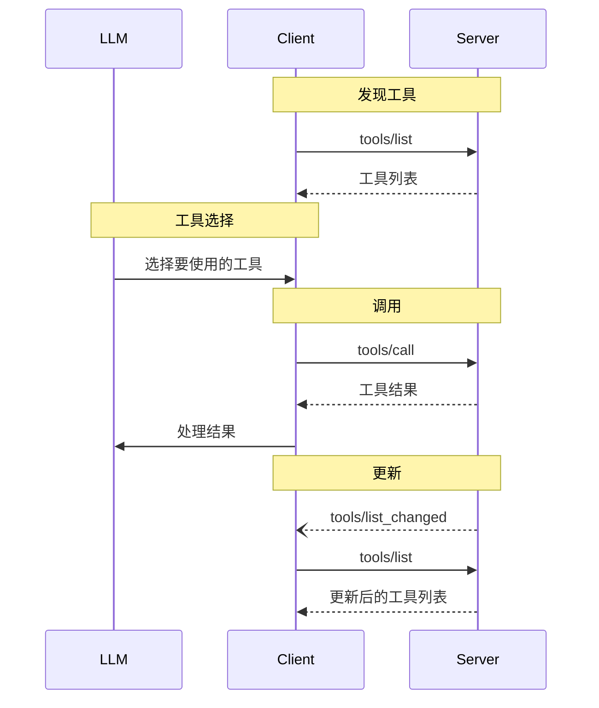

title: 工具
---

<div id="enable-section-numbers" />

<Info>**协议修订**: 2025-06-18</Info>

模型上下文协议（MCP）允许服务器暴露可被语言模型调用的工具。工具使模型能够与外部系统交互，例如查询数据库、调用API或执行计算。每个工具由其名称唯一标识，并包含描述其模式的元数据。

## 用户交互模型

MCP中的工具设计为**模型控制**，这意味着语言模型可以基于其上下文理解及用户的提示自动发现并调用工具。

然而，实现可以自由地通过任何适合其需求的接口模式暴露工具——协议本身不强制任何特定的用户交互模型。

<Warning>

出于信任、安全和隐私的考虑，**始终**应有人类参与，其有权拒绝工具调用。

应用程序**应**：

- 提供UI，明确显示暴露给AI模型的工具
- 在调用工具时插入清晰的视觉指示
- 在执行操作时向用户呈现确认提示，以确保人类参与其中

</Warning>

## 功能

支持工具的服务器**必须**声明 `tools` 功能：

```json
{
  "capabilities": {
    "tools": {
      "listChanged": true
    }
  }
}
```

`listChanged` 表示当可用工具列表变化时，服务器是否会发送通知。

## 协议消息

### 列出工具

为了发现可用工具，客户端发送 `tools/list` 请求。此操作支持[分页](/specification/2025-06-18/server/utilities/pagination)。

**请求：**

```json
{
  "jsonrpc": "2.0",
  "id": 1,
  "method": "tools/list",
  "params": {
    "cursor": "optional-cursor-value"
  }
}
```

**响应：**

```json
{
  "jsonrpc": "2.0",
  "id": 1,
  "result": {
    "tools": [
      {
        "name": "get_weather",
        "title": "天气信息提供者",
        "description": "获取某个地点的当前天气信息",
        "inputSchema": {
          "type": "object",
          "properties": {
            "location": {
              "type": "string",
              "description": "城市名或邮编"
            }
          },
          "required": ["location"]
        }
      }
    ],
    "nextCursor": "next-page-cursor"
  }
}
```

### 调用工具

为了调用工具，客户端发送 `tools/call` 请求：

**请求：**

```json
{
  "jsonrpc": "2.0",
  "id": 2,
  "method": "tools/call",
  "params": {
    "name": "get_weather",
    "arguments": {
      "location": "New York"
    }
  }
}
```

**响应：**

```json
{
  "jsonrpc": "2.0",
  "id": 2,
  "result": {
    "content": [
      {
        "type": "text",
        "text": "New York当前天气：\n温度：72°F\n状况：多云"
      }
    ],
    "isError": false
  }
}
```

### 列表变化通知

当可用工具列表发生变化时，声明了 `listChanged` 功能的服务器**应**发送通知：

```json
{
  "jsonrpc": "2.0",
  "method": "notifications/tools/list_changed"
}
```

## 消息流程



## 数据类型

### 工具

一个工具定义包括：

- `name`: 工具的唯一标识符
- `title`: 可选的人类可读工具名称，用于显示。
- `description`: 功能的人类可读描述
- `inputSchema`: JSON Schema，定义预期参数
- `outputSchema`: 可选的JSON Schema，定义预期输出结构
- `annotations`: 可选属性，描述工具行为

<Warning>

出于信任、安全和隐私考虑，客户端**必须**认为工具注解是不可信的，除非它们来自可信服务器。

</Warning>

### 工具结果

工具结果可以包含 [**结构化**](#structured-content) 或 **非结构化** 内容。

**非结构化** 内容返回在结果的 `content` 字段中，可以包含多种类型的内容项：

<Note>
  所有内容类型（文本、图像、音频、资源链接和嵌入资源）
  支持可选的
  [注解](/specification/2025-06-18/server/resources#annotations)，
  该注解提供了关于受众、优先级和修改时间的元数据。这与资源和提示使用的注解格式相同。
</Note>

#### 文本内容

```json
{
  "type": "text",
  "text": "工具结果文本"
}
```

#### 图像内容

```json
{
  "type": "image",
  "data": "base64-encoded-data",
  "mimeType": "image/png"
  "annotations": {
    "audience": ["user"],
    "priority": 0.9
  }

}
```

此示例演示了可选注解的使用。

#### 音频内容

```json
{
  "type": "audio",
  "data": "base64-encoded-audio-data",
  "mimeType": "audio/wav"
}
```

#### 资源链接

工具**可以**返回 [资源](/specification/2025-06-18/server/resources) 的链接，以提供额外的上下文或数据。在这种情况下，工具将返回一个客户端可以订阅或获取的URI：

```json
{
  "type": "resource_link",
  "uri": "file:///project/src/main.rs",
  "name": "main.rs",
  "description": "主要应用程序入口点",
  "mimeType": "text/x-rust",
  "annotations": {
    "audience": ["assistant"],
    "priority": 0.9
  }
}
```

资源链接支持与常规资源相同的 [资源注解](/specification/2025-06-18/server/resources#annotations)，以帮助客户端理解如何使用它们。

<Info>
  工具返回的资源链接不保证出现在 `resources/list` 请求的结果中。
</Info>

#### 嵌入式资源

[资源](/specification/2025-06-18/server/resources) **可以** 使用合适的 [URI方案](./resources#common-uri-schemes) 嵌入以提供额外的上下文或数据。使用嵌入式资源的服务器**应**实现 `resources` 功能：

```json
{
  "type": "resource",
  "resource": {
    "uri": "file:///project/src/main.rs",
    "title": "项目Rust主文件",
    "mimeType": "text/x-rust",
    "text": "fn main() {\n    println!(\"Hello world!\");\n}",
    "annotations": {
      "audience": ["user", "assistant"],
      "priority": 0.7,
      "lastModified": "2025-05-03T14:30:00Z"
    }
  }
}
```

嵌入式资源支持与常规资源相同的 [资源注解](/specification/2025-06-18/server/resources#annotations)，以帮助客户端理解如何使用它们。

#### 结构化内容

**结构化** 内容作为JSON对象返回在结果的 `structuredContent` 字段中。

为了向后兼容，返回结构化内容的工具**应**同时在 `TextContent` 块中返回序列化的JSON。

#### 输出模式

工具还可以提供输出模式，以验证结构化结果。
如果提供了输出模式：

- 服务器**必须**提供符合此模式的结构化结果。
- 客户端**应**针对此模式验证结构化结果。

示例具有输出模式的工具：

```json
{
  "name": "get_weather_data",
  "title": "天气数据检索器",
  "description": "获取某个地点的当前天气数据",
  "inputSchema": {
    "type": "object",
    "properties": {
      "location": {
        "type": "string",
        "description": "城市名或邮编"
      }
    },
    "required": ["location"]
  },
  "outputSchema": {
    "type": "object",
    "properties": {
      "temperature": {
        "type": "number",
        "description": "摄氏温度"
      },
      "conditions": {
        "type": "string",
        "description": "天气状况描述"
      },
      "humidity": {
        "type": "number",
        "description": "湿度百分比"
      }
    },
    "required": ["temperature", "conditions", "humidity"]
  }
}
```

此工具的有效响应示例：

```json
{
  "jsonrpc": "2.0",
  "id": 5,
  "result": {
    "content": [
      {
        "type": "text",
        "text": "{\"temperature\": 22.5, \"conditions\": \"Partly cloudy\", \"humidity\": 65}"
      }
    ],
    "structuredContent": {
      "temperature": 22.5,
      "conditions": "Partly cloudy",
      "humidity": 65
    }
  }
}
```

提供输出模式有助于客户端和LLM理解和正确处理结构化工具输出，方法包括：

- 对响应进行严格的模式验证
- 提供类型信息以便更好地与编程语言集成
- 指导客户端和LLM正确解析和利用返回的数据
- 支持更好的文档和开发体验

## 错误处理

工具使用两种错误报告机制：

1. **协议错误**：标准JSON-RPC错误，用于以下问题：
   - 未知工具
   - 无效参数
   - 服务器错误

2. **工具执行错误**：在工具结果中用 `isError: true` 报告：
   - API失败
   - 无效输入数据
   - 业务逻辑错误

示例协议错误：

```json
{
  "jsonrpc": "2.0",
  "id": 3,
  "error": {
    "code": -32602,
    "message": "未知工具：invalid_tool_name"
  }
}
```

示例工具执行错误：

```json
{
  "jsonrpc": "2.0",
  "id": 4,
  "result": {
    "content": [
      {
        "type": "text",
        "text": "无法获取天气数据：API调用次数超过限制"
      }
    ],
    "isError": true
  }
}
```

## 安全考虑

1. 服务器**必须**：
   - 验证所有工具输入
   - 实现适当的访问控制
   - 限制工具调用频率
   - 清理工具输出

2. 客户端**应**：
   - 在敏感操作时提示用户确认
   - 在调用服务器前向用户显示工具输入，以避免恶意或意外的数据泄露
   - 在传递给LLM前验证工具结果
   - 为工具调用实现超时机制
   - 记录工具使用情况以供审计