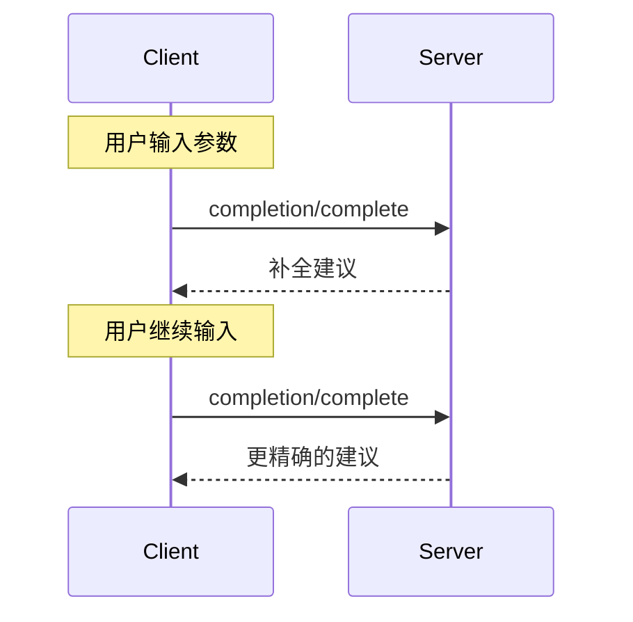

<div id="enable-section-numbers" />

<Info>**协议修订**：2025-06-18</Info>

模型上下文协议（MCP）提供了一种标准化的方式，使服务器能够为提示词（prompt）和资源 URI 提供参数自动补全建议。这使得可以实现类似 IDE 的丰富交互体验，用户在输入参数值时能够获得上下文相关的建议。

## 用户交互模型

MCP 中的补全功能设计用于支持类似 IDE 代码补全的交互式用户体验。

例如，应用程序可以在用户输入时显示一个下拉菜单或弹出窗口展示补全建议，并支持过滤和选择可用选项。

不过，实现方可以自由选择任何适合其需求的界面模式来暴露补全功能——协议本身并不强制要求特定的用户交互模型。

## 能力声明

支持补全功能的服务器**必须**声明 `completions` 能力：

```json
{
  "capabilities": {
    "completions": {}
  }
}
```

## 协议消息

### 请求补全

为了获取补全建议，客户端发送一个 `completion/complete` 请求，通过引用类型（reference type）指定正在补全的内容：

**请求：**

```json
{
  "jsonrpc": "2.0",
  "id": 1,
  "method": "completion/complete",
  "params": {
    "ref": {
      "type": "ref/prompt",
      "name": "code_review"
    },
    "argument": {
      "name": "language",
      "value": "py"
    }
  }
}
```

**响应：**

```json
{
  "jsonrpc": "2.0",
  "id": 1,
  "result": {
    "completion": {
      "values": ["python", "pytorch", "pyside"],
      "total": 10,
      "hasMore": true
    }
  }
}
```

对于具有多个参数的提示词或 URI 模板，客户端应在 `context.arguments` 对象中包含先前的补全结果，以便为后续请求提供上下文。

**请求：**

```json
{
  "jsonrpc": "2.0",
  "id": 1,
  "method": "completion/complete",
  "params": {
    "ref": {
      "type": "ref/prompt",
      "name": "code_review"
    },
    "argument": {
      "name": "framework",
      "value": "fla"
    },
    "context": {
      "arguments": {
        "language": "python"
      }
    }
  }
}
```

**响应：**

```json
{
  "jsonrpc": "2.0",
  "id": 1,
  "result": {
    "completion": {
      "values": ["flask"],
      "total": 1,
      "hasMore": false
    }
  }
}
```

### 引用类型

协议支持两种类型的补全引用：

| 类型           | 描述                   | 示例                                               |
| -------------- | ---------------------- | -------------------------------------------------- |
| `ref/prompt`   | 按名称引用提示词       | `{"type": "ref/prompt", "name": "code_review"}`    |
| `ref/resource` | 引用资源 URI           | `{"type": "ref/resource", "uri": "file:///{path}"}` |

### 补全结果

服务器返回一个按相关性排序的补全值数组，并包含：

- 每次响应最多返回 100 项
- 可选的匹配项总数
- 一个布尔值，表示是否存在更多结果

## 消息流程



## 数据类型

### CompleteRequest

- `ref`: 一个 `PromptReference` 或 `ResourceReference`
- `argument`: 包含以下字段的对象：
  - `name`: 参数名
  - `value`: 当前值
- `context`: 包含以下字段的对象：
  - `arguments`: 已解析参数名到其值的映射

### CompleteResult

- `completion`: 包含以下字段的对象：
  - `values`: 建议数组（最多 100 项）
  - `total`: 可选的匹配总数
  - `hasMore`: 是否存在更多结果的标志

## 错误处理

服务器**应**为常见的失败情况返回标准的 JSON-RPC 错误码：

- 方法未找到：`-32601`（不支持该能力）
- 提示词名称无效：`-32602`（参数无效）
- 缺少必填参数：`-32602`（参数无效）
- 内部错误：`-32603`（内部错误）

## 实现建议

1. 服务器**应**：
   - 返回按相关性排序的建议
   - 在适当的情况下实现模糊匹配
   - 对补全请求进行速率限制
   - 验证所有输入

2. 客户端**应**：
   - 对频繁的补全请求进行防抖处理
   - 在适当的情况下缓存补全结果
   - 优雅地处理缺失或部分结果

## 安全性

实现**必须**：

- 验证所有补全输入
- 实施适当的速率限制
- 控制对敏感建议的访问
- 防止基于补全的信息泄露