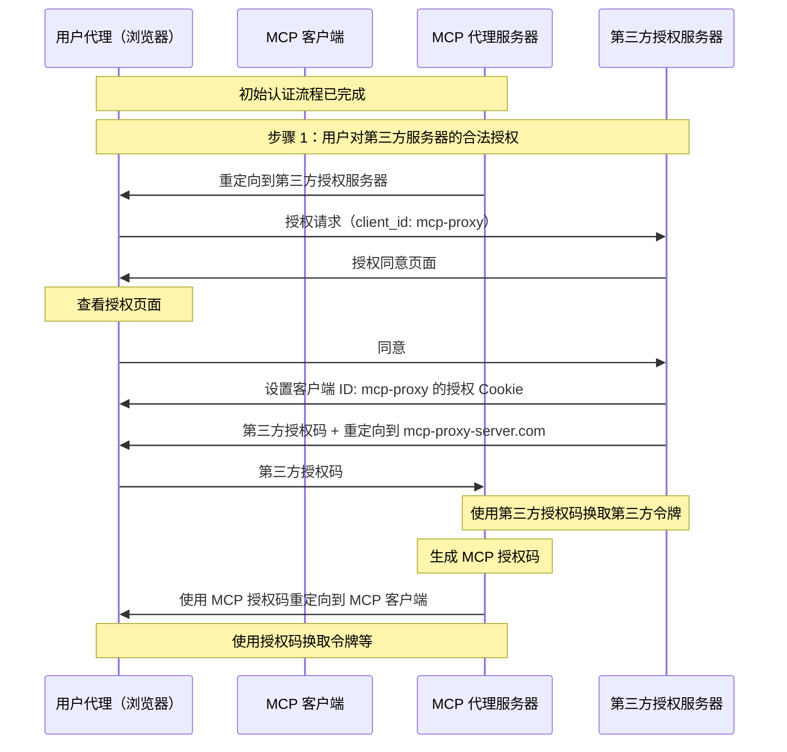
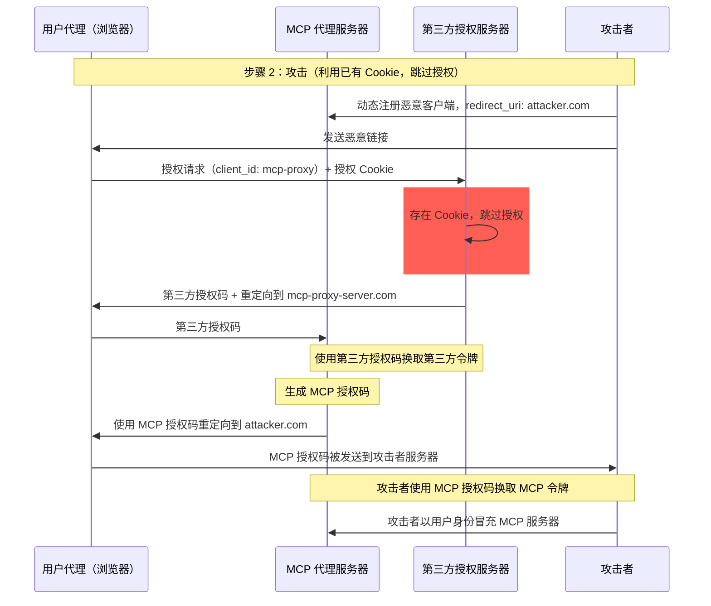
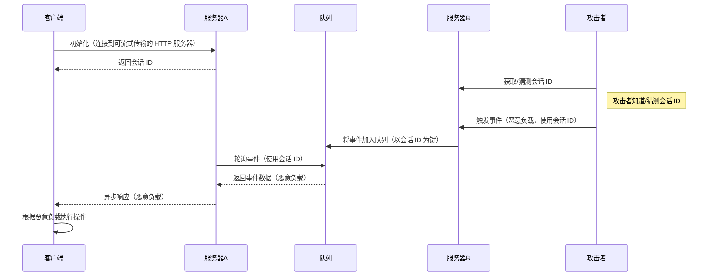
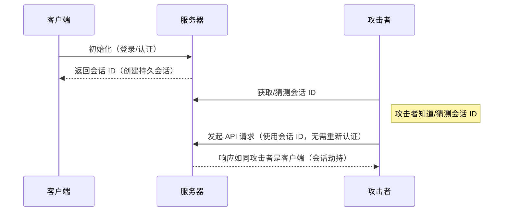

## 简介

### 目的与范围

本文档提供了 Model Context Protocol (MCP) 的安全考虑事项，作为 [MCP 授权](../basic/authorization.mdx) 规范的补充。文档中识别了与 MCP 实现相关的安全风险、攻击向量及最佳实践。

本文档的主要读者包括实现 MCP 授权流程的开发人员、运行 MCP 服务器的运维人员，以及评估基于 MCP 系统的安全专业人员。建议将本文档与 MCP 授权规范和 [OAuth 2.0 安全最佳实践](https://datatracker.ietf.org/doc/html/rfc9700) 一起阅读。

## 攻击与缓解措施

本节详细描述了针对 MCP 实现的攻击方式以及可能的应对措施。

### 混淆代理人问题（Confused Deputy Problem）

攻击者可以利用 MCP 服务器代理其他资源服务器的特性，从而引发“[混淆代理人](https://en.wikipedia.org/wiki/Confused_deputy_problem)”漏洞。

#### 术语说明

**MCP 代理服务器**
: 一种 MCP 服务器，将 MCP 客户端连接到第三方 API，提供 MCP 功能，同时将操作委托给第三方 API，并作为单个 OAuth 客户端与第三方 API 服务器通信。

**第三方授权服务器**
: 保护第三方 API 的授权服务器。它可能不支持动态客户端注册，因此 MCP 代理必须使用静态客户端 ID 来处理所有请求。

**第三方 API**
: 提供实际 API 功能的受保护资源服务器。访问此 API 需要由第三方授权服务器颁发的令牌。

**静态客户端 ID**
: MCP 代理服务器在与第三方授权服务器通信时使用的固定 OAuth 2.0 客户端标识符。该客户端 ID 表示作为第三方 API 客户端的 MCP 服务器。无论哪个 MCP 客户端发起请求，MCP 服务器与第三方 API 的所有交互中该客户端 ID 始终相同。

#### 架构与攻击流程

##### 正常 OAuth 代理使用（保留用户授权）

##### 恶意 OAuth 代理使用（跳过用户授权）

#### 攻击描述

当 MCP 代理服务器使用静态客户端 ID 对不支持动态客户端注册的第三方授权服务器进行身份验证时，可能发生以下攻击：

1. 用户通过 MCP 代理服务器正常认证以访问第三方 API
2. 在此流程中，第三方授权服务器会在用户代理上设置一个 Cookie，表示对静态客户端 ID 的授权
3. 攻击者随后向用户发送包含恶意授权请求的链接，该请求包含恶意的 `redirect_uri` 和新注册的客户端 ID
4. 当用户点击该链接时，其浏览器仍保留先前合法请求的授权 Cookie
5. 第三方授权服务器检测到 Cookie 并跳过授权页面
6. MCP 授权码被重定向至攻击者控制的服务器（在 [动态客户端注册](/specification/draft/basic/authorization#dynamic-client-registration) 期间指定的恶意 `redirect_uri`）
7. 攻击者使用窃取的授权码在未经用户明确批准的情况下换取 MCP 服务器的访问令牌
8. 攻击者现在可以以被攻击用户的名义访问第三方 API

#### 缓解措施

使用静态客户端 ID 的 MCP 代理服务器 **必须** 在将请求转发到第三方授权服务器之前，对每个动态注册的客户端获取用户的明确授权（这可能需要额外的授权步骤）。

### 令牌透传（Token Passthrough）

“令牌透传”是一种反模式，指的是 MCP 服务器接受来自 MCP 客户端的令牌，但未验证这些令牌是否确实颁发给该 MCP 服务器，并将其直接透传给下游 API。

#### 风险

令牌透传在 [授权规范](/specification/draft/basic/authorization) 中被明确禁止，因为它引入了多种安全风险，包括：

- **安全控制绕过**
  - MCP 服务器或下游 API 可能实现了诸如速率限制、请求验证或流量监控等重要安全控制措施，这些措施依赖于令牌受众或其他凭证约束。如果客户端可以绕过 MCP 服务器的验证机制，直接使用下游 API，就可以绕过这些安全控制。
- **责任追踪与审计日志问题**
  - 当客户端使用上游颁发的访问令牌调用 MCP 服务器时，MCP 服务器无法识别或区分不同的 MCP 客户端。
  - 下游资源服务器的日志可能显示请求来自不同的来源和身份，而非实际转发令牌的 MCP 服务器。
  - 这两个因素都会使事件调查、控制和审计变得更加困难。
  - 如果 MCP 服务器在未验证令牌声明（如角色、权限或受众）或其他元数据的情况下接受令牌，拥有窃取令牌的恶意行为者可以利用该服务器作为数据泄露的代理。
- **信任边界问题**
  - 下游资源服务器信任特定实体。这种信任可能包含对其来源或客户端行为模式的假设。破坏这个信任边界可能导致意外问题。
  - 如果多个服务在未正确验证的情况下接受令牌，攻击者攻破一个服务后，可以使用同一令牌访问其他连接服务。
- **未来兼容性风险**
  - 即使 MCP 服务器当前作为“纯代理”运行，未来也可能需要添加安全控制。从一开始就正确分离令牌受众，有助于未来安全模型的演进。

#### 缓解措施

MCP 服务器 **不得** 接受任何未明确颁发给该 MCP 服务器的令牌。

### 会话劫持

会话劫持是一种攻击方式，攻击者通过获取客户端的会话 ID 来冒充原始客户端，执行未经授权的操作。

#### 会话劫持 - 提示注入

#### 会话劫持 - 身份冒充

#### 攻击描述

当多个有状态的 HTTP 服务器处理 MCP 请求时，可能会出现以下攻击向量：

**会话劫持 - 提示注入**

1. 客户端连接到 **服务器 A** 并获得一个会话 ID。
1. 攻击者获取现有会话 ID，并向 **服务器 B** 发送包含该会话 ID 的恶意事件。
   - 当某个服务器支持 [消息重传/可恢复流](/specification/draft/basic/transports#resumability-and-redelivery) 时，在收到响应前主动终止请求可能导致原始客户端通过 GET 请求服务器发送事件来恢复该请求。
   - 如果某个服务器因调用工具（如 `notifications/tools/list_changed`）而触发服务器发送事件，攻击者可能影响服务器提供的工具列表，导致客户端在不知情的情况下启用某些工具。

1. **服务器 B** 将事件（与会话 ID 关联）放入共享队列。
1. **服务器 A** 使用会话 ID 轮询队列并获取恶意负载。
1. **服务器 A** 将恶意负载作为异步或恢复的响应发送给客户端。
1. 客户端接收并执行恶意负载，可能导致系统被入侵。

**会话劫持 - 身份冒充**

1. MCP 客户端与 MCP 服务器进行身份验证，创建持久的会话 ID。
2. 攻击者获取该会话 ID。
3. 攻击者使用该会话 ID 向 MCP 服务器发起调用。
4. MCP 服务器未进行额外的身份验证，将攻击者视为合法用户，导致未经授权的访问或操作。

#### 缓解措施

为防止会话劫持和事件注入攻击，应实施以下缓解措施：

实施授权的 MCP 服务器 **必须** 验证所有入站请求。  
MCP 服务器 **不得** 使用会话进行身份验证。

MCP 服务器 **必须** 使用安全、不可预测的会话 ID。  
生成的会话 ID（例如 UUID）**应** 使用安全的随机数生成器。避免使用攻击者可预测或顺序生成的会话 ID。轮换或过期会话 ID 也可以降低风险。

MCP 服务器 **应** 将会话 ID 绑定到用户特定信息。  
在存储或传输会话相关数据时（例如在队列中），将会话 ID 与授权用户的唯一信息（如内部用户 ID）结合使用。使用类似 `<user_id>:<session_id>` 的键格式。这样可以确保即使攻击者猜中会话 ID，也无法冒充其他用户，因为用户 ID 来自用户令牌，而非客户端提供。

MCP 服务器可以可选地使用其他唯一标识符。