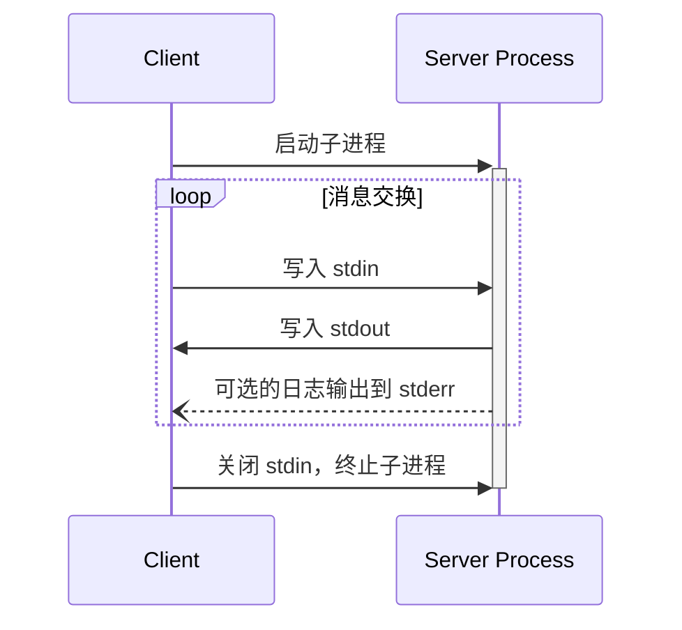
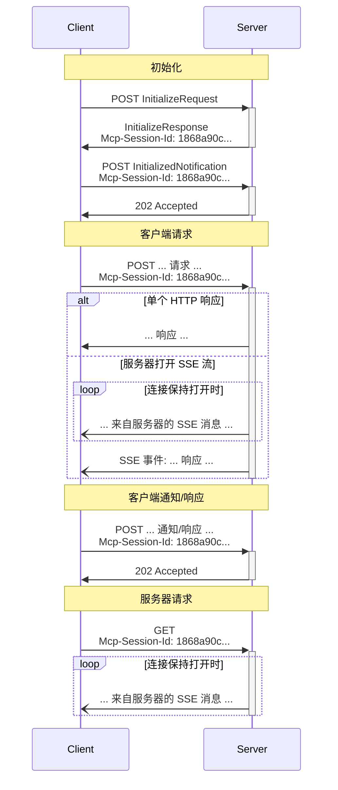

<Info>**协议修订版本**：草案</Info>

MCP 使用 JSON-RPC 对消息进行编码。JSON-RPC 消息 **必须** 采用 UTF-8 编码。

当前协议定义了两种标准的客户端-服务器通信传输机制：

1. [stdio](#stdio)，通过标准输入和标准输出进行通信
2. [可流式 HTTP](#streamable-http)

客户端 **应该** 在可能的情况下支持 stdio。

客户端和服务器也可以以可插拔的方式实现 [自定义传输机制](#custom-transports)。

## stdio

在 **stdio** 传输中：

- 客户端将 MCP 服务器作为子进程启动。
- 服务器从其标准输入（`stdin`）读取 JSON-RPC 消息，并通过其标准输出（`stdout`）发送消息。
- 消息是独立的 JSON-RPC 请求、通知或响应。
- 消息由换行符分隔，**不得** 包含嵌入的换行符。
- 服务器 **可以** 将 UTF-8 字符串写入其标准错误（`stderr`）用于日志记录。客户端 **可以** 捕获、转发或忽略这些日志。
- 服务器 **不得** 在其 `stdout` 中写入任何不是有效 MCP 消息的内容。
- 客户端 **不得** 向服务器的 `stdin` 写入任何不是有效 MCP 消息的内容。

## 可流式 HTTP

<Info>

此机制替代了协议版本 2024-11-05 中的 [HTTP+SSE 传输](/specification/2024-11-05/basic/transports#http-with-sse)。请参阅下方的 [向后兼容性](#backwards-compatibility) 指南。

</Info>

在 **可流式 HTTP** 传输中：

- 服务器作为一个独立进程运行，可以处理多个客户端连接。
- 该传输机制使用 HTTP POST 和 GET 请求。
- 服务器可以可选地使用 [Server-Sent Events](https://en.wikipedia.org/wiki/Server-sent_events) (SSE) 来流式传输多个服务器消息。
- 这使得基本的 MCP 服务器，以及支持流式传输、服务器到客户端通知和请求的更高级服务器均可使用。

服务器 **必须** 提供一个单一的 HTTP 端点路径（以下简称 **MCP 端点**），该端点支持 POST 和 GET 方法。例如：`https://example.com/mcp`。

### 安全警告

实现可流式 HTTP 传输时：

1. 服务器 **必须** 验证所有传入连接的 `Origin` 头，以防止 DNS 重新绑定攻击。
2. 在本地运行时，服务器 **应该** 仅绑定到 localhost（127.0.0.1），而不是所有网络接口（0.0.0.0）。
3. 服务器 **应该** 为所有连接实现适当的认证机制。

如果没有这些保护措施，攻击者可以通过 DNS 重新绑定从远程网站与本地 MCP 服务器交互。

### 向服务器发送消息

客户端发送的每个 JSON-RPC 消息 **必须** 是一个指向 MCP 端点的新 HTTP POST 请求。

1. 客户端 **必须** 使用 HTTP POST 向 MCP 端点发送 JSON-RPC 消息。
2. 客户端 **必须** 在请求中包含 `Accept` 头，列出 `application/json` 和 `text/event-stream` 作为支持的内容类型。
3. POST 请求的正文 **必须** 是一个 JSON-RPC _请求_、_通知_ 或 _响应_。
4. 如果输入是 JSON-RPC _响应_ 或 _通知_：
   - 如果服务器接受输入，**必须** 返回 HTTP 状态码 202 Accepted，且不带响应体。
   - 如果服务器无法接受输入，**必须** 返回一个 HTTP 错误状态码（如 400 Bad Request）。HTTP 响应体 **可以** 包含一个没有 `id` 的 JSON-RPC _错误响应_。
5. 如果输入是 JSON-RPC _请求_，服务器 **必须** 返回 `Content-Type: text/event-stream` 以启动 SSE 流，或返回 `Content-Type: application/json` 以返回一个 JSON 对象。客户端 **必须** 支持这两种情况。
6. 如果服务器启动了 SSE 流：
   - SSE 流 **应该** 最终包含对 POST 正文中发送的 JSON-RPC _请求_ 的 JSON-RPC _响应_。
   - 服务器 **可以** 在发送 JSON-RPC _响应_ 前发送 JSON-RPC _请求_ 和 _通知_。这些消息 **应该** 与原始客户端 _请求_ 相关。
   - 除非 [会话](#session-management) 过期，服务器 **不应该** 在发送 JSON-RPC _响应_ 前关闭 SSE 流。
   - 在 JSON-RPC _响应_ 发送后，服务器 **应该** 关闭 SSE 流。
   - 断开连接 **可以** 在任何时候发生（例如由于网络状况）。因此：
     - 断开连接 **不应该** 被解释为客户端取消请求。
     - 要取消，客户端 **应该** 显式发送一个 MCP `CancelledNotification`。
     - 为了避免因断开连接导致消息丢失，服务器 **可以** 使流 [可恢复](#resumability-and-redelivery)。

### 监听来自服务器的消息

1. 客户端 **可以** 向 MCP 端点发送 HTTP GET 请求。这可以用于打开一个 SSE 流，使服务器可以在客户端未首先通过 HTTP POST 发送数据的情况下与客户端通信。
2. 客户端 **必须** 在请求中包含 `Accept` 头，列出 `text/event-stream` 作为支持的内容类型。
3. 服务器 **必须** 在响应此 HTTP GET 请求时返回 `Content-Type: text/event-stream`，或返回 HTTP 405 Method Not Allowed，表示服务器在此端点不提供 SSE 流。
4. 如果服务器启动了 SSE 流：
   - 服务器 **可以** 在流上发送 JSON-RPC _请求_ 和 _通知_。
   - 这些消息 **应该** 与客户端当前运行的任何 JSON-RPC _请求_ 无关。
   - 除非 [恢复](#resumability-and-redelivery) 与之前客户端请求相关的流，否则服务器 **不得** 在流上发送 JSON-RPC _响应_。
   - 服务器 **可以** 在任何时候关闭 SSE 流。
   - 客户端 **可以** 在任何时候关闭 SSE 流。

### 多连接

1. 客户端 **可以** 同时保持多个 SSE 流连接。
2. 服务器 **必须** 只在其中一个连接的流上发送其 JSON-RPC 消息；即，**不得** 在多个流上广播相同的消息。
   - 通过使流 [可恢复](#resumability-and-redelivery)，可以减轻消息丢失的风险。

### 可恢复性与重传

为了支持断线恢复和可能丢失的消息重传：

1. 服务器 **可以** 按照 [SSE 标准](https://html.spec.whatwg.org/multipage/server-sent-events.html#event-stream-interpretation) 在其 SSE 事件中附加一个 `id` 字段。
   - 如果存在，ID **必须** 在该 [会话](#session-management) 内的所有流中全局唯一——或者如果未使用会话管理，则在该特定客户端的所有流中全局唯一。
2. 如果客户端希望在断线后恢复，**应该** 向 MCP 端点发送 HTTP GET 请求，并包含
   [`Last-Event-ID`](https://html.spec.whatwg.org/multipage/server-sent-events.html#the-last-event-id-header)
   头以指示其接收到的最后一个事件 ID。
   - 服务器 **可以** 使用此头来重新发送在最后一个事件 ID 之后应发送的消息，并从该点恢复流。
   - 服务器 **不得** 重发应通过其他流发送的消息。

换句话说，这些事件 ID 应由服务器按 _每个流_ 分配，作为该流内的游标。

### 会话管理

一个 MCP “会话” 包括客户端和服务器之间的逻辑相关交互，从 [初始化阶段](/specification/draft/basic/lifecycle) 开始。为了支持希望建立有状态会话的服务器：

1. 使用可流式 HTTP 传输的服务器 **可以** 在初始化时通过在包含 `InitializeResult` 的 HTTP 响应中添加 `Mcp-Session-Id` 头来分配会话 ID。
   - 会话 ID **应该** 是全局唯一且加密安全的（例如，安全生成的 UUID、JWT 或加密哈希）。
   - 会话 ID **必须** 仅包含可见 ASCII 字符（范围从 0x21 到 0x7E）。
2. 如果服务器在初始化期间返回了 `Mcp-Session-Id`，使用可流式 HTTP 传输的客户端 **必须** 在其后续所有 HTTP 请求的 `Mcp-Session-Id` 头中包含该 ID。
   - 要求会话 ID 的服务器 **应该** 对未包含 `Mcp-Session-Id` 头（初始化请求除外）的请求返回 HTTP 400 Bad Request。
3. 服务器 **可以** 在任何时间终止会话，之后 **必须** 对包含该会话 ID 的请求返回 HTTP 404 Not Found。
4. 当客户端收到包含 `Mcp-Session-Id` 的请求返回 HTTP 404 时，**必须** 发送一个新的不带会话 ID 的 `InitializeRequest` 来启动新会话。
5. 不再需要特定会话的客户端（例如，用户离开客户端应用）**应该** 向 MCP 端点发送带有 `Mcp-Session-Id` 头的 HTTP DELETE 请求，以显式终止会话。
   - 服务器 **可以** 对此请求返回 HTTP 405 Method Not Allowed，表示服务器不允许客户端终止会话。

### 时序图

### 协议版本头

如果使用 HTTP，客户端 **必须** 在所有后续请求中包含 `MCP-Protocol-Version: <protocol-version>` HTTP 头，以便 MCP 服务器可以根据 MCP 协议版本进行响应。

例如：`MCP-Protocol-Version: 2025-06-18`

客户端发送的协议版本 **应该** 是 [初始化期间协商](/specification/draft/basic/lifecycle#version-negotiation) 的版本。

为了向后兼容，如果服务器 **未** 接收到 `MCP-Protocol-Version` 头，并且没有其他方式识别版本（例如通过初始化期间协商的协议版本），服务器 **应该** 假定协议版本为 `2025-03-26`。

如果服务器收到带有无效或不支持的 `MCP-Protocol-Version` 的请求，**必须** 返回 `400 Bad Request`。

### 向后兼容性

客户端和服务器可以通过以下方式与已弃用的 [HTTP+SSE 传输](/specification/2024-11-05/basic/transports#http-with-sse)（协议版本 2024-11-05）保持向后兼容：

**服务器** 如需支持旧客户端应：

- 继续托管旧传输的 SSE 和 POST 端点，同时提供为可流式 HTTP 传输定义的新“MCP 端点”。
  - 也可以将旧的 POST 端点与新的 MCP 端点合并，但这可能引入不必要的复杂性。

**客户端** 如需支持旧服务器应：

1. 接受用户提供的 MCP 服务器 URL，该 URL 可能指向使用旧传输或新传输的服务器。
2. 尝试向服务器 URL 发送 `InitializeRequest` 的 POST 请求，并附上上述定义的 `Accept` 头：
   - 如果成功，客户端可以假设这是一个支持新可流式 HTTP 传输的服务器。
   - 如果失败并返回 HTTP 4xx 状态码（如 405 Method Not Allowed 或 404 Not Found）：
     - 向服务器 URL 发送 GET 请求，期望这将打开一个 SSE 流并返回一个 `endpoint` 事件作为第一个事件。
     - 当 `endpoint` 事件到达时，客户端可以假设这是一个运行旧 HTTP+SSE 传输的服务器，并应使用该传输进行所有后续通信。

## 自定义传输机制

客户端和服务器 **可以** 实现额外的自定义传输机制以满足其特定需求。该协议与传输机制无关，可以在任何支持双向消息交换的通信通道上实现。

选择支持自定义传输机制的实现者 **必须** 确保其保留 MCP 定义的 JSON-RPC 消息格式和生命周期要求。自定义传输机制 **应该** 记录其特定的连接建立和消息交换模式，以促进互操作性。