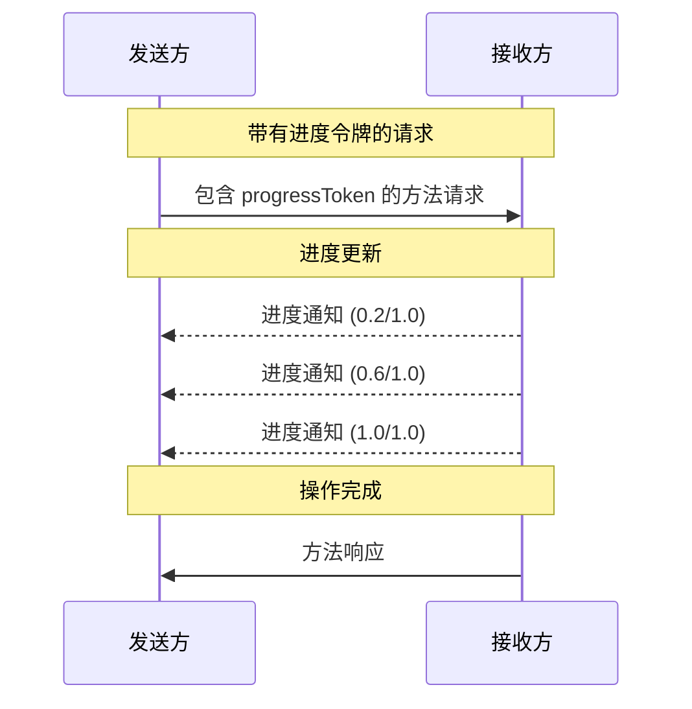

<div id="enable-section-numbers" />

<Info>**协议修订版本**: 草案</Info>

模型上下文协议（MCP）通过通知消息支持对长时间运行的操作进行可选的进度跟踪。任意一方都可以发送进度通知，以提供操作状态的更新。

## 进度流程

当一方希望为请求_接收_进度更新时，它应在请求元数据中包含一个 `progressToken`。

- 进度令牌 **必须** 是字符串或整数值
- 进度令牌可以由发送方以任何方式选择，但**必须**在所有活动请求中唯一

```json
{
  "jsonrpc": "2.0",
  "id": 1,
  "method": "some_method",
  "params": {
    "_meta": {
      "progressToken": "abc123"
    }
  }
}
```

接收方**可以**随后发送包含以下内容的进度通知：

- 原始的进度令牌
- 到目前为止的当前进度值
- 可选的 "total"（总进度）值
- 可选的 "message"（消息）值

```json
{
  "jsonrpc": "2.0",
  "method": "notifications/progress",
  "params": {
    "progressToken": "abc123",
    "progress": 50,
    "total": 100,
    "message": "正在校准曲线..."
  }
}
```

- 每次通知中的 `progress`（进度）值**必须**递增，即使总进度未知也是如此。
- `progress` 和 `total` 值**可以**是浮点数。
- `message` 字段**应该**提供相关的、可读性强的进度信息。

## 行为要求

1. 进度通知**必须**仅引用以下令牌：
   - 在活动请求中提供的令牌
   - 与正在进行的操作相关联的令牌

2. 进度请求的接收方**可以**：
   - 选择不发送任何进度通知
   - 以自认为合适的频率发送通知
   - 在未知总进度时省略 total 值



## 实现注意事项

- 发送方和接收方**应该**跟踪活动的进度令牌
- 双方**应该**实现速率限制以防止通知泛滥
- 完成后**必须**停止发送进度通知