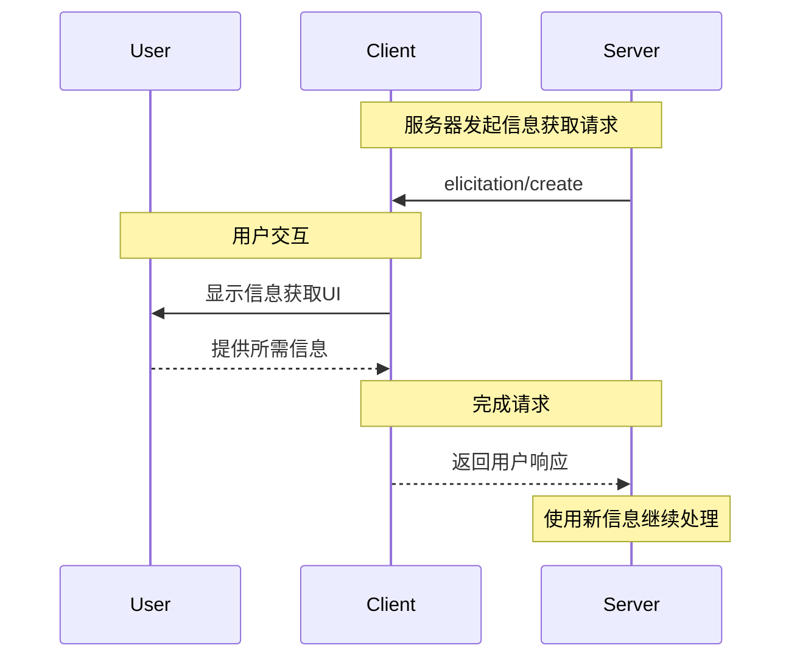

<div id="enable-section-numbers" />

<Info>**协议修订**：草案</Info>

<Note>

信息获取功能是在MCP规范的本版本中首次引入，其设计可能在未来的协议版本中演化。

</Note>

模型上下文协议（MCP）为服务器提供了一种标准化方式，通过客户端在交互过程中请求用户的附加信息。这种流程允许客户端在维持用户交互和数据共享控制的同时，使服务器能够动态地收集必要的信息。
服务器使用JSON Schema来验证用户的响应，请求结构化数据。

## 用户交互模型

MCP中的信息获取功能允许服务器通过在其他MCP服务器功能中嵌套用户输入请求的方式，实现交互式工作流程。

实现方可以自由地通过任何适合其需求的界面模式来暴露信息获取功能——协议本身不强制规定任何特定的用户交互模型。

<Warning>

出于信任、安全和隐私的考虑：

- 服务器 **不得** 使用信息获取功能请求敏感信息。

应用程序 **应** 做到以下几点：

- 提供清晰的UI，表明是哪个服务器在请求信息
- 允许用户在发送前审查和修改其响应
- 尊重用户隐私，并提供明确的拒绝和取消选项

</Warning>

## 能力声明

支持信息获取功能的客户端 **必须** 在[初始化](/specification/draft/basic/lifecycle#initialization)期间声明 `elicitation` 能力：

```json
{
  "capabilities": {
    "elicitation": {}
  }
}
```

## 协议消息

### 创建信息获取请求

为了向用户请求信息，服务器发送 `elicitation/create` 请求：

#### 简单文本请求

**请求：**

```json
{
  "jsonrpc": "2.0",
  "id": 1,
  "method": "elicitation/create",
  "params": {
    "message": "请提供你的GitHub用户名",
    "requestedSchema": {
      "type": "object",
      "properties": {
        "name": {
          "type": "string"
        }
      },
      "required": ["name"]
    }
  }
}
```

**响应：**

```json
{
  "jsonrpc": "2.0",
  "id": 1,
  "result": {
    "action": "accept",
    "content": {
      "name": "octocat"
    }
  }
}
```

#### 结构化数据请求

**请求：**

```json
{
  "jsonrpc": "2.0",
  "id": 2,
  "method": "elicitation/create",
  "params": {
    "message": "请提供你的联系信息",
    "requestedSchema": {
      "type": "object",
      "properties": {
        "name": {
          "type": "string",
          "description": "你的全名"
        },
        "email": {
          "type": "string",
          "format": "email",
          "description": "你的电子邮件地址"
        },
        "age": {
          "type": "number",
          "minimum": 18,
          "description": "你的年龄"
        }
      },
      "required": ["name", "email"]
    }
  }
}
```

**响应：**

```json
{
  "jsonrpc": "2.0",
  "id": 2,
  "result": {
    "action": "accept",
    "content": {
      "name": "Monalisa Octocat",
      "email": "octocat@github.com",
      "age": 30
    }
  }
}
```

**拒绝响应示例：**

```json
{
  "jsonrpc": "2.0",
  "id": 2,
  "result": {
    "action": "decline"
  }
}
```

**取消响应示例：**

```json
{
  "jsonrpc": "2.0",
  "id": 2,
  "result": {
    "action": "cancel"
  }
}
```

## 消息流程



## 请求模式

`requestedSchema` 字段允许服务器使用JSON Schema的一个受限子集定义预期响应的结构。为了简化客户端用户体验，信息获取模式仅限于包含基本属性的扁平对象：

```json
"requestedSchema": {
  "type": "object",
  "properties": {
    "propertyName": {
      "type": "string",
      "title": "显示名称",
      "description": "属性描述"
    },
    "anotherProperty": {
      "type": "number",
      "minimum": 0,
      "maximum": 100
    }
  },
  "required": ["propertyName"]
}
```

### 支持的模式类型

模式仅限于以下基本类型：

1. **字符串模式**

   ```json
   {
     "type": "string",
     "title": "显示名称",
     "description": "描述文本",
     "minLength": 3,
     "maxLength": 50,
     "pattern": "^[A-Za-z]+$",
     "format": "email"
   }
   ```

   支持的格式：`email`, `uri`, `date`, `date-time`

2. **数字模式**

   ```json
   {
     "type": "number", // 或 "integer"
     "title": "显示名称",
     "description": "描述文本",
     "minimum": 0,
     "maximum": 100
   }
   ```

3. **布尔模式**

   ```json
   {
     "type": "boolean",
     "title": "显示名称",
     "description": "描述文本",
     "default": false
   }
   ```

4. **枚举模式**
   ```json
   {
     "type": "string",
     "title": "显示名称",
     "description": "描述文本",
     "enum": ["option1", "option2", "option3"],
     "enumNames": ["选项1", "选项2", "选项3"]
   }
   ```

客户端可以使用此模式来：

1. 生成适当的输入表单
2. 在发送前验证用户输入
3. 向用户提供更好的指导

请注意，为了简化客户端用户体验，有意不支持复杂的嵌套结构、对象数组和其他高级JSON Schema功能。

## 响应动作

信息获取响应使用三动作模型以明确区分不同的用户操作：

```json
{
  "jsonrpc": "2.0",
  "id": 1,
  "result": {
    "action": "accept", // 或 "decline" 或 "cancel"
    "content": {
      "propertyName": "value",
      "anotherProperty": 42
    }
  }
}
```

三种响应动作如下：

1. **接受** (`action: "accept"`): 用户明确批准并提交了数据
   - `content` 字段包含符合请求模式的提交数据
   - 示例：用户点击了“提交”、“确定”、“确认”等按钮

2. **拒绝** (`action: "decline"`): 用户明确拒绝了请求
   - `content` 字段通常被省略
   - 示例：用户点击了“拒绝”、“否”等按钮

3. **取消** (`action: "cancel"`): 用户未做明确选择即关闭了对话框
   - `content` 字段通常被省略
   - 示例：用户关闭了对话框、点击了外部区域、按下了Esc键等

服务器应适当地处理每个状态：

- **接受**：处理提交的数据
- **拒绝**：处理用户的明确拒绝（例如，提供替代方案）
- **取消**：处理对话框的关闭（例如，稍后再次提示）


## 安全考虑

1. 服务器 **不得** 通过信息获取功能请求敏感信息
2. 客户端 **应** 实现用户审批控制
3. 双方 **应** 根据提供的模式验证信息获取内容
4. 客户端 **应** 清晰地表明是哪个服务器在请求信息
5. 客户端 **应** 允许用户随时拒绝信息获取请求
6. 客户端 **应** 实现速率限制
7. 客户端 **应** 以清晰的方式呈现信息获取请求，让用户明白正在请求哪些信息以及请求的原因