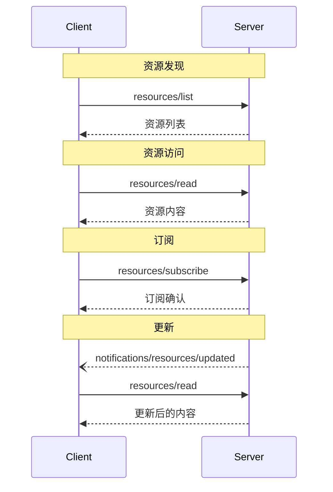

<div id="enable-section-numbers" />

<Info>**协议修订版本**: draft</Info>

模型上下文协议（MCP）提供了一种标准化方式，使服务器能够向客户端暴露资源。资源允许服务器共享为语言模型提供上下文的数据，例如文件、数据库模式或应用特定信息。每个资源由一个[URI](https://datatracker.ietf.org/doc/html/rfc3986)唯一标识。

## 用户交互模型

MCP中的资源设计为**由应用驱动**，由宿主应用根据其需求决定如何整合上下文。

例如，应用可以：

- 通过UI元素显式选择资源，例如树状视图或列表视图
- 允许用户搜索并过滤可用资源
- 根据启发式规则或AI模型的选择，自动包含上下文


然而，实现可以自由选择适合其需求的任何界面模式来暴露资源——协议本身不强制任何特定的用户交互模型。

## 功能能力

支持资源的服务器**必须**声明`resources`能力：

```json
{
  "capabilities": {
    "resources": {
      "subscribe": true,
      "listChanged": true
    }
  }
}
```

该能力支持两个可选功能：

- `subscribe`：客户端是否可以订阅单个资源的变更通知。
- `listChanged`：服务器是否会在可用资源列表发生变化时发出通知。

`subscribe`和`listChanged`均为可选项——服务器可以都不支持、只支持其中一个，或两者都支持：

```json
{
  "capabilities": {
    "resources": {} // 两者都不支持
  }
}
```

```json
{
  "capabilities": {
    "resources": {
      "subscribe": true // 仅支持订阅
    }
  }
}
```

```json
{
  "capabilities": {
    "resources": {
      "listChanged": true // 仅支持列表变更通知
    }
  }
}
```

## 协议消息

### 列出资源

为了发现可用资源，客户端发送`resources/list`请求。此操作支持[分页](/specification/draft/server/utilities/pagination)。

**请求：**

```json
{
  "jsonrpc": "2.0",
  "id": 1,
  "method": "resources/list",
  "params": {
    "cursor": "可选的游标值"
  }
}
```

**响应：**

```json
{
  "jsonrpc": "2.0",
  "id": 1,
  "result": {
    "resources": [
      {
        "uri": "file:///project/src/main.rs",
        "name": "main.rs",
        "title": "Rust软件应用主文件",
        "description": "主程序入口",
        "mimeType": "text/x-rust"
      }
    ],
    "nextCursor": "下一页游标"
  }
}
```

### 读取资源

为了获取资源内容，客户端发送`resources/read`请求：

**请求：**

```json
{
  "jsonrpc": "2.0",
  "id": 2,
  "method": "resources/read",
  "params": {
    "uri": "file:///project/src/main.rs"
  }
}
```

**响应：**

```json
{
  "jsonrpc": "2.0",
  "id": 2,
  "result": {
    "contents": [
      {
        "uri": "file:///project/src/main.rs",
        "name": "main.rs",
        "title": "Rust软件应用主文件",
        "mimeType": "text/x-rust",
        "text": "fn main() {\n    println!(\"Hello world!\");\n}"
      }
    ]
  }
}
```

### 资源模板

资源模板允许服务器使用[URI模板](https://datatracker.ietf.org/doc/html/rfc6570)暴露参数化资源。参数可以通过[补全API](/specification/draft/server/utilities/completion)自动补全。

**请求：**

```json
{
  "jsonrpc": "2.0",
  "id": 3,
  "method": "resources/templates/list"
}
```

**响应：**

```json
{
  "jsonrpc": "2.0",
  "id": 3,
  "result": {
    "resourceTemplates": [
      {
        "uriTemplate": "file:///{path}",
        "name": "项目文件",
        "title": "📁 项目文件",
        "description": "访问项目目录中的文件",
        "mimeType": "application/octet-stream"
      }
    ]
  }
}
```

### 列表变更通知

当可用资源列表发生变更时，声明了`listChanged`能力的服务器**应该**发送通知：

```json
{
  "jsonrpc": "2.0",
  "method": "notifications/resources/list_changed"
}
```

### 订阅

协议支持可选的资源变更订阅。客户端可以订阅特定资源，并在其变更时接收通知：

**订阅请求：**

```json
{
  "jsonrpc": "2.0",
  "id": 4,
  "method": "resources/subscribe",
  "params": {
    "uri": "file:///project/src/main.rs"
  }
}
```

**更新通知：**

```json
{
  "jsonrpc": "2.0",
  "method": "notifications/resources/updated",
  "params": {
    "uri": "file:///project/src/main.rs",
    "title": "Rust软件应用主文件"
  }
}
```

## 消息流程



## 数据类型

### 资源

一个资源定义包括：

- `uri`：资源的唯一标识符
- `name`：资源的名称
- `title`：可选的、用于显示的资源人类可读名称
- `description`：可选的描述
- `mimeType`：可选的MIME类型
- `size`：可选的字节大小

### 资源内容

资源可以包含文本或二进制数据：

#### 文本内容

```json
{
  "uri": "file:///example.txt",
  "name": "example.txt",
  "title": "示例文本文件",
  "mimeType": "text/plain",
  "text": "资源内容"
}
```

#### 二进制内容

```json
{
  "uri": "file:///example.png",
  "name": "example.png",
  "title": "示例图片",
  "mimeType": "image/png",
  "blob": "base64编码数据"
}
```

### 注解

资源、资源模板和内容块支持可选的注解，这些注解向客户端提供关于如何使用或显示资源的提示：

- **`audience`**：表示该资源的目标受众的数组。有效值为`"user"`和`"assistant"`。例如，`["user", "assistant"]`表示对两者都有用的内容。
- **`priority`**：从0.0到1.0的数字，表示资源的重要性。1表示“最重要”（实质上是必需的），0表示“最不重要”（完全可选）。
- **`lastModified`**：ISO 8601格式的时间戳，表示资源最后修改时间（例如，`"2025-01-12T15:00:58Z"`）。

带注解的资源示例：

```json
{
  "uri": "file:///project/README.md",
  "name": "README.md",
  "title": "项目文档",
  "mimeType": "text/markdown",
  "annotations": {
    "audience": ["user"],
    "priority": 0.8,
    "lastModified": "2025-01-12T15:00:58Z"
  }
}
```

客户端可以使用这些注解来：

- 根据目标受众过滤资源
- 优先选择哪些资源包含在上下文中
- 显示修改时间或按时间排序

## 常见URI方案

协议定义了若干标准URI方案。此列表**不是**详尽的——实现可以自由使用额外的、自定义的URI方案。

### https://

用于表示网络上的资源。

服务器**应该**仅在客户端能够自行直接从网络获取并加载资源时使用此方案——也就是说，客户端不需要通过MCP服务器读取该资源。

对于其他用例，服务器**应该**优先使用其他URI方案，或定义自定义方案，即使服务器本身将通过互联网下载资源内容。

### file://

用于标识行为类似于文件系统的资源。但资源不需要映射到实际的物理文件系统。

MCP服务器**可以**使用[XDG MIME类型](https://specifications.freedesktop.org/shared-mime-info-spec/0.14/ar01s02.html#id-1.3.14)标识`file://`资源，例如`inode/directory`，以表示没有标准MIME类型的非常规文件（如目录）。

### git://

Git版本控制集成。

### 自定义URI方案

自定义URI方案**必须**符合[RFC3986](https://datatracker.ietf.org/doc/html/rfc3986)，并应考虑上述指导。

## 错误处理

服务器**应该**为常见失败情况返回标准的JSON-RPC错误：

- 资源未找到：`-32002`
- 内部错误：`-32603`

示例错误：

```json
{
  "jsonrpc": "2.0",
  "id": 5,
  "error": {
    "code": -32002,
    "message": "资源未找到",
    "data": {
      "uri": "file:///nonexistent.txt"
    }
  }
}
```

## 安全考虑

1. 服务器**必须**验证所有资源URI
2. **应该**对敏感资源实施访问控制
3. 二进制数据**必须**正确编码
4. 操作前**应该**检查资源权限