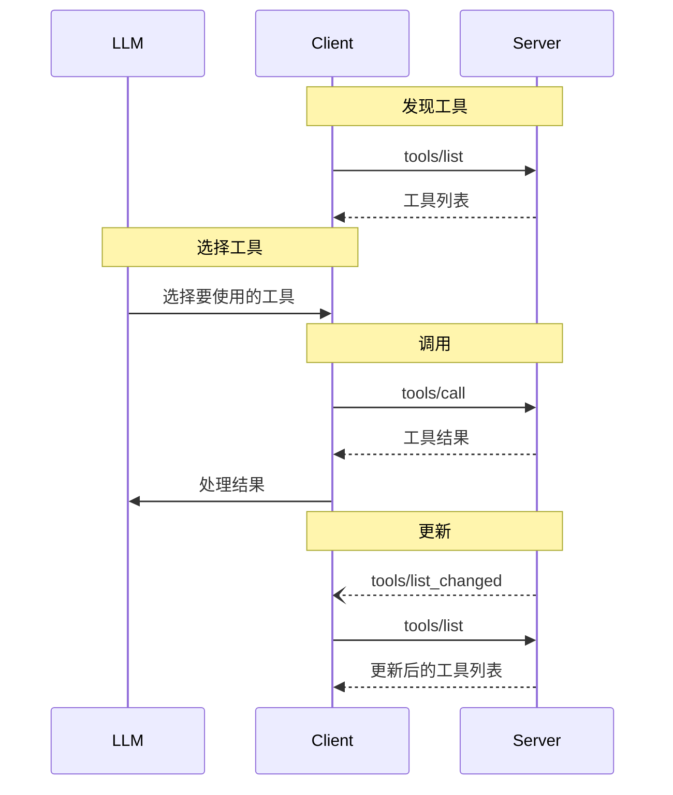

<div id="enable-section-numbers" />

<Info>**协议修订版本**: 草案</Info>

模型上下文协议（MCP）允许服务器暴露可供语言模型调用的工具。工具使模型能够与外部系统交互，例如查询数据库、调用API或执行计算。每个工具由其名称唯一标识，并包含描述其模式的元数据。

## 用户交互模型

MCP中的工具设计为**模型控制**，意味着语言模型可以根据其上下文理解和用户提示自动发现并调用工具。

然而，实现可以自由选择适合其需求的任何接口模式来暴露工具——协议本身并不规定任何特定的用户交互模型。

<Warning>

出于信任、安全与隐私考虑，**必须始终**有一个人在调用工具的流程中，拥有拒绝工具调用的能力。

应用程序**应当**：

- 提供清晰显示哪些工具暴露给AI模型的用户界面
- 在调用工具时插入清晰的视觉指示器
- 在执行操作时向用户呈现确认提示，以确保有人参与流程

</Warning>

## 能力声明

支持工具的服务器**必须**声明 `tools` 能力：

```json
{
  "capabilities": {
    "tools": {
      "listChanged": true
    }
  }
}
```

`listChanged` 表示当可用工具列表发生变化时，服务器是否会发送通知。

## 协议消息

### 列出工具

为了发现可用工具，客户端发送 `tools/list` 请求。此操作支持[分页](/specification/draft/server/utilities/pagination)。

**请求：**

```json
{
  "jsonrpc": "2.0",
  "id": 1,
  "method": "tools/list",
  "params": {
    "cursor": "可选游标值"
  }
}
```

**响应：**

```json
{
  "jsonrpc": "2.0",
  "id": 1,
  "result": {
    "tools": [
      {
        "name": "get_weather",
        "title": "天气信息提供者",
        "description": "获取指定地点的当前天气信息",
        "inputSchema": {
          "type": "object",
          "properties": {
            "location": {
              "type": "字符串",
              "description": "城市名称或邮政编码"
            }
          },
          "required": ["location"]
        }
      }
    ],
    "nextCursor": "下一页游标"
  }
}
```

### 调用工具

要调用工具，客户端发送 `tools/call` 请求：

**请求：**

```json
{
  "jsonrpc": "2.0",
  "id": 2,
  "method": "tools/call",
  "params": {
    "name": "get_weather",
    "arguments": {
      "location": "纽约"
    }
  }
}
```

**响应：**

```json
{
  "jsonrpc": "2.0",
  "id": 2,
  "result": {
    "content": [
      {
        "type": "text",
        "text": "纽约当前天气：\n温度：72°F\n天气状况：部分多云"
      }
    ],
    "isError": false
  }
}
```

### 工具列表变更通知

当可用工具列表发生变化时，声明了 `listChanged` 能力的服务器**应当**发送通知：

```json
{
  "jsonrpc": "2.0",
  "method": "notifications/tools/list_changed"
}
```

## 消息流程



## 数据类型

### 工具

一个工具定义包括：

- `name`: 工具的唯一标识符
- `title`: 可选的人类可读工具名称，用于显示
- `description`: 功能的可读描述
- `inputSchema`: 定义预期参数的JSON Schema
- `outputSchema`: 可选的定义预期输出结构的JSON Schema
- `annotations`: 描述工具行为的可选属性

<Warning>

出于信任、安全与隐私考虑，客户端**必须**将工具注解视为不可信，除非它们来自可信服务器。

</Warning>

### 工具结果

工具结果可能包含[**结构化**](#structured-content)或**非结构化**内容。

**非结构化**内容在结果的 `content` 字段中返回，可以包含多个不同类型的内容项：

<Note>
  所有内容类型（文本、图像、音频、资源链接和嵌入资源）
  都支持可选的
  [注解](/specification/draft/server/resources#annotations)，提供关于受众、优先级和修改时间的元数据。这与资源和提示使用的注解格式相同。
</Note>

#### 文本内容

```json
{
  "type": "text",
  "text": "工具返回的文本"
}
```

#### 图像内容

```json
{
  "type": "image",
  "data": "base64编码数据",
  "mimeType": "image/png",
  "annotations": {
    "audience": ["用户"],
    "priority": 0.9
  }
}
```

#### 音频内容

```json
{
  "type": "audio",
  "data": "base64编码音频数据",
  "mimeType": "audio/wav"
}
```

#### 资源链接

工具**可以**返回指向[资源](/specification/draft/server/resources)的链接，以提供额外的上下文或数据。在这种情况下，工具将返回客户端可以订阅或获取的URI：

```json
{
  "type": "resource_link",
  "uri": "file:///project/src/main.rs",
  "name": "main.rs",
  "description": "主应用程序入口点",
  "mimeType": "text/x-rust"
}
```

资源链接支持与常规资源相同的[资源注解](/specification/draft/server/resources#annotations)，以帮助客户端理解如何使用它们。

<Info>
  工具返回的资源链接不保证会出现在 `resources/list` 请求的结果中。
</Info>

#### 嵌入资源

[资源](/specification/draft/server/resources) **可以**通过使用合适的[URI方案](./resources#common-uri-schemes)嵌入，以提供额外的上下文或数据。使用嵌入资源的服务器**应该**实现 `resources` 能力：

```json
{
  "type": "resource",
  "resource": {
    "uri": "file:///project/src/main.rs",
    "title": "项目Rust主文件",
    "mimeType": "text/x-rust",
    "text": "fn main() {\n    println!(\"Hello world!\");\n}",
    "annotations": {
      "audience": ["用户", "助手"],
      "priority": 0.7,
      "lastModified": "2025-05-03T14:30:00Z"
    }
  }
}
```

嵌入资源支持与常规资源相同的[资源注解](/specification/draft/server/resources#annotations)，以帮助客户端理解如何使用它们。

#### 结构化内容

**结构化**内容作为JSON对象返回在结果的 `structuredContent` 字段中。

为了向后兼容，返回结构化内容的工具**应该**也在一个 `TextContent` 块中返回序列化后的JSON。

#### 输出模式

工具还可以提供输出模式以验证结构化结果。
如果提供了输出模式：

- 服务器**必须**提供符合此模式的结构化结果。
- 客户端**应该**根据此模式验证结构化结果。

示例带有输出模式的工具：

```json
{
  "name": "get_weather_data",
  "title": "天气数据获取器",
  "description": "获取指定地点的当前天气数据",
  "inputSchema": {
    "type": "object",
    "properties": {
      "location": {
        "type": "字符串",
        "description": "城市名称或邮政编码"
      }
    },
    "required": ["location"]
  },
  "outputSchema": {
    "type": "object",
    "properties": {
      "temperature": {
        "type": "数字",
        "description": "摄氏度温度"
      },
      "conditions": {
        "type": "字符串",
        "description": "天气状况描述"
      },
      "humidity": {
        "type": "数字",
        "description": "湿度百分比"
      }
    },
    "required": ["temperature", "conditions", "humidity"]
  }
}
```

此工具的有效响应示例：

```json
{
  "jsonrpc": "2.0",
  "id": 5,
  "result": {
    "content": [
      {
        "type": "text",
        "text": "{\"temperature\": 22.5, \"conditions\": \"Partly cloudy\", \"humidity\": 65}"
      }
    ],
    "structuredContent": {
      "temperature": 22.5,
      "conditions": "Partly cloudy",
      "humidity": 65
    }
  }
}
```

提供输出模式有助于客户端和LLM理解和正确处理结构化工具输出，具体表现为：

- 启用对响应的严格模式验证
- 提供类型信息以便更好地与编程语言集成
- 引导客户端和LLM正确解析和利用返回的数据
- 支持更好的文档和开发者体验

## 错误处理

工具使用两种错误报告机制：

1. **协议错误**：标准JSON-RPC错误，用于以下情况：
   - 未知工具
   - 无效参数
   - 服务器错误

2. **工具执行错误**：在工具结果中使用 `isError: true` 报告：
   - API调用失败
   - 无效输入数据
   - 业务逻辑错误

示例协议错误：

```json
{
  "jsonrpc": "2.0",
  "id": 3,
  "error": {
    "code": -32602,
    "message": "未知工具：invalid_tool_name"
  }
}
```

示例工具执行错误：

```json
{
  "jsonrpc": "2.0",
  "id": 4,
  "result": {
    "content": [
      {
        "type": "text",
        "text": "获取天气数据失败：API调用频率限制超出"
      }
    ],
    "isError": true
  }
}
```

## 安全考虑

1. 服务器**必须**：
   - 验证所有工具输入
   - 实施适当的访问控制
   - 对工具调用进行速率限制
   - 对工具输出进行清理

2. 客户端**应当**：
   - 在敏感操作时提示用户确认
   - 在调用服务器前向用户显示工具输入，以避免恶意或意外数据泄露
   - 在传递给LLM之前验证工具结果
   - 为工具调用实现超时机制
   - 记录工具使用情况以供审计